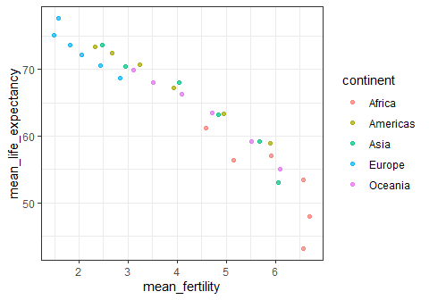
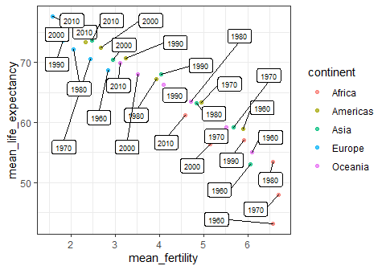
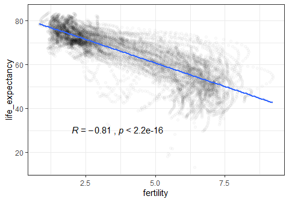
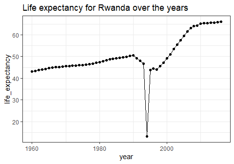
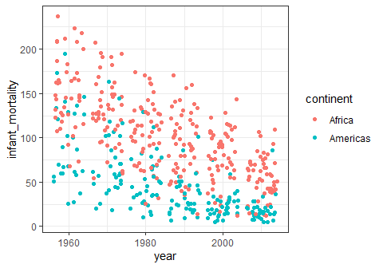
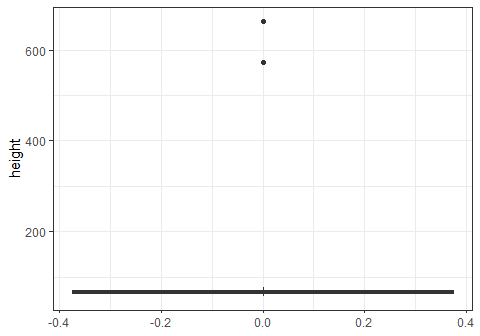

Hands-on - Exploring data with R
================
Dr. Marc A.T. Teunis; Dr. Jan-Willem Lankhaar
November 6th 2018

*From R. A. Fisher, 1938: To consult the statistician after an
experiment is finished is often merely to ask him to conduct a post
mortem examination. He can perhaps say what the experiment died of*

## Attribution: This work can be repro

## Loading the packages used in this demo

``` r
library(tidyverse)
library(gganimate)
library(dslabs)
library(lubridate)
library(ggplot2)
library(gapminder)
library(gganimate)
library(gifski)
library(tidyverse)
```

## A recreation of the Gapminder Bubble Graph, with facets per continent

``` r
gapminder_animation <- ggplot(gapminder, aes(gdpPercap, lifeExp, size = pop, colour = country)) +
  geom_point(alpha = 0.7, show.legend = FALSE) +
  scale_colour_manual(values = country_colors) +
  scale_size(range = c(2, 12)) +
  scale_x_log10() +
  facet_wrap(~ continent) +
  # Here comes the gganimate specific bits
  labs(title = 'Year: {frame_time}', 
       x = 'GDP per capita', 
       y = 'life expectancy') +
  transition_time(year) + ## regulation the actual layers for the animation
  ease_aes('linear')

gapminder_animation
```

<!-- -->

## Resources & references

<https://simplystatistics.org/2018/01/22/the-dslabs-package-provides-datasets-for-teaching-data-science/>

<https://github.com/rbind/simplystats>

[link to free online book “r4ds”:](https://r4ds.had.co.nz/) “R for Data
Science”, Hadley Wickham & Garret Grolemund

## The ggplot2 packages

I find the the ggplot2 package for R the best plotting system for R.
It’s syntax is an implementation of the ‘grammar of graphics’ and all
plots in this demo are created by using ggplot2.

To cite ggplot2 in your work run `citation("ggplot2")` in R to get the
reference details.

The 3rd edition of the free online book resource for ggplot2: [“ggplot2
Elegant Graphics for Data
Analysis”](https://ggplot2-book.org/index.html)
<!-- -->

## Citations

``` r
citation(package = "ggplot2")
citation(package = "tidyverse")
citation(package = "dslabs")
```

## Installing data package

``` r
install.packages("dslabs")
```

## Loading a specific dataset by name

``` r
data(package = "dslabs")
data("us_contagious_diseases", package = "dslabs")
unique(us_contagious_diseases$disease)
```

    ## [1] Hepatitis A Measles     Mumps       Pertussis   Polio       Rubella    
    ## [7] Smallpox   
    ## Levels: Hepatitis A Measles Mumps Pertussis Polio Rubella Smallpox

## Measles example

Every data cycle starts with a question / problem:

  - Problem
  - Plan
  - Data
  - Analysis
  - Conclusion

<!-- end list -->

``` r
 DiagrammeR::grViz("
digraph rmarkdown {
  Problem -> Plan
  Plan -> Data
  Data -> Analysis
  Analysis -> Conclusion 
  Conclusion -> Problem
}
")
```

<!--html_preserve-->

<div id="htmlwidget-af8d4e6fb68b4d9f0f68" class="grViz html-widget" style="width:480px;height:336px;">

</div>

<script type="application/json" data-for="htmlwidget-af8d4e6fb68b4d9f0f68">{"x":{"diagram":"\ndigraph rmarkdown {\n  Problem -> Plan\n  Plan -> Data\n  Data -> Analysis\n  Analysis -> Conclusion \n  Conclusion -> Problem\n}\n","config":{"engine":"dot","options":null}},"evals":[],"jsHooks":[]}</script>

<!--/html_preserve-->

## Was the introduction of the vaccination against the measles effective?

``` r
library(dslabs)
data(us_contagious_diseases)
the_disease <- "Measles"
dat <- us_contagious_diseases %>%
  dplyr::filter(!state%in%c("Hawaii","Alaska") &  
      disease == the_disease) %>%
  mutate(rate = count / population * 10000 * 52 / weeks_reporting) 

jet.colors <- colorRampPalette(c("#F0FFFF", "cyan", "#007FFF", "yellow", "#FFBF00", "orange", "red", "#7F0000"), bias = 2.25)

dat %>% mutate(state = reorder(state, desc(state))) %>%
  ggplot(aes(year, state, fill = rate)) +
  geom_tile(color = "white", size = 0.35) +
  scale_x_continuous(expand = c(0,0)) +
  scale_fill_gradientn(colors = jet.colors(16), na.value = 'white') +
  geom_vline(xintercept = 1963, col = "black") +
  theme_minimal() + 
  theme(panel.grid = element_blank()) +
  coord_cartesian(clip = 'off') +
  ggtitle(the_disease) +
  ylab("") +
  xlab("") +  
  theme(legend.position = "bottom", text = element_text(size = 8)) + 
  annotate(geom = "text", x = 1963, y = 50.5, label = "Vaccine introduced", size = 3, hjust = 0)
```

<!-- -->

## Build upon existing code

Try changing the line in the code chunk above from

`the_disease <- "Measles"` (*Mazelen* in Dutch) to

`the_disease <- "Smallpox"` (*Pokken* in Dutch) and rerun the code.

Can you find out which part of the code above plots the vertical line
and prints the words “Vaccine introduced”. Try to adapt the figure for
the Smallpox data: The introduction of the smallpox vaccine was already
as early as in 1940. **TIP** You will need to change the year 1963 twice
to 1940 in oder for the new figure to be correct for the Smallpox subset
of the data. Try adapting the code and rerun the code chunk.

Question: When did vaccination against smallpox stop? Try googling for
the answer\!

## Exploring the Gapminder dataset in R

The gapminder dataset contains a number of measurements on health and
income outcomes for 184 countries from 1960 to 2016. It also includes
two character vectors, OECD and OPEC, with the names of OECD and OPEC
countries from 2016.

## Inspecting the dataset with R

``` r
data("gapminder", package = "dslabs")
head(gapminder)
```

    ##               country year infant_mortality life_expectancy fertility
    ## 1             Albania 1960           115.40           62.87      6.19
    ## 2             Algeria 1960           148.20           47.50      7.65
    ## 3              Angola 1960           208.00           35.98      7.32
    ## 4 Antigua and Barbuda 1960               NA           62.97      4.43
    ## 5           Argentina 1960            59.87           65.39      3.11
    ## 6             Armenia 1960               NA           66.86      4.55
    ##   population          gdp continent          region
    ## 1    1636054           NA    Europe Southern Europe
    ## 2   11124892  13828152297    Africa Northern Africa
    ## 3    5270844           NA    Africa   Middle Africa
    ## 4      54681           NA  Americas       Caribbean
    ## 5   20619075 108322326649  Americas   South America
    ## 6    1867396           NA      Asia    Western Asia

``` r
gapminder <- gapminder %>% as_tibble()
names(gapminder)
```

    ## [1] "country"          "year"             "infant_mortality"
    ## [4] "life_expectancy"  "fertility"        "population"      
    ## [7] "gdp"              "continent"        "region"

## A very simple example to start with

``` r
gapminder %>% 
  ggplot(aes(x = fertility,
             y = life_expectancy)) +
  geom_point()
```

<!-- -->

# Fixing overplotting

We call this ‘overplotting’.

This can be fixed in several ways:

  - Reducing the transparency of data points  
  - Mapping colour to a variable (continuous or categorical)
  - Reduce the data in the plot
  - Mapping a shape to a variable
  - Add noise (`"jitter"`) to points
  - Facetting - create panels for ‘categorical’ or so-called ‘factor’
    variables in R
  - Summarize the data
  - Displaying a model / relationship that represents the data (and not
    sho the actual data itself)
  - Or any combination of the above strategies

**Basically you map an `aesthetic` (`aes()`) or a `characteristic` to a
variable**

Let’s go over these overplotting methods one by one

### 1\. Overplotting: Reducing transparency (`alpha`) of points or lines in the data

``` r
gapminder %>% 
  ggplot(aes(x = fertility,
             y = life_expectancy)) +
  geom_point(alpha = 0.1)
```

<!-- -->

### 2\. Mapping colour to a variable (continuous or categorical)

``` r
gapminder %>% 
  ggplot(aes(x = fertility,
             y = life_expectancy)) +
  geom_point(aes(colour = continent))
```

<!-- -->

#### or combined with `alpha`

``` r
gapminder %>% 
  ggplot(aes(x = fertility,
             y = life_expectancy)) +
  geom_point(aes(colour = continent), alpha = 0.1) +
  guides(colour = guide_legend(override.aes = list(alpha = 1)))
```

<!-- -->

#### **Do it yourself:**

  - Try adjusting some of the arguments in the previous `ggplot2` call.
    For example, adjust the `alpha = ...` or change the variable in `x =
    ...`, `y = ...` or `colour = ...`
  - `names(gapminder)` gives you the variable names that you can change
  - Show and discuss the resulting plot with your neighbour
  - What do you think this part does:

`guides(colour = guide_legend(override.aes = list(alpha = 1)))`

  - Try to find out by disabling with `#`

### 3\. Reduce the data in the plot

``` r
reduce_data_plot <- gapminder %>% 
  filter(continent == "Africa" | continent == "Europe") %>%
  ggplot(aes(x = fertility,
             y = life_expectancy)) +
  geom_point(aes(colour = continent), alpha = 0.2) +
  ## override the alpha setting for the points in the legend:
  guides(colour = guide_legend(override.aes = list(alpha = 1))) 

reduce_data_plot
```

<!-- -->

### **Discuss with you neighbour:**

  - What does the the `aes()` part of the `geom_point()` do?
  - Compare the code below with the code above, can you spot the
    difference, what is the advantage of the code below?

<!-- end list -->

``` r
reduce_data_plot <- gapminder %>% 
  filter(continent == "Africa" | continent == "Europe") %>%
  ggplot(aes(x = fertility,
             y = life_expectancy, colour = continent)) +
  geom_point(alpha = 0.2) +
  ## override the alpha setting for the points in the legend:
  guides(colour = guide_legend(override.aes = list(alpha = 1))) 
```

### 4\. Mapping a shape to a variable

``` r
## or e.g. show only two years and map a shape to continent
shape_plot <- gapminder %>% 
  dplyr::filter(continent == "Africa" | continent == "Europe",
         year == "1960" | year == "2010") %>%
  ggplot(aes(x = fertility,
             y = life_expectancy)) +
  geom_point(aes(colour = as_factor(as.character(year)), 
                 shape = continent), 
             alpha = 0.7)

shape_plot
```

<!-- -->

#### **Do it youself**

  - Try removing the `as_factor(as.character(year))` call and replace
    this by only `year` above and rerun the plot, what happened?

### 5\. Facetting

Create panels for ‘categorical’ or so-called ‘factor’ variables in R

``` r
facets_plot <- gapminder %>% 
  dplyr::filter(continent == "Africa" | continent == "Europe",
         year == "1960" | year == "2010") %>%
  ggplot(aes(x = fertility,
             y = life_expectancy)) +
  geom_point(aes(colour = continent), alpha = 0.5) +
  facet_wrap(~ year)

facets_plot
```

<!-- -->

### 6\. Summarize the data

``` r
library(ggrepel)

years <- c("1960", "1970", "1980", "1990", "2000", "2010")

summarize_plot <- gapminder %>% 
  dplyr::filter(year %in% years) %>%
  group_by(continent, year) %>%
  summarise(mean_life_expectancy = mean(life_expectancy),
            mean_fertility = mean(fertility)) %>%
  ggplot(aes(x = mean_fertility,
             y = mean_life_expectancy)) +
  geom_point(aes(colour = continent), alpha = 0.7) 

summarize_plot
```

<!-- -->

#### Adding labels to points with `{ggrepel}`

``` r
library(ggrepel)

years <- c("1960", "1970", "1980", "1990", "2000", "2010")

labels_plot <- gapminder %>% 
  dplyr::filter(year %in% years) %>%
  group_by(continent, year) %>%
  summarise(mean_life_expectancy = mean(life_expectancy),
            mean_fertility = mean(fertility)) %>%
  ggplot(aes(x = mean_fertility,
             y = mean_life_expectancy)) +
  geom_point(aes(colour = continent), alpha = 0.7) +
  geom_label_repel(aes(label=year), size = 2.5, box.padding = .5)
  

labels_plot
```

<!-- -->

### 7\. Displaying a model / relationship that represents the data (and not show the actual data itself)

``` r
## Model
lm <- gapminder %>% lm(formula = life_expectancy ~ fertility)

correlation <- cor.test(x = gapminder$fertility, y = gapminder$life_expectancy, method = "pearson")

# save predictions of the model in the new data frame 
# together with variable you want to plot against
predicted_df <- data.frame(gapminder_pred = predict(lm, gapminder), 
                           fertility = gapminder$fertility)
```

#### Add model to plot

``` r
model_plot <- gapminder %>% 
  ggplot(aes(x = fertility,
             y = life_expectancy)) +
#  geom_point(alpha = 0.03) +
  geom_line(data = predicted_df, aes(x = fertility, 
                                     y = gapminder_pred),
            colour = "darkred", size = 1)
model_plot
```

<!-- -->

#### Plotting statistics to the graph with the `{ggpubr}` package

<!-- -->

#### Using a smoother `geom_smooth` to display potential relationships

``` r
gapminder %>% 
  ggplot(aes(x = fertility,
             y = life_expectancy)) +
  geom_point(alpha = 0.02) +
  geom_smooth(method = "lm") +
  stat_cor(method = "pearson", label.x = 2, label.y = 30) +
  theme_bw()
```

<!-- -->

## Recap **Discuss with your neighbour**

Which tricks can we use to reduce the dimensionality of the plotted data
(prevent overpltting)?

Try listing at least 6 methods:

## Relation between `gdp`, Gross Domestic Product and `infant_mortality` rate.

<https://en.wikipedia.org/wiki/Gross_domestic_product> Wikipedia: Gross
Domestic Product (GDP) is a monetary measure of the market value of all
the final goods and services produced in a period of time, often
annually or quarterly. Nominal GDP estimates are commonly used to
determine the economic performance of a whole country or region, and to
make international comparisons.

``` r
gdp_infant_plot <- gapminder %>%
  dplyr::filter(continent == "Europe" | continent == "Africa") %>%
  ggplot(aes(x = gdp, 
             y = infant_mortality)) +
  geom_point() 
gdp_infant_plot
```

<!-- -->

# Adding a bit of colour

The figure above does not provide any clue on a possible difference
between Europe and Africa, nor does it convey any information on trends
over time.

``` r
colour_to_continent <- gapminder %>%
  dplyr::filter(continent == "Europe" | continent == "Africa") %>%
  ggplot(aes(x = gdp, 
             y = infant_mortality)) +
  geom_point(aes(colour = continent))

colour_to_continent
```

<!-- -->

## Adding facets

Let’s investigate whether things have improved over time. We compare
1960 to 2010 by using a panel of two figures. Adding simply `facet_wrap(
~ facetting_variable)` will do the trick.

## **Discuss with your neighbour:**

Without looking ahead try to contruct a plot that conveys information on
the `gdp` per continent, over time. Try to recycle some of the examples
above.

``` r
facets_gdp_infant <- gapminder %>%
  dplyr::filter(continent == "Europe" | continent == "Africa",
                year == "1960" | year == "2010") %>%
  ggplot(aes(x = gdp, 
             y = infant_mortality)) +
  geom_point(aes(colour = continent)) +
  facet_wrap(~ year) +
  theme(axis.text.x = element_text(angle = -90, hjust = 1))
  

facets_gdp_infant
```

<!-- -->

# Mapping to continuous variables

So far we have been mapping colours and shapes to categorical variables.
You can also map to continuous variables though.

``` r
continuous <- gapminder %>%
  dplyr::filter(country == "Netherlands" | 
                country == "China" |
                country == "India") %>%
  dplyr::filter(year %in% years) %>%
  ggplot(aes(x = year,
         y = life_expectancy)) +
  geom_point(aes(size = population, colour = country)) +
  guides(colour = guide_legend(override.aes = list(alpha = 1))) +
  geom_line(aes(group = country)) +
  theme_bw()

continuous
```

<!-- -->

## **Discuss with your neighbour**

Try plotting the `infant_mortality` against the filtered years for the
same countries as the code above (Netherlands, India, China), recycling
some of the code above. Discuss the resulting graph in the light of the
life\_expectancy graph, what do you think about the the developments in
China?

Want to know more? see:
<https://www.ncbi.nlm.nih.gov/pmc/articles/PMC4331212/> Babxiarz, 2016

## **Discuss with your neighbour**

Analyze the following code chunk: try running line by line to see what
happens:

  - How many observations are we plotting here?
  - How many variables are we plotting?
  - Try adding or removing variables to the `group_by()` statement, what
    happens if you do?

## Summarize per continent and sum population

``` r
population_plot <- gapminder %>% 
  dplyr::group_by(continent, year) %>%
  dplyr::filter(year %in% years) %>%
  summarise(sum_population = sum(population)) %>% 
  ggplot(aes(x = year, 
             y = sum_population)) +
    geom_point(aes(colour = continent)) +
    geom_line(aes(group = continent,
                  colour = continent))
population_plot
```

<!-- -->

# Ranking data

``` r
ranking_plot <- gapminder %>%
  dplyr::filter(continent == "Europe",
                year == 2010) %>%
  ggplot(aes(x = reorder(as_factor(country), population),
             y = log10(population))) +
  geom_point() +
  ylab("log10(Population)") +
  xlab("Country") + 
  coord_flip() +
  geom_point(data = filter(gapminder %>%
  dplyr::filter(continent == "Europe",
                year == 2010), population >= 1e7), colour = "red")

ranking_plot
```

<!-- -->

# Let’s look at a time series

We filter for “Americas” and “Oceania” and look at `life_expectancy`
over the years.

``` r
## without summarizing for countries
gapminder$continent %>% as_factor() %>% levels()
```

    ## [1] "Africa"   "Americas" "Asia"     "Europe"   "Oceania"

``` r
gapminder %>% 
  dplyr::filter(continent == "Americas" | continent == "Oceania") %>%
  ggplot(aes(x = year,
             y = life_expectancy)) +
  geom_line(aes(group = continent,
                colour = continent))
```

<!-- -->

**Obviously something went wrong here. Please, discuss with your
neighbour what you think happened or needs to be done to fix this
(without looking ahead ;-) )**

## Grouping

We can see what happened if we plot individual datapoints

``` r
gapminder %>% 
  dplyr::filter(continent == "Americas" | continent == "Oceania") %>%
  ggplot(aes(x = year,
             y = life_expectancy)) +
  geom_point(aes(colour = country)) +
  theme(legend.position="none") +
  facet_wrap( ~ continent) +
  theme(legend.position="none") 
```

<!-- -->

## Summarizing time series data

``` r
gapminder$continent %>% as_factor() %>% levels()
```

    ## [1] "Africa"   "Americas" "Asia"     "Europe"   "Oceania"

``` r
gapminder %>% 
  dplyr::filter(continent == "Americas" | continent == "Oceania") %>%
  group_by(continent, year) %>%
  summarise(mean_life_expectancy = mean(life_expectancy)) %>%
  ggplot(aes(x = year,
             y = mean_life_expectancy)) +
  geom_line(aes(group = continent,
                colour = continent)) +
  theme(axis.text.x = element_text(angle = 90, hjust = 1))
```

<!-- -->

# Statistical proof?

``` r
df <- gapminder %>% 
  dplyr::filter(continent == "Americas" | continent == "Oceania") %>%
  group_by(continent, year)

model <- aov(data = df, life_expectancy ~ continent * year)
anova(model)
```

    ## Analysis of Variance Table
    ## 
    ## Response: life_expectancy
    ##                  Df Sum Sq Mean Sq  F value Pr(>F)    
    ## continent         1   8982    8982  269.104 <2e-16 ***
    ## year              1  58606   58606 1755.931 <2e-16 ***
    ## continent:year    1      9       9    0.278 0.5981    
    ## Residuals      2732  91183      33                    
    ## ---
    ## Signif. codes:  0 '***' 0.001 '**' 0.01 '*' 0.05 '.' 0.1 ' ' 1

Some remarks on the above Two-way ANOVA:

  - Repeated measures / multilevel models might be more appropriate here
    (paired / nested designs)
  - We did not perform any check on assumptions
  - We performed our analysis on only part of the data

## One more option: categorical values and “jitter”

Sometimes you have overlapping plots and adding transparency with
`alpha()` or mapping colour to underlying categorical values is not
working because there are simple to many points overlapping

Let’s look at an example

``` r
gapminder %>% 
  dplyr::filter(continent == "Americas" |
                continent == "Africa") %>%
  group_by(continent) %>%
  dplyr::filter(year %in% years) %>%
  ggplot(aes(x = year,
             y = infant_mortality)) +
  geom_point(aes(colour = country)) +
  theme(legend.position="none")
```

<!-- -->

In such cases it can be helpfull to add some noise to the points
(`position = "jitter"`) to reduce overlapping. This can be a powerfull
approach, especially when combined with setting `alpha()`

``` r
gapminder %>% 
  dplyr::filter(continent == "Americas" |
                continent == "Africa") %>%
  dplyr::filter(year %in% years) %>%
    group_by(continent) %>%
  ggplot(aes(x = year,
             y = infant_mortality)) +
  geom_point(aes(colour = continent), position = "jitter") 
```

<!-- -->

## Bar chart

It would be nice to know what the mean child mortality is for both
continents

``` r
gapminder %>% 
  dplyr::filter(continent == "Americas" |
                continent == "Africa") %>%
  dplyr::filter(year %in% years) %>%
  group_by(continent, year) %>%
  summarise(mean_infant_mortality = mean(infant_mortality, na.rm = TRUE)) %>% 
  ggplot(aes(x = year,
             y = mean_infant_mortality)) +
  geom_col(aes(fill = continent), position = "dodge") 
```

<!-- -->

## Adding summary data to an existing plot

Now that we have the mean infant mortality for each year for the two
continents, let’s add that data to the previous dot plot where we used
jitter

``` r
mean_inf_mort <- gapminder %>% 
  dplyr::filter(continent == "Americas" |
                continent == "Africa") %>%
  dplyr::filter(year %in% years) %>%
  group_by(continent, year) %>%
  summarise(mean_infant_mortality = mean(infant_mortality, na.rm = TRUE))

gapminder %>% 
  dplyr::filter(continent == "Americas" |
                continent == "Africa") %>%
  dplyr::filter(year %in% years) %>%
    group_by(continent) %>%
  ggplot(aes(x = year,
             y = infant_mortality)) +
  geom_point(aes(colour = continent), position = "jitter") +

## summary data added to previous 
  geom_line(data = mean_inf_mort, aes(x = year, 
                                      y = mean_infant_mortality, 
                                      colour = continent),  size = 2)
```

<!-- -->

## Filter data from a graph

In the figure above we can observe a number of countries in ‘Americas’
continent that have a child mortality that are above the average (over
the years) of ‘Africa’. Which countries are this?

``` r
library(ggiraph)

gapminder$country <- 
  str_replace_all(string = gapminder$country, 
                pattern = "'", 
                replacement = "_")


interactive_inf_mort <- gapminder %>% 
  dplyr::filter(continent == "Americas" |
                continent == "Africa") %>%
  dplyr::filter(year %in% years) %>%
    group_by(region, country) %>%
  ggplot(aes(x = year,
             y = infant_mortality)) +
  
  geom_point_interactive(aes(tooltip = country, colour = region), position = "jitter") +
  
#  geom_point(aes(colour = continent), position = "jitter") +

## summary data added to previous 
 geom_line(data = mean_inf_mort, aes(x = year, 
                                      y = mean_infant_mortality, 
                                      colour = continent, group = continent),  size = 2
            )

interactive_inf_mort
```

<!-- -->

``` r
gapminder$country %>% as_factor() %>% levels()
```

    ##   [1] "Albania"                        "Algeria"                       
    ##   [3] "Angola"                         "Antigua and Barbuda"           
    ##   [5] "Argentina"                      "Armenia"                       
    ##   [7] "Aruba"                          "Australia"                     
    ##   [9] "Austria"                        "Azerbaijan"                    
    ##  [11] "Bahamas"                        "Bahrain"                       
    ##  [13] "Bangladesh"                     "Barbados"                      
    ##  [15] "Belarus"                        "Belgium"                       
    ##  [17] "Belize"                         "Benin"                         
    ##  [19] "Bhutan"                         "Bolivia"                       
    ##  [21] "Bosnia and Herzegovina"         "Botswana"                      
    ##  [23] "Brazil"                         "Brunei"                        
    ##  [25] "Bulgaria"                       "Burkina Faso"                  
    ##  [27] "Burundi"                        "Cambodia"                      
    ##  [29] "Cameroon"                       "Canada"                        
    ##  [31] "Cape Verde"                     "Central African Republic"      
    ##  [33] "Chad"                           "Chile"                         
    ##  [35] "China"                          "Colombia"                      
    ##  [37] "Comoros"                        "Congo, Dem. Rep."              
    ##  [39] "Congo, Rep."                    "Costa Rica"                    
    ##  [41] "Cote d_Ivoire"                  "Croatia"                       
    ##  [43] "Cuba"                           "Cyprus"                        
    ##  [45] "Czech Republic"                 "Denmark"                       
    ##  [47] "Djibouti"                       "Dominican Republic"            
    ##  [49] "Ecuador"                        "Egypt"                         
    ##  [51] "El Salvador"                    "Equatorial Guinea"             
    ##  [53] "Eritrea"                        "Estonia"                       
    ##  [55] "Ethiopia"                       "Fiji"                          
    ##  [57] "Finland"                        "France"                        
    ##  [59] "French Polynesia"               "Gabon"                         
    ##  [61] "Gambia"                         "Georgia"                       
    ##  [63] "Germany"                        "Ghana"                         
    ##  [65] "Greece"                         "Greenland"                     
    ##  [67] "Grenada"                        "Guatemala"                     
    ##  [69] "Guinea"                         "Guinea-Bissau"                 
    ##  [71] "Guyana"                         "Haiti"                         
    ##  [73] "Honduras"                       "Hong Kong, China"              
    ##  [75] "Hungary"                        "Iceland"                       
    ##  [77] "India"                          "Indonesia"                     
    ##  [79] "Iran"                           "Iraq"                          
    ##  [81] "Ireland"                        "Israel"                        
    ##  [83] "Italy"                          "Jamaica"                       
    ##  [85] "Japan"                          "Jordan"                        
    ##  [87] "Kazakhstan"                     "Kenya"                         
    ##  [89] "Kiribati"                       "South Korea"                   
    ##  [91] "Kuwait"                         "Kyrgyz Republic"               
    ##  [93] "Lao"                            "Latvia"                        
    ##  [95] "Lebanon"                        "Lesotho"                       
    ##  [97] "Liberia"                        "Libya"                         
    ##  [99] "Lithuania"                      "Luxembourg"                    
    ## [101] "Macao, China"                   "Macedonia, FYR"                
    ## [103] "Madagascar"                     "Malawi"                        
    ## [105] "Malaysia"                       "Maldives"                      
    ## [107] "Mali"                           "Malta"                         
    ## [109] "Mauritania"                     "Mauritius"                     
    ## [111] "Mexico"                         "Micronesia, Fed. Sts."         
    ## [113] "Moldova"                        "Mongolia"                      
    ## [115] "Montenegro"                     "Morocco"                       
    ## [117] "Mozambique"                     "Namibia"                       
    ## [119] "Nepal"                          "Netherlands"                   
    ## [121] "New Caledonia"                  "New Zealand"                   
    ## [123] "Nicaragua"                      "Niger"                         
    ## [125] "Nigeria"                        "Norway"                        
    ## [127] "Oman"                           "Pakistan"                      
    ## [129] "Panama"                         "Papua New Guinea"              
    ## [131] "Paraguay"                       "Peru"                          
    ## [133] "Philippines"                    "Poland"                        
    ## [135] "Portugal"                       "Puerto Rico"                   
    ## [137] "Qatar"                          "Romania"                       
    ## [139] "Russia"                         "Rwanda"                        
    ## [141] "St. Lucia"                      "St. Vincent and the Grenadines"
    ## [143] "Samoa"                          "Saudi Arabia"                  
    ## [145] "Senegal"                        "Serbia"                        
    ## [147] "Seychelles"                     "Sierra Leone"                  
    ## [149] "Singapore"                      "Slovak Republic"               
    ## [151] "Slovenia"                       "Solomon Islands"               
    ## [153] "South Africa"                   "Spain"                         
    ## [155] "Sri Lanka"                      "Sudan"                         
    ## [157] "Suriname"                       "Swaziland"                     
    ## [159] "Sweden"                         "Switzerland"                   
    ## [161] "Syria"                          "Tajikistan"                    
    ## [163] "Tanzania"                       "Thailand"                      
    ## [165] "Timor-Leste"                    "Togo"                          
    ## [167] "Tonga"                          "Trinidad and Tobago"           
    ## [169] "Tunisia"                        "Turkey"                        
    ## [171] "Turkmenistan"                   "Uganda"                        
    ## [173] "Ukraine"                        "United Arab Emirates"          
    ## [175] "United Kingdom"                 "United States"                 
    ## [177] "Uruguay"                        "Uzbekistan"                    
    ## [179] "Vanuatu"                        "Venezuela"                     
    ## [181] "West Bank and Gaza"             "Vietnam"                       
    ## [183] "Yemen"                          "Zambia"                        
    ## [185] "Zimbabwe"

``` r
ggiraph(ggobj = interactive_inf_mort)
```

<!--html_preserve-->

<div id="htmlwidget-23d59cf6778642a96ac9" class="girafe html-widget" style="width:480px;height:336px;">

</div>

<script type="application/json" data-for="htmlwidget-23d59cf6778642a96ac9">{"x":{"html":"<?xml version=\"1.0\" encoding=\"UTF-8\"?>\n<svg xmlns=\"http://www.w3.org/2000/svg\" xmlns:xlink=\"http://www.w3.org/1999/xlink\" id=\"svg_9142a185cc320190904160635\" viewBox=\"0 0 432.00 360.00\">\n  <g>\n    <defs>\n      <clipPath id=\"cl_id9143345c8020190904160635_1679565025\">\n        <rect x=\"0.00\" y=\"360.00\" width=\"0.00\" height=\"72.00\"/>\n      <\/clipPath>\n    <\/defs>\n    <rect x=\"0.00\" y=\"0.00\" width=\"432.00\" height=\"360.00\" id=\"1\" clip-path=\"url(#cl_id9143345c8020190904160635_1679565025)\" fill=\"#FFFFFF\" fill-opacity=\"1\" stroke-width=\"0.75\" stroke=\"#FFFFFF\" stroke-opacity=\"1\" stroke-linejoin=\"round\" stroke-linecap=\"round\"/>\n    <defs>\n      <clipPath id=\"cl_id9143345c8020190904160635_1679565026\">\n        <rect x=\"0.00\" y=\"0.00\" width=\"432.00\" height=\"360.00\"/>\n      <\/clipPath>\n    <\/defs>\n    <rect x=\"0.00\" y=\"0.00\" width=\"432.00\" height=\"360.00\" id=\"2\" clip-path=\"url(#cl_id9143345c8020190904160635_1679565026)\" fill=\"#FFFFFF\" fill-opacity=\"1\" stroke-width=\"1.06698\" stroke=\"#FFFFFF\" stroke-opacity=\"1\" stroke-linejoin=\"round\" stroke-linecap=\"round\"/>\n    <defs>\n      <clipPath id=\"cl_id9143345c8020190904160635_1679565027\">\n        <rect x=\"38.02\" y=\"5.48\" width=\"274.86\" height=\"323.03\"/>\n      <\/clipPath>\n    <\/defs>\n    <rect x=\"38.02\" y=\"5.48\" width=\"274.86\" height=\"323.03\" id=\"3\" clip-path=\"url(#cl_id9143345c8020190904160635_1679565027)\" fill=\"#FFFFFF\" fill-opacity=\"1\" stroke=\"none\"/>\n    <polyline points=\"38.02,288.44 312.89,288.44\" id=\"4\" clip-path=\"url(#cl_svg_9142a185cc320190904160635_1679565027)\" fill=\"none\" stroke-width=\"0.533489\" stroke=\"#EBEBEB\" stroke-opacity=\"1\" stroke-linejoin=\"round\" stroke-linecap=\"butt\"/>\n    <polyline points=\"38.02,225.28 312.89,225.28\" id=\"5\" clip-path=\"url(#cl_svg_9142a185cc320190904160635_1679565027)\" fill=\"none\" stroke-width=\"0.533489\" stroke=\"#EBEBEB\" stroke-opacity=\"1\" stroke-linejoin=\"round\" stroke-linecap=\"butt\"/>\n    <polyline points=\"38.02,162.12 312.89,162.12\" id=\"6\" clip-path=\"url(#cl_svg_9142a185cc320190904160635_1679565027)\" fill=\"none\" stroke-width=\"0.533489\" stroke=\"#EBEBEB\" stroke-opacity=\"1\" stroke-linejoin=\"round\" stroke-linecap=\"butt\"/>\n    <polyline points=\"38.02,98.97 312.89,98.97\" id=\"7\" clip-path=\"url(#cl_svg_9142a185cc320190904160635_1679565027)\" fill=\"none\" stroke-width=\"0.533489\" stroke=\"#EBEBEB\" stroke-opacity=\"1\" stroke-linejoin=\"round\" stroke-linecap=\"butt\"/>\n    <polyline points=\"38.02,35.81 312.89,35.81\" id=\"8\" clip-path=\"url(#cl_svg_9142a185cc320190904160635_1679565027)\" fill=\"none\" stroke-width=\"0.533489\" stroke=\"#EBEBEB\" stroke-opacity=\"1\" stroke-linejoin=\"round\" stroke-linecap=\"butt\"/>\n    <polyline points=\"110.57,328.51 110.57,5.48\" id=\"9\" clip-path=\"url(#cl_svg_9142a185cc320190904160635_1679565027)\" fill=\"none\" stroke-width=\"0.533489\" stroke=\"#EBEBEB\" stroke-opacity=\"1\" stroke-linejoin=\"round\" stroke-linecap=\"butt\"/>\n    <polyline points=\"197.02,328.51 197.02,5.48\" id=\"10\" clip-path=\"url(#cl_svg_9142a185cc320190904160635_1679565027)\" fill=\"none\" stroke-width=\"0.533489\" stroke=\"#EBEBEB\" stroke-opacity=\"1\" stroke-linejoin=\"round\" stroke-linecap=\"butt\"/>\n    <polyline points=\"283.47,328.51 283.47,5.48\" id=\"11\" clip-path=\"url(#cl_svg_9142a185cc320190904160635_1679565027)\" fill=\"none\" stroke-width=\"0.533489\" stroke=\"#EBEBEB\" stroke-opacity=\"1\" stroke-linejoin=\"round\" stroke-linecap=\"butt\"/>\n    <polyline points=\"38.02,320.02 312.89,320.02\" id=\"12\" clip-path=\"url(#cl_svg_9142a185cc320190904160635_1679565027)\" fill=\"none\" stroke-width=\"1.06698\" stroke=\"#EBEBEB\" stroke-opacity=\"1\" stroke-linejoin=\"round\" stroke-linecap=\"butt\"/>\n    <polyline points=\"38.02,256.86 312.89,256.86\" id=\"13\" clip-path=\"url(#cl_svg_9142a185cc320190904160635_1679565027)\" fill=\"none\" stroke-width=\"1.06698\" stroke=\"#EBEBEB\" stroke-opacity=\"1\" stroke-linejoin=\"round\" stroke-linecap=\"butt\"/>\n    <polyline points=\"38.02,193.70 312.89,193.70\" id=\"14\" clip-path=\"url(#cl_svg_9142a185cc320190904160635_1679565027)\" fill=\"none\" stroke-width=\"1.06698\" stroke=\"#EBEBEB\" stroke-opacity=\"1\" stroke-linejoin=\"round\" stroke-linecap=\"butt\"/>\n    <polyline points=\"38.02,130.55 312.89,130.55\" id=\"15\" clip-path=\"url(#cl_svg_9142a185cc320190904160635_1679565027)\" fill=\"none\" stroke-width=\"1.06698\" stroke=\"#EBEBEB\" stroke-opacity=\"1\" stroke-linejoin=\"round\" stroke-linecap=\"butt\"/>\n    <polyline points=\"38.02,67.39 312.89,67.39\" id=\"16\" clip-path=\"url(#cl_svg_9142a185cc320190904160635_1679565027)\" fill=\"none\" stroke-width=\"1.06698\" stroke=\"#EBEBEB\" stroke-opacity=\"1\" stroke-linejoin=\"round\" stroke-linecap=\"butt\"/>\n    <polyline points=\"67.35,328.51 67.35,5.48\" id=\"17\" clip-path=\"url(#cl_svg_9142a185cc320190904160635_1679565027)\" fill=\"none\" stroke-width=\"1.06698\" stroke=\"#EBEBEB\" stroke-opacity=\"1\" stroke-linejoin=\"round\" stroke-linecap=\"butt\"/>\n    <polyline points=\"153.80,328.51 153.80,5.48\" id=\"18\" clip-path=\"url(#cl_svg_9142a185cc320190904160635_1679565027)\" fill=\"none\" stroke-width=\"1.06698\" stroke=\"#EBEBEB\" stroke-opacity=\"1\" stroke-linejoin=\"round\" stroke-linecap=\"butt\"/>\n    <polyline points=\"240.25,328.51 240.25,5.48\" id=\"19\" clip-path=\"url(#cl_svg_9142a185cc320190904160635_1679565027)\" fill=\"none\" stroke-width=\"1.06698\" stroke=\"#EBEBEB\" stroke-opacity=\"1\" stroke-linejoin=\"round\" stroke-linecap=\"butt\"/>\n    <circle cx=\"62.41\" cy=\"132.82\" r=\"1.47pt\" id=\"20\" clip-path=\"url(#cl_id9143345c8020190904160635_1679565027)\" fill=\"#00BADE\" fill-opacity=\"1\" stroke-width=\"0.708661\" stroke=\"#00BADE\" stroke-opacity=\"1\" stroke-linejoin=\"round\" stroke-linecap=\"round\"/>\n    <circle cx=\"57.28\" cy=\"57.29\" r=\"1.47pt\" id=\"21\" clip-path=\"url(#cl_id9143345c8020190904160635_1679565027)\" fill=\"#00C1A7\" fill-opacity=\"1\" stroke-width=\"0.708661\" stroke=\"#00C1A7\" stroke-opacity=\"1\" stroke-linejoin=\"round\" stroke-linecap=\"round\"/>\n    <circle cx=\"71.03\" cy=\"244.39\" r=\"1.47pt\" id=\"22\" clip-path=\"url(#cl_id9143345c8020190904160635_1679565027)\" fill=\"#B385FF\" fill-opacity=\"1\" stroke-width=\"0.708661\" stroke=\"#B385FF\" stroke-opacity=\"1\" stroke-linejoin=\"round\" stroke-linecap=\"round\"/>\n    <circle cx=\"77.96\" cy=\"255.60\" r=\"1.47pt\" id=\"23\" clip-path=\"url(#cl_id9143345c8020190904160635_1679565027)\" fill=\"#AEA200\" fill-opacity=\"1\" stroke-width=\"0.708661\" stroke=\"#AEA200\" stroke-opacity=\"1\" stroke-linejoin=\"round\" stroke-linecap=\"round\"/>\n    <circle cx=\"53.42\" cy=\"232.23\" r=\"1.47pt\" id=\"24\" clip-path=\"url(#cl_id9143345c8020190904160635_1679565027)\" fill=\"#AEA200\" fill-opacity=\"1\" stroke-width=\"0.708661\" stroke=\"#AEA200\" stroke-opacity=\"1\" stroke-linejoin=\"round\" stroke-linecap=\"round\"/>\n    <circle cx=\"51.24\" cy=\"83.92\" r=\"1.47pt\" id=\"25\" clip-path=\"url(#cl_id9143345c8020190904160635_1679565027)\" fill=\"#FF63B6\" fill-opacity=\"1\" stroke-width=\"0.708661\" stroke=\"#FF63B6\" stroke-opacity=\"1\" stroke-linejoin=\"round\" stroke-linecap=\"round\"/>\n    <circle cx=\"52.84\" cy=\"100.99\" r=\"1.47pt\" id=\"26\" clip-path=\"url(#cl_id9143345c8020190904160635_1679565027)\" fill=\"#B385FF\" fill-opacity=\"1\" stroke-width=\"0.708661\" stroke=\"#B385FF\" stroke-opacity=\"1\" stroke-linejoin=\"round\" stroke-linecap=\"round\"/>\n    <circle cx=\"58.75\" cy=\"174.13\" r=\"1.47pt\" id=\"27\" clip-path=\"url(#cl_id9143345c8020190904160635_1679565027)\" fill=\"#EF67EB\" fill-opacity=\"1\" stroke-width=\"0.708661\" stroke=\"#EF67EB\" stroke-opacity=\"1\" stroke-linejoin=\"round\" stroke-linecap=\"round\"/>\n    <circle cx=\"60.45\" cy=\"156.55\" r=\"1.47pt\" id=\"28\" clip-path=\"url(#cl_id9143345c8020190904160635_1679565027)\" fill=\"#B385FF\" fill-opacity=\"1\" stroke-width=\"0.708661\" stroke=\"#B385FF\" stroke-opacity=\"1\" stroke-linejoin=\"round\" stroke-linecap=\"round\"/>\n    <circle cx=\"65.34\" cy=\"116.27\" r=\"1.47pt\" id=\"29\" clip-path=\"url(#cl_id9143345c8020190904160635_1679565027)\" fill=\"#FF63B6\" fill-opacity=\"1\" stroke-width=\"0.708661\" stroke=\"#FF63B6\" stroke-opacity=\"1\" stroke-linejoin=\"round\" stroke-linecap=\"round\"/>\n    <circle cx=\"79.88\" cy=\"136.72\" r=\"1.47pt\" id=\"30\" clip-path=\"url(#cl_id9143345c8020190904160635_1679565027)\" fill=\"#00BD5C\" fill-opacity=\"1\" stroke-width=\"0.708661\" stroke=\"#00BD5C\" stroke-opacity=\"1\" stroke-linejoin=\"round\" stroke-linecap=\"round\"/>\n    <circle cx=\"64.67\" cy=\"109.21\" r=\"1.47pt\" id=\"31\" clip-path=\"url(#cl_id9143345c8020190904160635_1679565027)\" fill=\"#00C1A7\" fill-opacity=\"1\" stroke-width=\"0.708661\" stroke=\"#00C1A7\" stroke-opacity=\"1\" stroke-linejoin=\"round\" stroke-linecap=\"round\"/>\n    <circle cx=\"54.21\" cy=\"284.91\" r=\"1.47pt\" id=\"32\" clip-path=\"url(#cl_id9143345c8020190904160635_1679565027)\" fill=\"#00A6FF\" fill-opacity=\"1\" stroke-width=\"0.708661\" stroke=\"#00A6FF\" stroke-opacity=\"1\" stroke-linejoin=\"round\" stroke-linecap=\"round\"/>\n    <circle cx=\"64.00\" cy=\"110.96\" r=\"1.47pt\" id=\"33\" clip-path=\"url(#cl_id9143345c8020190904160635_1679565027)\" fill=\"#00C1A7\" fill-opacity=\"1\" stroke-width=\"0.708661\" stroke=\"#00C1A7\" stroke-opacity=\"1\" stroke-linejoin=\"round\" stroke-linecap=\"round\"/>\n    <circle cx=\"65.99\" cy=\"158.83\" r=\"1.47pt\" id=\"34\" clip-path=\"url(#cl_id9143345c8020190904160635_1679565027)\" fill=\"#B385FF\" fill-opacity=\"1\" stroke-width=\"0.708661\" stroke=\"#B385FF\" stroke-opacity=\"1\" stroke-linejoin=\"round\" stroke-linecap=\"round\"/>\n    <circle cx=\"57.95\" cy=\"207.22\" r=\"1.47pt\" id=\"35\" clip-path=\"url(#cl_id9143345c8020190904160635_1679565027)\" fill=\"#B385FF\" fill-opacity=\"1\" stroke-width=\"0.708661\" stroke=\"#B385FF\" stroke-opacity=\"1\" stroke-linejoin=\"round\" stroke-linecap=\"round\"/>\n    <circle cx=\"73.30\" cy=\"67.39\" r=\"1.47pt\" id=\"36\" clip-path=\"url(#cl_id9143345c8020190904160635_1679565027)\" fill=\"#00BD5C\" fill-opacity=\"1\" stroke-width=\"0.708661\" stroke=\"#00BD5C\" stroke-opacity=\"1\" stroke-linejoin=\"round\" stroke-linecap=\"round\"/>\n    <circle cx=\"84.59\" cy=\"100.22\" r=\"1.47pt\" id=\"37\" clip-path=\"url(#cl_id9143345c8020190904160635_1679565027)\" fill=\"#00C1A7\" fill-opacity=\"1\" stroke-width=\"0.708661\" stroke=\"#00C1A7\" stroke-opacity=\"1\" stroke-linejoin=\"round\" stroke-linecap=\"round\"/>\n    <circle cx=\"72.68\" cy=\"180.30\" r=\"1.47pt\" id=\"38\" clip-path=\"url(#cl_id9143345c8020190904160635_1679565027)\" fill=\"#00C1A7\" fill-opacity=\"1\" stroke-width=\"0.708661\" stroke=\"#00C1A7\" stroke-opacity=\"1\" stroke-linejoin=\"round\" stroke-linecap=\"round\"/>\n    <circle cx=\"67.32\" cy=\"210.70\" r=\"1.47pt\" id=\"39\" clip-path=\"url(#cl_id9143345c8020190904160635_1679565027)\" fill=\"#64B200\" fill-opacity=\"1\" stroke-width=\"0.708661\" stroke=\"#64B200\" stroke-opacity=\"1\" stroke-linejoin=\"round\" stroke-linecap=\"round\"/>\n    <circle cx=\"55.91\" cy=\"56.78\" r=\"1.47pt\" id=\"40\" clip-path=\"url(#cl_id9143345c8020190904160635_1679565027)\" fill=\"#FF63B6\" fill-opacity=\"1\" stroke-width=\"0.708661\" stroke=\"#FF63B6\" stroke-opacity=\"1\" stroke-linejoin=\"round\" stroke-linecap=\"round\"/>\n    <circle cx=\"70.57\" cy=\"273.28\" r=\"1.47pt\" id=\"41\" clip-path=\"url(#cl_id9143345c8020190904160635_1679565027)\" fill=\"#AEA200\" fill-opacity=\"1\" stroke-width=\"0.708661\" stroke=\"#AEA200\" stroke-opacity=\"1\" stroke-linejoin=\"round\" stroke-linecap=\"round\"/>\n    <circle cx=\"76.18\" cy=\"191.05\" r=\"1.47pt\" id=\"42\" clip-path=\"url(#cl_id9143345c8020190904160635_1679565027)\" fill=\"#AEA200\" fill-opacity=\"1\" stroke-width=\"0.708661\" stroke=\"#AEA200\" stroke-opacity=\"1\" stroke-linejoin=\"round\" stroke-linecap=\"round\"/>\n    <circle cx=\"75.65\" cy=\"166.68\" r=\"1.47pt\" id=\"43\" clip-path=\"url(#cl_id9143345c8020190904160635_1679565027)\" fill=\"#B385FF\" fill-opacity=\"1\" stroke-width=\"0.708661\" stroke=\"#B385FF\" stroke-opacity=\"1\" stroke-linejoin=\"round\" stroke-linecap=\"round\"/>\n    <circle cx=\"81.59\" cy=\"55.26\" r=\"1.47pt\" id=\"44\" clip-path=\"url(#cl_id9143345c8020190904160635_1679565027)\" fill=\"#00BADE\" fill-opacity=\"1\" stroke-width=\"0.708661\" stroke=\"#00BADE\" stroke-opacity=\"1\" stroke-linejoin=\"round\" stroke-linecap=\"round\"/>\n    <circle cx=\"64.28\" cy=\"160.60\" r=\"1.47pt\" id=\"45\" clip-path=\"url(#cl_id9143345c8020190904160635_1679565027)\" fill=\"#64B200\" fill-opacity=\"1\" stroke-width=\"0.708661\" stroke=\"#64B200\" stroke-opacity=\"1\" stroke-linejoin=\"round\" stroke-linecap=\"round\"/>\n    <circle cx=\"83.26\" cy=\"115.38\" r=\"1.47pt\" id=\"46\" clip-path=\"url(#cl_id9143345c8020190904160635_1679565027)\" fill=\"#00BD5C\" fill-opacity=\"1\" stroke-width=\"0.708661\" stroke=\"#00BD5C\" stroke-opacity=\"1\" stroke-linejoin=\"round\" stroke-linecap=\"round\"/>\n    <circle cx=\"76.76\" cy=\"132.56\" r=\"1.47pt\" id=\"47\" clip-path=\"url(#cl_id9143345c8020190904160635_1679565027)\" fill=\"#FF63B6\" fill-opacity=\"1\" stroke-width=\"0.708661\" stroke=\"#FF63B6\" stroke-opacity=\"1\" stroke-linejoin=\"round\" stroke-linecap=\"round\"/>\n    <circle cx=\"76.53\" cy=\"161.98\" r=\"1.47pt\" id=\"48\" clip-path=\"url(#cl_id9143345c8020190904160635_1679565027)\" fill=\"#FF63B6\" fill-opacity=\"1\" stroke-width=\"0.708661\" stroke=\"#FF63B6\" stroke-opacity=\"1\" stroke-linejoin=\"round\" stroke-linecap=\"round\"/>\n    <circle cx=\"76.76\" cy=\"135.61\" r=\"1.47pt\" id=\"49\" clip-path=\"url(#cl_id9143345c8020190904160635_1679565027)\" fill=\"#64B200\" fill-opacity=\"1\" stroke-width=\"0.708661\" stroke=\"#64B200\" stroke-opacity=\"1\" stroke-linejoin=\"round\" stroke-linecap=\"round\"/>\n    <circle cx=\"79.06\" cy=\"234.51\" r=\"1.47pt\" id=\"50\" clip-path=\"url(#cl_id9143345c8020190904160635_1679565027)\" fill=\"#B385FF\" fill-opacity=\"1\" stroke-width=\"0.708661\" stroke=\"#B385FF\" stroke-opacity=\"1\" stroke-linejoin=\"round\" stroke-linecap=\"round\"/>\n    <circle cx=\"80.16\" cy=\"73.97\" r=\"1.47pt\" id=\"51\" clip-path=\"url(#cl_id9143345c8020190904160635_1679565027)\" fill=\"#AEA200\" fill-opacity=\"1\" stroke-width=\"0.708661\" stroke=\"#AEA200\" stroke-opacity=\"1\" stroke-linejoin=\"round\" stroke-linecap=\"round\"/>\n    <circle cx=\"77.80\" cy=\"142.03\" r=\"1.47pt\" id=\"52\" clip-path=\"url(#cl_id9143345c8020190904160635_1679565027)\" fill=\"#64B200\" fill-opacity=\"1\" stroke-width=\"0.708661\" stroke=\"#64B200\" stroke-opacity=\"1\" stroke-linejoin=\"round\" stroke-linecap=\"round\"/>\n    <circle cx=\"52.37\" cy=\"241.69\" r=\"1.47pt\" id=\"53\" clip-path=\"url(#cl_id9143345c8020190904160635_1679565027)\" fill=\"#AEA200\" fill-opacity=\"1\" stroke-width=\"0.708661\" stroke=\"#AEA200\" stroke-opacity=\"1\" stroke-linejoin=\"round\" stroke-linecap=\"round\"/>\n    <circle cx=\"70.68\" cy=\"170.22\" r=\"1.47pt\" id=\"54\" clip-path=\"url(#cl_id9143345c8020190904160635_1679565027)\" fill=\"#00BD5C\" fill-opacity=\"1\" stroke-width=\"0.708661\" stroke=\"#00BD5C\" stroke-opacity=\"1\" stroke-linejoin=\"round\" stroke-linecap=\"round\"/>\n    <circle cx=\"72.29\" cy=\"139.00\" r=\"1.47pt\" id=\"55\" clip-path=\"url(#cl_id9143345c8020190904160635_1679565027)\" fill=\"#EF67EB\" fill-opacity=\"1\" stroke-width=\"0.708661\" stroke=\"#EF67EB\" stroke-opacity=\"1\" stroke-linejoin=\"round\" stroke-linecap=\"round\"/>\n    <circle cx=\"82.31\" cy=\"52.23\" r=\"1.47pt\" id=\"56\" clip-path=\"url(#cl_id9143345c8020190904160635_1679565027)\" fill=\"#FF63B6\" fill-opacity=\"1\" stroke-width=\"0.708661\" stroke=\"#FF63B6\" stroke-opacity=\"1\" stroke-linejoin=\"round\" stroke-linecap=\"round\"/>\n    <circle cx=\"66.65\" cy=\"112.22\" r=\"1.47pt\" id=\"57\" clip-path=\"url(#cl_id9143345c8020190904160635_1679565027)\" fill=\"#00BADE\" fill-opacity=\"1\" stroke-width=\"0.708661\" stroke=\"#00BADE\" stroke-opacity=\"1\" stroke-linejoin=\"round\" stroke-linecap=\"round\"/>\n    <circle cx=\"60.45\" cy=\"178.55\" r=\"1.47pt\" id=\"58\" clip-path=\"url(#cl_id9143345c8020190904160635_1679565027)\" fill=\"#00BD5C\" fill-opacity=\"1\" stroke-width=\"0.708661\" stroke=\"#00BD5C\" stroke-opacity=\"1\" stroke-linejoin=\"round\" stroke-linecap=\"round\"/>\n    <circle cx=\"74.84\" cy=\"44.40\" r=\"1.47pt\" id=\"59\" clip-path=\"url(#cl_id9143345c8020190904160635_1679565027)\" fill=\"#00BD5C\" fill-opacity=\"1\" stroke-width=\"0.708661\" stroke=\"#00BD5C\" stroke-opacity=\"1\" stroke-linejoin=\"round\" stroke-linecap=\"round\"/>\n    <circle cx=\"62.21\" cy=\"20.16\" r=\"1.47pt\" id=\"60\" clip-path=\"url(#cl_id9143345c8020190904160635_1679565027)\" fill=\"#FF63B6\" fill-opacity=\"1\" stroke-width=\"0.708661\" stroke=\"#FF63B6\" stroke-opacity=\"1\" stroke-linejoin=\"round\" stroke-linecap=\"round\"/>\n    <circle cx=\"57.13\" cy=\"149.48\" r=\"1.47pt\" id=\"61\" clip-path=\"url(#cl_id9143345c8020190904160635_1679565027)\" fill=\"#FF63B6\" fill-opacity=\"1\" stroke-width=\"0.708661\" stroke=\"#FF63B6\" stroke-opacity=\"1\" stroke-linejoin=\"round\" stroke-linecap=\"round\"/>\n    <circle cx=\"77.68\" cy=\"234.37\" r=\"1.47pt\" id=\"62\" clip-path=\"url(#cl_id9143345c8020190904160635_1679565027)\" fill=\"#00BD5C\" fill-opacity=\"1\" stroke-width=\"0.708661\" stroke=\"#00BD5C\" stroke-opacity=\"1\" stroke-linejoin=\"round\" stroke-linecap=\"round\"/>\n    <circle cx=\"74.71\" cy=\"192.93\" r=\"1.47pt\" id=\"63\" clip-path=\"url(#cl_id9143345c8020190904160635_1679565027)\" fill=\"#64B200\" fill-opacity=\"1\" stroke-width=\"0.708661\" stroke=\"#64B200\" stroke-opacity=\"1\" stroke-linejoin=\"round\" stroke-linecap=\"round\"/>\n    <circle cx=\"70.51\" cy=\"136.87\" r=\"1.47pt\" id=\"64\" clip-path=\"url(#cl_id9143345c8020190904160635_1679565027)\" fill=\"#00BADE\" fill-opacity=\"1\" stroke-width=\"0.708661\" stroke=\"#00BADE\" stroke-opacity=\"1\" stroke-linejoin=\"round\" stroke-linecap=\"round\"/>\n    <circle cx=\"53.31\" cy=\"88.87\" r=\"1.47pt\" id=\"65\" clip-path=\"url(#cl_id9143345c8020190904160635_1679565027)\" fill=\"#00BD5C\" fill-opacity=\"1\" stroke-width=\"0.708661\" stroke=\"#00BD5C\" stroke-opacity=\"1\" stroke-linejoin=\"round\" stroke-linecap=\"round\"/>\n    <circle cx=\"64.64\" cy=\"191.19\" r=\"1.47pt\" id=\"66\" clip-path=\"url(#cl_id9143345c8020190904160635_1679565027)\" fill=\"#EF67EB\" fill-opacity=\"1\" stroke-width=\"0.708661\" stroke=\"#EF67EB\" stroke-opacity=\"1\" stroke-linejoin=\"round\" stroke-linecap=\"round\"/>\n    <circle cx=\"64.23\" cy=\"150.75\" r=\"1.47pt\" id=\"67\" clip-path=\"url(#cl_id9143345c8020190904160635_1679565027)\" fill=\"#64B200\" fill-opacity=\"1\" stroke-width=\"0.708661\" stroke=\"#64B200\" stroke-opacity=\"1\" stroke-linejoin=\"round\" stroke-linecap=\"round\"/>\n    <circle cx=\"67.50\" cy=\"111.59\" r=\"1.47pt\" id=\"68\" clip-path=\"url(#cl_id9143345c8020190904160635_1679565027)\" fill=\"#FF63B6\" fill-opacity=\"1\" stroke-width=\"0.708661\" stroke=\"#FF63B6\" stroke-opacity=\"1\" stroke-linejoin=\"round\" stroke-linecap=\"round\"/>\n    <circle cx=\"60.09\" cy=\"235.52\" r=\"1.47pt\" id=\"69\" clip-path=\"url(#cl_id9143345c8020190904160635_1679565027)\" fill=\"#64B200\" fill-opacity=\"1\" stroke-width=\"0.708661\" stroke=\"#64B200\" stroke-opacity=\"1\" stroke-linejoin=\"round\" stroke-linecap=\"round\"/>\n    <circle cx=\"66.41\" cy=\"240.94\" r=\"1.47pt\" id=\"70\" clip-path=\"url(#cl_id9143345c8020190904160635_1679565027)\" fill=\"#B385FF\" fill-opacity=\"1\" stroke-width=\"0.708661\" stroke=\"#B385FF\" stroke-opacity=\"1\" stroke-linejoin=\"round\" stroke-linecap=\"round\"/>\n    <circle cx=\"75.77\" cy=\"148.37\" r=\"1.47pt\" id=\"71\" clip-path=\"url(#cl_id9143345c8020190904160635_1679565027)\" fill=\"#B385FF\" fill-opacity=\"1\" stroke-width=\"0.708661\" stroke=\"#B385FF\" stroke-opacity=\"1\" stroke-linejoin=\"round\" stroke-linecap=\"round\"/>\n    <circle cx=\"60.64\" cy=\"158.46\" r=\"1.47pt\" id=\"72\" clip-path=\"url(#cl_id9143345c8020190904160635_1679565027)\" fill=\"#00BD5C\" fill-opacity=\"1\" stroke-width=\"0.708661\" stroke=\"#00BD5C\" stroke-opacity=\"1\" stroke-linejoin=\"round\" stroke-linecap=\"round\"/>\n    <circle cx=\"78.65\" cy=\"160.47\" r=\"1.47pt\" id=\"73\" clip-path=\"url(#cl_id9143345c8020190904160635_1679565027)\" fill=\"#FF63B6\" fill-opacity=\"1\" stroke-width=\"0.708661\" stroke=\"#FF63B6\" stroke-opacity=\"1\" stroke-linejoin=\"round\" stroke-linecap=\"round\"/>\n    <circle cx=\"59.17\" cy=\"227.05\" r=\"1.47pt\" id=\"74\" clip-path=\"url(#cl_id9143345c8020190904160635_1679565027)\" fill=\"#00BD5C\" fill-opacity=\"1\" stroke-width=\"0.708661\" stroke=\"#00BD5C\" stroke-opacity=\"1\" stroke-linejoin=\"round\" stroke-linecap=\"round\"/>\n    <circle cx=\"83.84\" cy=\"37.59\" r=\"1.47pt\" id=\"75\" clip-path=\"url(#cl_id9143345c8020190904160635_1679565027)\" fill=\"#FF63B6\" fill-opacity=\"1\" stroke-width=\"0.708661\" stroke=\"#FF63B6\" stroke-opacity=\"1\" stroke-linejoin=\"round\" stroke-linecap=\"round\"/>\n    <circle cx=\"50.52\" cy=\"184.34\" r=\"1.47pt\" id=\"76\" clip-path=\"url(#cl_id9143345c8020190904160635_1679565027)\" fill=\"#00BADE\" fill-opacity=\"1\" stroke-width=\"0.708661\" stroke=\"#00BADE\" stroke-opacity=\"1\" stroke-linejoin=\"round\" stroke-linecap=\"round\"/>\n    <circle cx=\"79.12\" cy=\"141.04\" r=\"1.47pt\" id=\"77\" clip-path=\"url(#cl_id9143345c8020190904160635_1679565027)\" fill=\"#EF67EB\" fill-opacity=\"1\" stroke-width=\"0.708661\" stroke=\"#EF67EB\" stroke-opacity=\"1\" stroke-linejoin=\"round\" stroke-linecap=\"round\"/>\n    <circle cx=\"57.52\" cy=\"137.75\" r=\"1.47pt\" id=\"78\" clip-path=\"url(#cl_id9143345c8020190904160635_1679565027)\" fill=\"#00BD5C\" fill-opacity=\"1\" stroke-width=\"0.708661\" stroke=\"#00BD5C\" stroke-opacity=\"1\" stroke-linejoin=\"round\" stroke-linecap=\"round\"/>\n    <circle cx=\"59.55\" cy=\"114.87\" r=\"1.47pt\" id=\"79\" clip-path=\"url(#cl_id9143345c8020190904160635_1679565027)\" fill=\"#FF63B6\" fill-opacity=\"1\" stroke-width=\"0.708661\" stroke=\"#FF63B6\" stroke-opacity=\"1\" stroke-linejoin=\"round\" stroke-linecap=\"round\"/>\n    <circle cx=\"84.22\" cy=\"248.52\" r=\"1.47pt\" id=\"80\" clip-path=\"url(#cl_id9143345c8020190904160635_1679565027)\" fill=\"#AEA200\" fill-opacity=\"1\" stroke-width=\"0.708661\" stroke=\"#AEA200\" stroke-opacity=\"1\" stroke-linejoin=\"round\" stroke-linecap=\"round\"/>\n    <circle cx=\"75.26\" cy=\"100.99\" r=\"1.47pt\" id=\"81\" clip-path=\"url(#cl_id9143345c8020190904160635_1679565027)\" fill=\"#00BADE\" fill-opacity=\"1\" stroke-width=\"0.708661\" stroke=\"#00BADE\" stroke-opacity=\"1\" stroke-linejoin=\"round\" stroke-linecap=\"round\"/>\n    <circle cx=\"78.22\" cy=\"152.91\" r=\"1.47pt\" id=\"82\" clip-path=\"url(#cl_id9143345c8020190904160635_1679565027)\" fill=\"#00BD5C\" fill-opacity=\"1\" stroke-width=\"0.708661\" stroke=\"#00BD5C\" stroke-opacity=\"1\" stroke-linejoin=\"round\" stroke-linecap=\"round\"/>\n    <circle cx=\"73.72\" cy=\"287.31\" r=\"1.47pt\" id=\"83\" clip-path=\"url(#cl_id9143345c8020190904160635_1679565027)\" fill=\"#00A6FF\" fill-opacity=\"1\" stroke-width=\"0.708661\" stroke=\"#00A6FF\" stroke-opacity=\"1\" stroke-linejoin=\"round\" stroke-linecap=\"round\"/>\n    <circle cx=\"79.89\" cy=\"247.14\" r=\"1.47pt\" id=\"84\" clip-path=\"url(#cl_id9143345c8020190904160635_1679565027)\" fill=\"#B385FF\" fill-opacity=\"1\" stroke-width=\"0.708661\" stroke=\"#B385FF\" stroke-opacity=\"1\" stroke-linejoin=\"round\" stroke-linecap=\"round\"/>\n    <circle cx=\"59.92\" cy=\"244.35\" r=\"1.47pt\" id=\"85\" clip-path=\"url(#cl_id9143345c8020190904160635_1679565027)\" fill=\"#B385FF\" fill-opacity=\"1\" stroke-width=\"0.708661\" stroke=\"#B385FF\" stroke-opacity=\"1\" stroke-linejoin=\"round\" stroke-linecap=\"round\"/>\n    <circle cx=\"78.73\" cy=\"164.40\" r=\"1.47pt\" id=\"86\" clip-path=\"url(#cl_id9143345c8020190904160635_1679565027)\" fill=\"#00BD5C\" fill-opacity=\"1\" stroke-width=\"0.708661\" stroke=\"#00BD5C\" stroke-opacity=\"1\" stroke-linejoin=\"round\" stroke-linecap=\"round\"/>\n    <circle cx=\"83.73\" cy=\"203.06\" r=\"1.47pt\" id=\"87\" clip-path=\"url(#cl_id9143345c8020190904160635_1679565027)\" fill=\"#00BD5C\" fill-opacity=\"1\" stroke-width=\"0.708661\" stroke=\"#00BD5C\" stroke-opacity=\"1\" stroke-linejoin=\"round\" stroke-linecap=\"round\"/>\n    <circle cx=\"120.57\" cy=\"135.59\" r=\"1.47pt\" id=\"88\" clip-path=\"url(#cl_id9143345c8020190904160635_1679565027)\" fill=\"#00BADE\" fill-opacity=\"1\" stroke-width=\"0.708661\" stroke=\"#00BADE\" stroke-opacity=\"1\" stroke-linejoin=\"round\" stroke-linecap=\"round\"/>\n    <circle cx=\"95.78\" cy=\"92.66\" r=\"1.47pt\" id=\"89\" clip-path=\"url(#cl_id9143345c8020190904160635_1679565027)\" fill=\"#00C1A7\" fill-opacity=\"1\" stroke-width=\"0.708661\" stroke=\"#00C1A7\" stroke-opacity=\"1\" stroke-linejoin=\"round\" stroke-linecap=\"round\"/>\n    <circle cx=\"105.52\" cy=\"244.85\" r=\"1.47pt\" id=\"90\" clip-path=\"url(#cl_id9143345c8020190904160635_1679565027)\" fill=\"#B385FF\" fill-opacity=\"1\" stroke-width=\"0.708661\" stroke=\"#B385FF\" stroke-opacity=\"1\" stroke-linejoin=\"round\" stroke-linecap=\"round\"/>\n    <circle cx=\"103.58\" cy=\"287.18\" r=\"1.47pt\" id=\"91\" clip-path=\"url(#cl_id9143345c8020190904160635_1679565027)\" fill=\"#AEA200\" fill-opacity=\"1\" stroke-width=\"0.708661\" stroke=\"#AEA200\" stroke-opacity=\"1\" stroke-linejoin=\"round\" stroke-linecap=\"round\"/>\n    <circle cx=\"104.06\" cy=\"268.10\" r=\"1.47pt\" id=\"92\" clip-path=\"url(#cl_id9143345c8020190904160635_1679565027)\" fill=\"#AEA200\" fill-opacity=\"1\" stroke-width=\"0.708661\" stroke=\"#AEA200\" stroke-opacity=\"1\" stroke-linejoin=\"round\" stroke-linecap=\"round\"/>\n    <circle cx=\"108.82\" cy=\"231.22\" r=\"1.47pt\" id=\"93\" clip-path=\"url(#cl_id9143345c8020190904160635_1679565027)\" fill=\"#64B200\" fill-opacity=\"1\" stroke-width=\"0.708661\" stroke=\"#64B200\" stroke-opacity=\"1\" stroke-linejoin=\"round\" stroke-linecap=\"round\"/>\n    <circle cx=\"119.92\" cy=\"121.59\" r=\"1.47pt\" id=\"94\" clip-path=\"url(#cl_id9143345c8020190904160635_1679565027)\" fill=\"#FF63B6\" fill-opacity=\"1\" stroke-width=\"0.708661\" stroke=\"#FF63B6\" stroke-opacity=\"1\" stroke-linejoin=\"round\" stroke-linecap=\"round\"/>\n    <circle cx=\"120.81\" cy=\"137.63\" r=\"1.47pt\" id=\"95\" clip-path=\"url(#cl_id9143345c8020190904160635_1679565027)\" fill=\"#B385FF\" fill-opacity=\"1\" stroke-width=\"0.708661\" stroke=\"#B385FF\" stroke-opacity=\"1\" stroke-linejoin=\"round\" stroke-linecap=\"round\"/>\n    <circle cx=\"104.21\" cy=\"212.28\" r=\"1.47pt\" id=\"96\" clip-path=\"url(#cl_id9143345c8020190904160635_1679565027)\" fill=\"#EF67EB\" fill-opacity=\"1\" stroke-width=\"0.708661\" stroke=\"#EF67EB\" stroke-opacity=\"1\" stroke-linejoin=\"round\" stroke-linecap=\"round\"/>\n    <circle cx=\"104.68\" cy=\"190.54\" r=\"1.47pt\" id=\"97\" clip-path=\"url(#cl_id9143345c8020190904160635_1679565027)\" fill=\"#B385FF\" fill-opacity=\"1\" stroke-width=\"0.708661\" stroke=\"#B385FF\" stroke-opacity=\"1\" stroke-linejoin=\"round\" stroke-linecap=\"round\"/>\n    <circle cx=\"121.10\" cy=\"131.44\" r=\"1.47pt\" id=\"98\" clip-path=\"url(#cl_id9143345c8020190904160635_1679565027)\" fill=\"#FF63B6\" fill-opacity=\"1\" stroke-width=\"0.708661\" stroke=\"#FF63B6\" stroke-opacity=\"1\" stroke-linejoin=\"round\" stroke-linecap=\"round\"/>\n    <circle cx=\"111.37\" cy=\"135.10\" r=\"1.47pt\" id=\"99\" clip-path=\"url(#cl_id9143345c8020190904160635_1679565027)\" fill=\"#00BD5C\" fill-opacity=\"1\" stroke-width=\"0.708661\" stroke=\"#00BD5C\" stroke-opacity=\"1\" stroke-linejoin=\"round\" stroke-linecap=\"round\"/>\n    <circle cx=\"98.76\" cy=\"160.61\" r=\"1.47pt\" id=\"100\" clip-path=\"url(#cl_id9143345c8020190904160635_1679565027)\" fill=\"#00C1A7\" fill-opacity=\"1\" stroke-width=\"0.708661\" stroke=\"#00C1A7\" stroke-opacity=\"1\" stroke-linejoin=\"round\" stroke-linecap=\"round\"/>\n    <circle cx=\"108.65\" cy=\"296.65\" r=\"1.47pt\" id=\"101\" clip-path=\"url(#cl_id9143345c8020190904160635_1679565027)\" fill=\"#00A6FF\" fill-opacity=\"1\" stroke-width=\"0.708661\" stroke=\"#00A6FF\" stroke-opacity=\"1\" stroke-linejoin=\"round\" stroke-linecap=\"round\"/>\n    <circle cx=\"99.22\" cy=\"178.04\" r=\"1.47pt\" id=\"102\" clip-path=\"url(#cl_id9143345c8020190904160635_1679565027)\" fill=\"#FF63B6\" fill-opacity=\"1\" stroke-width=\"0.708661\" stroke=\"#FF63B6\" stroke-opacity=\"1\" stroke-linejoin=\"round\" stroke-linecap=\"round\"/>\n    <circle cx=\"122.16\" cy=\"146.97\" r=\"1.47pt\" id=\"103\" clip-path=\"url(#cl_id9143345c8020190904160635_1679565027)\" fill=\"#00C1A7\" fill-opacity=\"1\" stroke-width=\"0.708661\" stroke=\"#00C1A7\" stroke-opacity=\"1\" stroke-linejoin=\"round\" stroke-linecap=\"round\"/>\n    <circle cx=\"107.18\" cy=\"148.37\" r=\"1.47pt\" id=\"104\" clip-path=\"url(#cl_id9143345c8020190904160635_1679565027)\" fill=\"#00C1A7\" fill-opacity=\"1\" stroke-width=\"0.708661\" stroke=\"#00C1A7\" stroke-opacity=\"1\" stroke-linejoin=\"round\" stroke-linecap=\"round\"/>\n    <circle cx=\"122.84\" cy=\"234.62\" r=\"1.47pt\" id=\"105\" clip-path=\"url(#cl_id9143345c8020190904160635_1679565027)\" fill=\"#B385FF\" fill-opacity=\"1\" stroke-width=\"0.708661\" stroke=\"#B385FF\" stroke-opacity=\"1\" stroke-linejoin=\"round\" stroke-linecap=\"round\"/>\n    <circle cx=\"100.98\" cy=\"231.08\" r=\"1.47pt\" id=\"106\" clip-path=\"url(#cl_id9143345c8020190904160635_1679565027)\" fill=\"#B385FF\" fill-opacity=\"1\" stroke-width=\"0.708661\" stroke=\"#B385FF\" stroke-opacity=\"1\" stroke-linejoin=\"round\" stroke-linecap=\"round\"/>\n    <circle cx=\"112.95\" cy=\"128.66\" r=\"1.47pt\" id=\"107\" clip-path=\"url(#cl_id9143345c8020190904160635_1679565027)\" fill=\"#00BD5C\" fill-opacity=\"1\" stroke-width=\"0.708661\" stroke=\"#00BD5C\" stroke-opacity=\"1\" stroke-linejoin=\"round\" stroke-linecap=\"round\"/>\n    <circle cx=\"116.74\" cy=\"131.81\" r=\"1.47pt\" id=\"108\" clip-path=\"url(#cl_id9143345c8020190904160635_1679565027)\" fill=\"#00C1A7\" fill-opacity=\"1\" stroke-width=\"0.708661\" stroke=\"#00C1A7\" stroke-opacity=\"1\" stroke-linejoin=\"round\" stroke-linecap=\"round\"/>\n    <circle cx=\"116.06\" cy=\"208.24\" r=\"1.47pt\" id=\"109\" clip-path=\"url(#cl_id9143345c8020190904160635_1679565027)\" fill=\"#00C1A7\" fill-opacity=\"1\" stroke-width=\"0.708661\" stroke=\"#00C1A7\" stroke-opacity=\"1\" stroke-linejoin=\"round\" stroke-linecap=\"round\"/>\n    <circle cx=\"108.56\" cy=\"242.70\" r=\"1.47pt\" id=\"110\" clip-path=\"url(#cl_id9143345c8020190904160635_1679565027)\" fill=\"#64B200\" fill-opacity=\"1\" stroke-width=\"0.708661\" stroke=\"#64B200\" stroke-opacity=\"1\" stroke-linejoin=\"round\" stroke-linecap=\"round\"/>\n    <circle cx=\"126.64\" cy=\"116.64\" r=\"1.47pt\" id=\"111\" clip-path=\"url(#cl_id9143345c8020190904160635_1679565027)\" fill=\"#FF63B6\" fill-opacity=\"1\" stroke-width=\"0.708661\" stroke=\"#FF63B6\" stroke-opacity=\"1\" stroke-linejoin=\"round\" stroke-linecap=\"round\"/>\n    <circle cx=\"114.73\" cy=\"272.78\" r=\"1.47pt\" id=\"112\" clip-path=\"url(#cl_id9143345c8020190904160635_1679565027)\" fill=\"#AEA200\" fill-opacity=\"1\" stroke-width=\"0.708661\" stroke=\"#AEA200\" stroke-opacity=\"1\" stroke-linejoin=\"round\" stroke-linecap=\"round\"/>\n    <circle cx=\"126.26\" cy=\"211.78\" r=\"1.47pt\" id=\"113\" clip-path=\"url(#cl_id9143345c8020190904160635_1679565027)\" fill=\"#AEA200\" fill-opacity=\"1\" stroke-width=\"0.708661\" stroke=\"#AEA200\" stroke-opacity=\"1\" stroke-linejoin=\"round\" stroke-linecap=\"round\"/>\n    <circle cx=\"122.05\" cy=\"198.75\" r=\"1.47pt\" id=\"114\" clip-path=\"url(#cl_id9143345c8020190904160635_1679565027)\" fill=\"#B385FF\" fill-opacity=\"1\" stroke-width=\"0.708661\" stroke=\"#B385FF\" stroke-opacity=\"1\" stroke-linejoin=\"round\" stroke-linecap=\"round\"/>\n    <circle cx=\"96.15\" cy=\"115.38\" r=\"1.47pt\" id=\"115\" clip-path=\"url(#cl_id9143345c8020190904160635_1679565027)\" fill=\"#00BADE\" fill-opacity=\"1\" stroke-width=\"0.708661\" stroke=\"#00BADE\" stroke-opacity=\"1\" stroke-linejoin=\"round\" stroke-linecap=\"round\"/>\n    <circle cx=\"108.91\" cy=\"185.25\" r=\"1.47pt\" id=\"116\" clip-path=\"url(#cl_id9143345c8020190904160635_1679565027)\" fill=\"#64B200\" fill-opacity=\"1\" stroke-width=\"0.708661\" stroke=\"#64B200\" stroke-opacity=\"1\" stroke-linejoin=\"round\" stroke-linecap=\"round\"/>\n    <circle cx=\"103.03\" cy=\"159.22\" r=\"1.47pt\" id=\"117\" clip-path=\"url(#cl_id9143345c8020190904160635_1679565027)\" fill=\"#00BD5C\" fill-opacity=\"1\" stroke-width=\"0.708661\" stroke=\"#00BD5C\" stroke-opacity=\"1\" stroke-linejoin=\"round\" stroke-linecap=\"round\"/>\n    <circle cx=\"102.08\" cy=\"140.01\" r=\"1.47pt\" id=\"118\" clip-path=\"url(#cl_id9143345c8020190904160635_1679565027)\" fill=\"#00BD5C\" fill-opacity=\"1\" stroke-width=\"0.708661\" stroke=\"#00BD5C\" stroke-opacity=\"1\" stroke-linejoin=\"round\" stroke-linecap=\"round\"/>\n    <circle cx=\"105.15\" cy=\"160.86\" r=\"1.47pt\" id=\"119\" clip-path=\"url(#cl_id9143345c8020190904160635_1679565027)\" fill=\"#FF63B6\" fill-opacity=\"1\" stroke-width=\"0.708661\" stroke=\"#FF63B6\" stroke-opacity=\"1\" stroke-linejoin=\"round\" stroke-linecap=\"round\"/>\n    <circle cx=\"106.68\" cy=\"168.32\" r=\"1.47pt\" id=\"120\" clip-path=\"url(#cl_id9143345c8020190904160635_1679565027)\" fill=\"#FF63B6\" fill-opacity=\"1\" stroke-width=\"0.708661\" stroke=\"#FF63B6\" stroke-opacity=\"1\" stroke-linejoin=\"round\" stroke-linecap=\"round\"/>\n    <circle cx=\"93.78\" cy=\"170.71\" r=\"1.47pt\" id=\"121\" clip-path=\"url(#cl_id9143345c8020190904160635_1679565027)\" fill=\"#64B200\" fill-opacity=\"1\" stroke-width=\"0.708661\" stroke=\"#64B200\" stroke-opacity=\"1\" stroke-linejoin=\"round\" stroke-linecap=\"round\"/>\n    <circle cx=\"117.77\" cy=\"73.45\" r=\"1.47pt\" id=\"122\" clip-path=\"url(#cl_id9143345c8020190904160635_1679565027)\" fill=\"#FF63B6\" fill-opacity=\"1\" stroke-width=\"0.708661\" stroke=\"#FF63B6\" stroke-opacity=\"1\" stroke-linejoin=\"round\" stroke-linecap=\"round\"/>\n    <circle cx=\"100.23\" cy=\"250.04\" r=\"1.47pt\" id=\"123\" clip-path=\"url(#cl_id9143345c8020190904160635_1679565027)\" fill=\"#B385FF\" fill-opacity=\"1\" stroke-width=\"0.708661\" stroke=\"#B385FF\" stroke-opacity=\"1\" stroke-linejoin=\"round\" stroke-linecap=\"round\"/>\n    <circle cx=\"99.76\" cy=\"113.61\" r=\"1.47pt\" id=\"124\" clip-path=\"url(#cl_id9143345c8020190904160635_1679565027)\" fill=\"#AEA200\" fill-opacity=\"1\" stroke-width=\"0.708661\" stroke=\"#AEA200\" stroke-opacity=\"1\" stroke-linejoin=\"round\" stroke-linecap=\"round\"/>\n    <circle cx=\"125.16\" cy=\"190.94\" r=\"1.47pt\" id=\"125\" clip-path=\"url(#cl_id9143345c8020190904160635_1679565027)\" fill=\"#64B200\" fill-opacity=\"1\" stroke-width=\"0.708661\" stroke=\"#64B200\" stroke-opacity=\"1\" stroke-linejoin=\"round\" stroke-linecap=\"round\"/>\n    <circle cx=\"124.90\" cy=\"263.41\" r=\"1.47pt\" id=\"126\" clip-path=\"url(#cl_id9143345c8020190904160635_1679565027)\" fill=\"#AEA200\" fill-opacity=\"1\" stroke-width=\"0.708661\" stroke=\"#AEA200\" stroke-opacity=\"1\" stroke-linejoin=\"round\" stroke-linecap=\"round\"/>\n    <circle cx=\"124.13\" cy=\"204.68\" r=\"1.47pt\" id=\"127\" clip-path=\"url(#cl_id9143345c8020190904160635_1679565027)\" fill=\"#00BD5C\" fill-opacity=\"1\" stroke-width=\"0.708661\" stroke=\"#00BD5C\" stroke-opacity=\"1\" stroke-linejoin=\"round\" stroke-linecap=\"round\"/>\n    <circle cx=\"99.27\" cy=\"153.77\" r=\"1.47pt\" id=\"128\" clip-path=\"url(#cl_id9143345c8020190904160635_1679565027)\" fill=\"#EF67EB\" fill-opacity=\"1\" stroke-width=\"0.708661\" stroke=\"#EF67EB\" stroke-opacity=\"1\" stroke-linejoin=\"round\" stroke-linecap=\"round\"/>\n    <circle cx=\"124.40\" cy=\"78.37\" r=\"1.47pt\" id=\"129\" clip-path=\"url(#cl_id9143345c8020190904160635_1679565027)\" fill=\"#FF63B6\" fill-opacity=\"1\" stroke-width=\"0.708661\" stroke=\"#FF63B6\" stroke-opacity=\"1\" stroke-linejoin=\"round\" stroke-linecap=\"round\"/>\n    <circle cx=\"126.28\" cy=\"198.75\" r=\"1.47pt\" id=\"130\" clip-path=\"url(#cl_id9143345c8020190904160635_1679565027)\" fill=\"#00BADE\" fill-opacity=\"1\" stroke-width=\"0.708661\" stroke=\"#00BADE\" stroke-opacity=\"1\" stroke-linejoin=\"round\" stroke-linecap=\"round\"/>\n    <circle cx=\"103.53\" cy=\"202.30\" r=\"1.47pt\" id=\"131\" clip-path=\"url(#cl_id9143345c8020190904160635_1679565027)\" fill=\"#00BD5C\" fill-opacity=\"1\" stroke-width=\"0.708661\" stroke=\"#00BD5C\" stroke-opacity=\"1\" stroke-linejoin=\"round\" stroke-linecap=\"round\"/>\n    <circle cx=\"99.37\" cy=\"57.67\" r=\"1.47pt\" id=\"132\" clip-path=\"url(#cl_id9143345c8020190904160635_1679565027)\" fill=\"#00BD5C\" fill-opacity=\"1\" stroke-width=\"0.708661\" stroke=\"#00BD5C\" stroke-opacity=\"1\" stroke-linejoin=\"round\" stroke-linecap=\"round\"/>\n    <circle cx=\"119.18\" cy=\"72.82\" r=\"1.47pt\" id=\"133\" clip-path=\"url(#cl_id9143345c8020190904160635_1679565027)\" fill=\"#FF63B6\" fill-opacity=\"1\" stroke-width=\"0.708661\" stroke=\"#FF63B6\" stroke-opacity=\"1\" stroke-linejoin=\"round\" stroke-linecap=\"round\"/>\n    <circle cx=\"122.05\" cy=\"182.95\" r=\"1.47pt\" id=\"134\" clip-path=\"url(#cl_id9143345c8020190904160635_1679565027)\" fill=\"#FF63B6\" fill-opacity=\"1\" stroke-width=\"0.708661\" stroke=\"#FF63B6\" stroke-opacity=\"1\" stroke-linejoin=\"round\" stroke-linecap=\"round\"/>\n    <circle cx=\"106.76\" cy=\"243.85\" r=\"1.47pt\" id=\"135\" clip-path=\"url(#cl_id9143345c8020190904160635_1679565027)\" fill=\"#00BD5C\" fill-opacity=\"1\" stroke-width=\"0.708661\" stroke=\"#00BD5C\" stroke-opacity=\"1\" stroke-linejoin=\"round\" stroke-linecap=\"round\"/>\n    <circle cx=\"122.48\" cy=\"222.13\" r=\"1.47pt\" id=\"136\" clip-path=\"url(#cl_id9143345c8020190904160635_1679565027)\" fill=\"#64B200\" fill-opacity=\"1\" stroke-width=\"0.708661\" stroke=\"#64B200\" stroke-opacity=\"1\" stroke-linejoin=\"round\" stroke-linecap=\"round\"/>\n    <circle cx=\"114.60\" cy=\"167.42\" r=\"1.47pt\" id=\"137\" clip-path=\"url(#cl_id9143345c8020190904160635_1679565027)\" fill=\"#00BADE\" fill-opacity=\"1\" stroke-width=\"0.708661\" stroke=\"#00BADE\" stroke-opacity=\"1\" stroke-linejoin=\"round\" stroke-linecap=\"round\"/>\n    <circle cx=\"106.91\" cy=\"90.26\" r=\"1.47pt\" id=\"138\" clip-path=\"url(#cl_id9143345c8020190904160635_1679565027)\" fill=\"#00BD5C\" fill-opacity=\"1\" stroke-width=\"0.708661\" stroke=\"#00BD5C\" stroke-opacity=\"1\" stroke-linejoin=\"round\" stroke-linecap=\"round\"/>\n    <circle cx=\"106.16\" cy=\"240.95\" r=\"1.47pt\" id=\"139\" clip-path=\"url(#cl_id9143345c8020190904160635_1679565027)\" fill=\"#EF67EB\" fill-opacity=\"1\" stroke-width=\"0.708661\" stroke=\"#EF67EB\" stroke-opacity=\"1\" stroke-linejoin=\"round\" stroke-linecap=\"round\"/>\n    <circle cx=\"104.07\" cy=\"172.75\" r=\"1.47pt\" id=\"140\" clip-path=\"url(#cl_id9143345c8020190904160635_1679565027)\" fill=\"#64B200\" fill-opacity=\"1\" stroke-width=\"0.708661\" stroke=\"#64B200\" stroke-opacity=\"1\" stroke-linejoin=\"round\" stroke-linecap=\"round\"/>\n    <circle cx=\"125.95\" cy=\"146.21\" r=\"1.47pt\" id=\"141\" clip-path=\"url(#cl_id9143345c8020190904160635_1679565027)\" fill=\"#FF63B6\" fill-opacity=\"1\" stroke-width=\"0.708661\" stroke=\"#FF63B6\" stroke-opacity=\"1\" stroke-linejoin=\"round\" stroke-linecap=\"round\"/>\n    <circle cx=\"103.49\" cy=\"106.67\" r=\"1.47pt\" id=\"142\" clip-path=\"url(#cl_id9143345c8020190904160635_1679565027)\" fill=\"#FF63B6\" fill-opacity=\"1\" stroke-width=\"0.708661\" stroke=\"#FF63B6\" stroke-opacity=\"1\" stroke-linejoin=\"round\" stroke-linecap=\"round\"/>\n    <circle cx=\"110.17\" cy=\"255.09\" r=\"1.47pt\" id=\"143\" clip-path=\"url(#cl_id9143345c8020190904160635_1679565027)\" fill=\"#64B200\" fill-opacity=\"1\" stroke-width=\"0.708661\" stroke=\"#64B200\" stroke-opacity=\"1\" stroke-linejoin=\"round\" stroke-linecap=\"round\"/>\n    <circle cx=\"121.63\" cy=\"246.76\" r=\"1.47pt\" id=\"144\" clip-path=\"url(#cl_id9143345c8020190904160635_1679565027)\" fill=\"#B385FF\" fill-opacity=\"1\" stroke-width=\"0.708661\" stroke=\"#B385FF\" stroke-opacity=\"1\" stroke-linejoin=\"round\" stroke-linecap=\"round\"/>\n    <circle cx=\"107.58\" cy=\"189.39\" r=\"1.47pt\" id=\"145\" clip-path=\"url(#cl_id9143345c8020190904160635_1679565027)\" fill=\"#B385FF\" fill-opacity=\"1\" stroke-width=\"0.708661\" stroke=\"#B385FF\" stroke-opacity=\"1\" stroke-linejoin=\"round\" stroke-linecap=\"round\"/>\n    <circle cx=\"110.44\" cy=\"156.57\" r=\"1.47pt\" id=\"146\" clip-path=\"url(#cl_id9143345c8020190904160635_1679565027)\" fill=\"#00BD5C\" fill-opacity=\"1\" stroke-width=\"0.708661\" stroke=\"#00BD5C\" stroke-opacity=\"1\" stroke-linejoin=\"round\" stroke-linecap=\"round\"/>\n    <circle cx=\"107.59\" cy=\"247.39\" r=\"1.47pt\" id=\"147\" clip-path=\"url(#cl_id9143345c8020190904160635_1679565027)\" fill=\"#AEA200\" fill-opacity=\"1\" stroke-width=\"0.708661\" stroke=\"#AEA200\" stroke-opacity=\"1\" stroke-linejoin=\"round\" stroke-linecap=\"round\"/>\n    <circle cx=\"119.82\" cy=\"245.99\" r=\"1.47pt\" id=\"148\" clip-path=\"url(#cl_id9143345c8020190904160635_1679565027)\" fill=\"#AEA200\" fill-opacity=\"1\" stroke-width=\"0.708661\" stroke=\"#AEA200\" stroke-opacity=\"1\" stroke-linejoin=\"round\" stroke-linecap=\"round\"/>\n    <circle cx=\"97.26\" cy=\"166.29\" r=\"1.47pt\" id=\"149\" clip-path=\"url(#cl_id9143345c8020190904160635_1679565027)\" fill=\"#FF63B6\" fill-opacity=\"1\" stroke-width=\"0.708661\" stroke=\"#FF63B6\" stroke-opacity=\"1\" stroke-linejoin=\"round\" stroke-linecap=\"round\"/>\n    <circle cx=\"125.03\" cy=\"251.69\" r=\"1.47pt\" id=\"150\" clip-path=\"url(#cl_id9143345c8020190904160635_1679565027)\" fill=\"#00BD5C\" fill-opacity=\"1\" stroke-width=\"0.708661\" stroke=\"#00BD5C\" stroke-opacity=\"1\" stroke-linejoin=\"round\" stroke-linecap=\"round\"/>\n    <circle cx=\"119.34\" cy=\"78.76\" r=\"1.47pt\" id=\"151\" clip-path=\"url(#cl_id9143345c8020190904160635_1679565027)\" fill=\"#FF63B6\" fill-opacity=\"1\" stroke-width=\"0.708661\" stroke=\"#FF63B6\" stroke-opacity=\"1\" stroke-linejoin=\"round\" stroke-linecap=\"round\"/>\n    <circle cx=\"102.17\" cy=\"200.40\" r=\"1.47pt\" id=\"152\" clip-path=\"url(#cl_id9143345c8020190904160635_1679565027)\" fill=\"#00BADE\" fill-opacity=\"1\" stroke-width=\"0.708661\" stroke=\"#00BADE\" stroke-opacity=\"1\" stroke-linejoin=\"round\" stroke-linecap=\"round\"/>\n    <circle cx=\"93.54\" cy=\"169.32\" r=\"1.47pt\" id=\"153\" clip-path=\"url(#cl_id9143345c8020190904160635_1679565027)\" fill=\"#EF67EB\" fill-opacity=\"1\" stroke-width=\"0.708661\" stroke=\"#EF67EB\" stroke-opacity=\"1\" stroke-linejoin=\"round\" stroke-linecap=\"round\"/>\n    <circle cx=\"117.71\" cy=\"158.85\" r=\"1.47pt\" id=\"154\" clip-path=\"url(#cl_id9143345c8020190904160635_1679565027)\" fill=\"#00BD5C\" fill-opacity=\"1\" stroke-width=\"0.708661\" stroke=\"#00BD5C\" stroke-opacity=\"1\" stroke-linejoin=\"round\" stroke-linecap=\"round\"/>\n    <circle cx=\"125.80\" cy=\"152.26\" r=\"1.47pt\" id=\"155\" clip-path=\"url(#cl_id9143345c8020190904160635_1679565027)\" fill=\"#FF63B6\" fill-opacity=\"1\" stroke-width=\"0.708661\" stroke=\"#FF63B6\" stroke-opacity=\"1\" stroke-linejoin=\"round\" stroke-linecap=\"round\"/>\n    <circle cx=\"97.22\" cy=\"264.56\" r=\"1.47pt\" id=\"156\" clip-path=\"url(#cl_id9143345c8020190904160635_1679565027)\" fill=\"#AEA200\" fill-opacity=\"1\" stroke-width=\"0.708661\" stroke=\"#AEA200\" stroke-opacity=\"1\" stroke-linejoin=\"round\" stroke-linecap=\"round\"/>\n    <circle cx=\"122.27\" cy=\"165.66\" r=\"1.47pt\" id=\"157\" clip-path=\"url(#cl_id9143345c8020190904160635_1679565027)\" fill=\"#00BADE\" fill-opacity=\"1\" stroke-width=\"0.708661\" stroke=\"#00BADE\" stroke-opacity=\"1\" stroke-linejoin=\"round\" stroke-linecap=\"round\"/>\n    <circle cx=\"98.49\" cy=\"176.64\" r=\"1.47pt\" id=\"158\" clip-path=\"url(#cl_id9143345c8020190904160635_1679565027)\" fill=\"#00BD5C\" fill-opacity=\"1\" stroke-width=\"0.708661\" stroke=\"#00BD5C\" stroke-opacity=\"1\" stroke-linejoin=\"round\" stroke-linecap=\"round\"/>\n    <circle cx=\"114.74\" cy=\"294.89\" r=\"1.47pt\" id=\"159\" clip-path=\"url(#cl_id9143345c8020190904160635_1679565027)\" fill=\"#00A6FF\" fill-opacity=\"1\" stroke-width=\"0.708661\" stroke=\"#00A6FF\" stroke-opacity=\"1\" stroke-linejoin=\"round\" stroke-linecap=\"round\"/>\n    <circle cx=\"95.59\" cy=\"258.64\" r=\"1.47pt\" id=\"160\" clip-path=\"url(#cl_id9143345c8020190904160635_1679565027)\" fill=\"#B385FF\" fill-opacity=\"1\" stroke-width=\"0.708661\" stroke=\"#B385FF\" stroke-opacity=\"1\" stroke-linejoin=\"round\" stroke-linecap=\"round\"/>\n    <circle cx=\"101.69\" cy=\"259.27\" r=\"1.47pt\" id=\"161\" clip-path=\"url(#cl_id9143345c8020190904160635_1679565027)\" fill=\"#B385FF\" fill-opacity=\"1\" stroke-width=\"0.708661\" stroke=\"#B385FF\" stroke-opacity=\"1\" stroke-linejoin=\"round\" stroke-linecap=\"round\"/>\n    <circle cx=\"113.61\" cy=\"181.96\" r=\"1.47pt\" id=\"162\" clip-path=\"url(#cl_id9143345c8020190904160635_1679565027)\" fill=\"#00BD5C\" fill-opacity=\"1\" stroke-width=\"0.708661\" stroke=\"#00BD5C\" stroke-opacity=\"1\" stroke-linejoin=\"round\" stroke-linecap=\"round\"/>\n    <circle cx=\"124.96\" cy=\"228.56\" r=\"1.47pt\" id=\"163\" clip-path=\"url(#cl_id9143345c8020190904160635_1679565027)\" fill=\"#00BD5C\" fill-opacity=\"1\" stroke-width=\"0.708661\" stroke=\"#00BD5C\" stroke-opacity=\"1\" stroke-linejoin=\"round\" stroke-linecap=\"round\"/>\n    <circle cx=\"157.56\" cy=\"192.30\" r=\"1.47pt\" id=\"164\" clip-path=\"url(#cl_id9143345c8020190904160635_1679565027)\" fill=\"#00BADE\" fill-opacity=\"1\" stroke-width=\"0.708661\" stroke=\"#00BADE\" stroke-opacity=\"1\" stroke-linejoin=\"round\" stroke-linecap=\"round\"/>\n    <circle cx=\"136.96\" cy=\"145.33\" r=\"1.47pt\" id=\"165\" clip-path=\"url(#cl_id9143345c8020190904160635_1679565027)\" fill=\"#00C1A7\" fill-opacity=\"1\" stroke-width=\"0.708661\" stroke=\"#00C1A7\" stroke-opacity=\"1\" stroke-linejoin=\"round\" stroke-linecap=\"round\"/>\n    <circle cx=\"165.26\" cy=\"273.04\" r=\"1.47pt\" id=\"166\" clip-path=\"url(#cl_id9143345c8020190904160635_1679565027)\" fill=\"#B385FF\" fill-opacity=\"1\" stroke-width=\"0.708661\" stroke=\"#B385FF\" stroke-opacity=\"1\" stroke-linejoin=\"round\" stroke-linecap=\"round\"/>\n    <circle cx=\"152.32\" cy=\"288.18\" r=\"1.47pt\" id=\"167\" clip-path=\"url(#cl_id9143345c8020190904160635_1679565027)\" fill=\"#AEA200\" fill-opacity=\"1\" stroke-width=\"0.708661\" stroke=\"#AEA200\" stroke-opacity=\"1\" stroke-linejoin=\"round\" stroke-linecap=\"round\"/>\n    <circle cx=\"154.71\" cy=\"289.94\" r=\"1.47pt\" id=\"168\" clip-path=\"url(#cl_id9143345c8020190904160635_1679565027)\" fill=\"#AEA200\" fill-opacity=\"1\" stroke-width=\"0.708661\" stroke=\"#AEA200\" stroke-opacity=\"1\" stroke-linejoin=\"round\" stroke-linecap=\"round\"/>\n    <circle cx=\"138.16\" cy=\"256.21\" r=\"1.47pt\" id=\"169\" clip-path=\"url(#cl_id9143345c8020190904160635_1679565027)\" fill=\"#64B200\" fill-opacity=\"1\" stroke-width=\"0.708661\" stroke=\"#64B200\" stroke-opacity=\"1\" stroke-linejoin=\"round\" stroke-linecap=\"round\"/>\n    <circle cx=\"145.62\" cy=\"157.46\" r=\"1.47pt\" id=\"170\" clip-path=\"url(#cl_id9143345c8020190904160635_1679565027)\" fill=\"#FF63B6\" fill-opacity=\"1\" stroke-width=\"0.708661\" stroke=\"#FF63B6\" stroke-opacity=\"1\" stroke-linejoin=\"round\" stroke-linecap=\"round\"/>\n    <circle cx=\"143.45\" cy=\"178.16\" r=\"1.47pt\" id=\"171\" clip-path=\"url(#cl_id9143345c8020190904160635_1679565027)\" fill=\"#B385FF\" fill-opacity=\"1\" stroke-width=\"0.708661\" stroke=\"#B385FF\" stroke-opacity=\"1\" stroke-linejoin=\"round\" stroke-linecap=\"round\"/>\n    <circle cx=\"168.09\" cy=\"250.92\" r=\"1.47pt\" id=\"172\" clip-path=\"url(#cl_id9143345c8020190904160635_1679565027)\" fill=\"#EF67EB\" fill-opacity=\"1\" stroke-width=\"0.708661\" stroke=\"#EF67EB\" stroke-opacity=\"1\" stroke-linejoin=\"round\" stroke-linecap=\"round\"/>\n    <circle cx=\"154.57\" cy=\"224.15\" r=\"1.47pt\" id=\"173\" clip-path=\"url(#cl_id9143345c8020190904160635_1679565027)\" fill=\"#B385FF\" fill-opacity=\"1\" stroke-width=\"0.708661\" stroke=\"#B385FF\" stroke-opacity=\"1\" stroke-linejoin=\"round\" stroke-linecap=\"round\"/>\n    <circle cx=\"158.32\" cy=\"171.47\" r=\"1.47pt\" id=\"174\" clip-path=\"url(#cl_id9143345c8020190904160635_1679565027)\" fill=\"#FF63B6\" fill-opacity=\"1\" stroke-width=\"0.708661\" stroke=\"#FF63B6\" stroke-opacity=\"1\" stroke-linejoin=\"round\" stroke-linecap=\"round\"/>\n    <circle cx=\"148.30\" cy=\"154.43\" r=\"1.47pt\" id=\"175\" clip-path=\"url(#cl_id9143345c8020190904160635_1679565027)\" fill=\"#00BD5C\" fill-opacity=\"1\" stroke-width=\"0.708661\" stroke=\"#00BD5C\" stroke-opacity=\"1\" stroke-linejoin=\"round\" stroke-linecap=\"round\"/>\n    <circle cx=\"156.74\" cy=\"182.07\" r=\"1.47pt\" id=\"176\" clip-path=\"url(#cl_id9143345c8020190904160635_1679565027)\" fill=\"#00C1A7\" fill-opacity=\"1\" stroke-width=\"0.708661\" stroke=\"#00C1A7\" stroke-opacity=\"1\" stroke-linejoin=\"round\" stroke-linecap=\"round\"/>\n    <circle cx=\"166.93\" cy=\"307.00\" r=\"1.47pt\" id=\"177\" clip-path=\"url(#cl_id9143345c8020190904160635_1679565027)\" fill=\"#00A6FF\" fill-opacity=\"1\" stroke-width=\"0.708661\" stroke=\"#00A6FF\" stroke-opacity=\"1\" stroke-linejoin=\"round\" stroke-linecap=\"round\"/>\n    <circle cx=\"164.37\" cy=\"240.95\" r=\"1.47pt\" id=\"178\" clip-path=\"url(#cl_id9143345c8020190904160635_1679565027)\" fill=\"#FF63B6\" fill-opacity=\"1\" stroke-width=\"0.708661\" stroke=\"#FF63B6\" stroke-opacity=\"1\" stroke-linejoin=\"round\" stroke-linecap=\"round\"/>\n    <circle cx=\"148.55\" cy=\"170.45\" r=\"1.47pt\" id=\"179\" clip-path=\"url(#cl_id9143345c8020190904160635_1679565027)\" fill=\"#00C1A7\" fill-opacity=\"1\" stroke-width=\"0.708661\" stroke=\"#00C1A7\" stroke-opacity=\"1\" stroke-linejoin=\"round\" stroke-linecap=\"round\"/>\n    <circle cx=\"149.00\" cy=\"160.10\" r=\"1.47pt\" id=\"180\" clip-path=\"url(#cl_id9143345c8020190904160635_1679565027)\" fill=\"#00C1A7\" fill-opacity=\"1\" stroke-width=\"0.708661\" stroke=\"#00C1A7\" stroke-opacity=\"1\" stroke-linejoin=\"round\" stroke-linecap=\"round\"/>\n    <circle cx=\"137.85\" cy=\"284.40\" r=\"1.47pt\" id=\"181\" clip-path=\"url(#cl_id9143345c8020190904160635_1679565027)\" fill=\"#B385FF\" fill-opacity=\"1\" stroke-width=\"0.708661\" stroke=\"#B385FF\" stroke-opacity=\"1\" stroke-linejoin=\"round\" stroke-linecap=\"round\"/>\n    <circle cx=\"166.88\" cy=\"263.69\" r=\"1.47pt\" id=\"182\" clip-path=\"url(#cl_id9143345c8020190904160635_1679565027)\" fill=\"#B385FF\" fill-opacity=\"1\" stroke-width=\"0.708661\" stroke=\"#B385FF\" stroke-opacity=\"1\" stroke-linejoin=\"round\" stroke-linecap=\"round\"/>\n    <circle cx=\"139.57\" cy=\"169.71\" r=\"1.47pt\" id=\"183\" clip-path=\"url(#cl_id9143345c8020190904160635_1679565027)\" fill=\"#00BD5C\" fill-opacity=\"1\" stroke-width=\"0.708661\" stroke=\"#00BD5C\" stroke-opacity=\"1\" stroke-linejoin=\"round\" stroke-linecap=\"round\"/>\n    <circle cx=\"166.08\" cy=\"153.27\" r=\"1.47pt\" id=\"184\" clip-path=\"url(#cl_id9143345c8020190904160635_1679565027)\" fill=\"#00C1A7\" fill-opacity=\"1\" stroke-width=\"0.708661\" stroke=\"#00C1A7\" stroke-opacity=\"1\" stroke-linejoin=\"round\" stroke-linecap=\"round\"/>\n    <circle cx=\"165.31\" cy=\"230.07\" r=\"1.47pt\" id=\"185\" clip-path=\"url(#cl_id9143345c8020190904160635_1679565027)\" fill=\"#00C1A7\" fill-opacity=\"1\" stroke-width=\"0.708661\" stroke=\"#00C1A7\" stroke-opacity=\"1\" stroke-linejoin=\"round\" stroke-linecap=\"round\"/>\n    <circle cx=\"165.46\" cy=\"295.00\" r=\"1.47pt\" id=\"186\" clip-path=\"url(#cl_id9143345c8020190904160635_1679565027)\" fill=\"#64B200\" fill-opacity=\"1\" stroke-width=\"0.708661\" stroke=\"#64B200\" stroke-opacity=\"1\" stroke-linejoin=\"round\" stroke-linecap=\"round\"/>\n    <circle cx=\"154.48\" cy=\"176.40\" r=\"1.47pt\" id=\"187\" clip-path=\"url(#cl_id9143345c8020190904160635_1679565027)\" fill=\"#FF63B6\" fill-opacity=\"1\" stroke-width=\"0.708661\" stroke=\"#FF63B6\" stroke-opacity=\"1\" stroke-linejoin=\"round\" stroke-linecap=\"round\"/>\n    <circle cx=\"142.97\" cy=\"298.91\" r=\"1.47pt\" id=\"188\" clip-path=\"url(#cl_id9143345c8020190904160635_1679565027)\" fill=\"#AEA200\" fill-opacity=\"1\" stroke-width=\"0.708661\" stroke=\"#AEA200\" stroke-opacity=\"1\" stroke-linejoin=\"round\" stroke-linecap=\"round\"/>\n    <circle cx=\"156.45\" cy=\"170.83\" r=\"1.47pt\" id=\"189\" clip-path=\"url(#cl_id9143345c8020190904160635_1679565027)\" fill=\"#00BD5C\" fill-opacity=\"1\" stroke-width=\"0.708661\" stroke=\"#00BD5C\" stroke-opacity=\"1\" stroke-linejoin=\"round\" stroke-linecap=\"round\"/>\n    <circle cx=\"137.64\" cy=\"239.17\" r=\"1.47pt\" id=\"190\" clip-path=\"url(#cl_id9143345c8020190904160635_1679565027)\" fill=\"#AEA200\" fill-opacity=\"1\" stroke-width=\"0.708661\" stroke=\"#AEA200\" stroke-opacity=\"1\" stroke-linejoin=\"round\" stroke-linecap=\"round\"/>\n    <circle cx=\"153.56\" cy=\"233.99\" r=\"1.47pt\" id=\"191\" clip-path=\"url(#cl_id9143345c8020190904160635_1679565027)\" fill=\"#B385FF\" fill-opacity=\"1\" stroke-width=\"0.708661\" stroke=\"#B385FF\" stroke-opacity=\"1\" stroke-linejoin=\"round\" stroke-linecap=\"round\"/>\n    <circle cx=\"154.45\" cy=\"175.65\" r=\"1.47pt\" id=\"192\" clip-path=\"url(#cl_id9143345c8020190904160635_1679565027)\" fill=\"#00BADE\" fill-opacity=\"1\" stroke-width=\"0.708661\" stroke=\"#00BADE\" stroke-opacity=\"1\" stroke-linejoin=\"round\" stroke-linecap=\"round\"/>\n    <circle cx=\"164.70\" cy=\"220.47\" r=\"1.47pt\" id=\"193\" clip-path=\"url(#cl_id9143345c8020190904160635_1679565027)\" fill=\"#64B200\" fill-opacity=\"1\" stroke-width=\"0.708661\" stroke=\"#64B200\" stroke-opacity=\"1\" stroke-linejoin=\"round\" stroke-linecap=\"round\"/>\n    <circle cx=\"144.95\" cy=\"175.76\" r=\"1.47pt\" id=\"194\" clip-path=\"url(#cl_id9143345c8020190904160635_1679565027)\" fill=\"#00BD5C\" fill-opacity=\"1\" stroke-width=\"0.708661\" stroke=\"#00BD5C\" stroke-opacity=\"1\" stroke-linejoin=\"round\" stroke-linecap=\"round\"/>\n    <circle cx=\"165.39\" cy=\"139.65\" r=\"1.47pt\" id=\"195\" clip-path=\"url(#cl_id9143345c8020190904160635_1679565027)\" fill=\"#00BD5C\" fill-opacity=\"1\" stroke-width=\"0.708661\" stroke=\"#00BD5C\" stroke-opacity=\"1\" stroke-linejoin=\"round\" stroke-linecap=\"round\"/>\n    <circle cx=\"145.60\" cy=\"226.29\" r=\"1.47pt\" id=\"196\" clip-path=\"url(#cl_id9143345c8020190904160635_1679565027)\" fill=\"#00C1A7\" fill-opacity=\"1\" stroke-width=\"0.708661\" stroke=\"#00C1A7\" stroke-opacity=\"1\" stroke-linejoin=\"round\" stroke-linecap=\"round\"/>\n    <circle cx=\"152.83\" cy=\"189.66\" r=\"1.47pt\" id=\"197\" clip-path=\"url(#cl_id9143345c8020190904160635_1679565027)\" fill=\"#FF63B6\" fill-opacity=\"1\" stroke-width=\"0.708661\" stroke=\"#FF63B6\" stroke-opacity=\"1\" stroke-linejoin=\"round\" stroke-linecap=\"round\"/>\n    <circle cx=\"145.50\" cy=\"192.55\" r=\"1.47pt\" id=\"198\" clip-path=\"url(#cl_id9143345c8020190904160635_1679565027)\" fill=\"#FF63B6\" fill-opacity=\"1\" stroke-width=\"0.708661\" stroke=\"#FF63B6\" stroke-opacity=\"1\" stroke-linejoin=\"round\" stroke-linecap=\"round\"/>\n    <circle cx=\"157.16\" cy=\"209.24\" r=\"1.47pt\" id=\"199\" clip-path=\"url(#cl_id9143345c8020190904160635_1679565027)\" fill=\"#64B200\" fill-opacity=\"1\" stroke-width=\"0.708661\" stroke=\"#64B200\" stroke-opacity=\"1\" stroke-linejoin=\"round\" stroke-linecap=\"round\"/>\n    <circle cx=\"145.54\" cy=\"105.02\" r=\"1.47pt\" id=\"200\" clip-path=\"url(#cl_id9143345c8020190904160635_1679565027)\" fill=\"#FF63B6\" fill-opacity=\"1\" stroke-width=\"0.708661\" stroke=\"#FF63B6\" stroke-opacity=\"1\" stroke-linejoin=\"round\" stroke-linecap=\"round\"/>\n    <circle cx=\"150.07\" cy=\"152.66\" r=\"1.47pt\" id=\"201\" clip-path=\"url(#cl_id9143345c8020190904160635_1679565027)\" fill=\"#FF63B6\" fill-opacity=\"1\" stroke-width=\"0.708661\" stroke=\"#FF63B6\" stroke-opacity=\"1\" stroke-linejoin=\"round\" stroke-linecap=\"round\"/>\n    <circle cx=\"138.65\" cy=\"252.83\" r=\"1.47pt\" id=\"202\" clip-path=\"url(#cl_id9143345c8020190904160635_1679565027)\" fill=\"#B385FF\" fill-opacity=\"1\" stroke-width=\"0.708661\" stroke=\"#B385FF\" stroke-opacity=\"1\" stroke-linejoin=\"round\" stroke-linecap=\"round\"/>\n    <circle cx=\"168.97\" cy=\"156.57\" r=\"1.47pt\" id=\"203\" clip-path=\"url(#cl_id9143345c8020190904160635_1679565027)\" fill=\"#AEA200\" fill-opacity=\"1\" stroke-width=\"0.708661\" stroke=\"#AEA200\" stroke-opacity=\"1\" stroke-linejoin=\"round\" stroke-linecap=\"round\"/>\n    <circle cx=\"157.29\" cy=\"232.61\" r=\"1.47pt\" id=\"204\" clip-path=\"url(#cl_id9143345c8020190904160635_1679565027)\" fill=\"#64B200\" fill-opacity=\"1\" stroke-width=\"0.708661\" stroke=\"#64B200\" stroke-opacity=\"1\" stroke-linejoin=\"round\" stroke-linecap=\"round\"/>\n    <circle cx=\"170.86\" cy=\"278.47\" r=\"1.47pt\" id=\"205\" clip-path=\"url(#cl_id9143345c8020190904160635_1679565027)\" fill=\"#AEA200\" fill-opacity=\"1\" stroke-width=\"0.708661\" stroke=\"#AEA200\" stroke-opacity=\"1\" stroke-linejoin=\"round\" stroke-linecap=\"round\"/>\n    <circle cx=\"147.88\" cy=\"232.34\" r=\"1.47pt\" id=\"206\" clip-path=\"url(#cl_id9143345c8020190904160635_1679565027)\" fill=\"#00BD5C\" fill-opacity=\"1\" stroke-width=\"0.708661\" stroke=\"#00BD5C\" stroke-opacity=\"1\" stroke-linejoin=\"round\" stroke-linecap=\"round\"/>\n    <circle cx=\"154.92\" cy=\"201.92\" r=\"1.47pt\" id=\"207\" clip-path=\"url(#cl_id9143345c8020190904160635_1679565027)\" fill=\"#EF67EB\" fill-opacity=\"1\" stroke-width=\"0.708661\" stroke=\"#EF67EB\" stroke-opacity=\"1\" stroke-linejoin=\"round\" stroke-linecap=\"round\"/>\n    <circle cx=\"169.21\" cy=\"116.89\" r=\"1.47pt\" id=\"208\" clip-path=\"url(#cl_id9143345c8020190904160635_1679565027)\" fill=\"#FF63B6\" fill-opacity=\"1\" stroke-width=\"0.708661\" stroke=\"#FF63B6\" stroke-opacity=\"1\" stroke-linejoin=\"round\" stroke-linecap=\"round\"/>\n    <circle cx=\"141.45\" cy=\"248.00\" r=\"1.47pt\" id=\"209\" clip-path=\"url(#cl_id9143345c8020190904160635_1679565027)\" fill=\"#00BADE\" fill-opacity=\"1\" stroke-width=\"0.708661\" stroke=\"#00BADE\" stroke-opacity=\"1\" stroke-linejoin=\"round\" stroke-linecap=\"round\"/>\n    <circle cx=\"141.06\" cy=\"186.87\" r=\"1.47pt\" id=\"210\" clip-path=\"url(#cl_id9143345c8020190904160635_1679565027)\" fill=\"#00BD5C\" fill-opacity=\"1\" stroke-width=\"0.708661\" stroke=\"#00BD5C\" stroke-opacity=\"1\" stroke-linejoin=\"round\" stroke-linecap=\"round\"/>\n    <circle cx=\"143.64\" cy=\"128.27\" r=\"1.47pt\" id=\"211\" clip-path=\"url(#cl_id9143345c8020190904160635_1679565027)\" fill=\"#00BD5C\" fill-opacity=\"1\" stroke-width=\"0.708661\" stroke=\"#00BD5C\" stroke-opacity=\"1\" stroke-linejoin=\"round\" stroke-linecap=\"round\"/>\n    <circle cx=\"161.93\" cy=\"116.40\" r=\"1.47pt\" id=\"212\" clip-path=\"url(#cl_id9143345c8020190904160635_1679565027)\" fill=\"#FF63B6\" fill-opacity=\"1\" stroke-width=\"0.708661\" stroke=\"#FF63B6\" stroke-opacity=\"1\" stroke-linejoin=\"round\" stroke-linecap=\"round\"/>\n    <circle cx=\"145.21\" cy=\"198.39\" r=\"1.47pt\" id=\"213\" clip-path=\"url(#cl_id9143345c8020190904160635_1679565027)\" fill=\"#FF63B6\" fill-opacity=\"1\" stroke-width=\"0.708661\" stroke=\"#FF63B6\" stroke-opacity=\"1\" stroke-linejoin=\"round\" stroke-linecap=\"round\"/>\n    <circle cx=\"147.50\" cy=\"279.23\" r=\"1.47pt\" id=\"214\" clip-path=\"url(#cl_id9143345c8020190904160635_1679565027)\" fill=\"#00BD5C\" fill-opacity=\"1\" stroke-width=\"0.708661\" stroke=\"#00BD5C\" stroke-opacity=\"1\" stroke-linejoin=\"round\" stroke-linecap=\"round\"/>\n    <circle cx=\"143.26\" cy=\"249.16\" r=\"1.47pt\" id=\"215\" clip-path=\"url(#cl_id9143345c8020190904160635_1679565027)\" fill=\"#64B200\" fill-opacity=\"1\" stroke-width=\"0.708661\" stroke=\"#64B200\" stroke-opacity=\"1\" stroke-linejoin=\"round\" stroke-linecap=\"round\"/>\n    <circle cx=\"138.17\" cy=\"201.28\" r=\"1.47pt\" id=\"216\" clip-path=\"url(#cl_id9143345c8020190904160635_1679565027)\" fill=\"#00BADE\" fill-opacity=\"1\" stroke-width=\"0.708661\" stroke=\"#00BADE\" stroke-opacity=\"1\" stroke-linejoin=\"round\" stroke-linecap=\"round\"/>\n    <circle cx=\"145.79\" cy=\"99.47\" r=\"1.47pt\" id=\"217\" clip-path=\"url(#cl_id9143345c8020190904160635_1679565027)\" fill=\"#00BD5C\" fill-opacity=\"1\" stroke-width=\"0.708661\" stroke=\"#00BD5C\" stroke-opacity=\"1\" stroke-linejoin=\"round\" stroke-linecap=\"round\"/>\n    <circle cx=\"153.72\" cy=\"240.18\" r=\"1.47pt\" id=\"218\" clip-path=\"url(#cl_id9143345c8020190904160635_1679565027)\" fill=\"#EF67EB\" fill-opacity=\"1\" stroke-width=\"0.708661\" stroke=\"#EF67EB\" stroke-opacity=\"1\" stroke-linejoin=\"round\" stroke-linecap=\"round\"/>\n    <circle cx=\"150.37\" cy=\"221.75\" r=\"1.47pt\" id=\"219\" clip-path=\"url(#cl_id9143345c8020190904160635_1679565027)\" fill=\"#64B200\" fill-opacity=\"1\" stroke-width=\"0.708661\" stroke=\"#64B200\" stroke-opacity=\"1\" stroke-linejoin=\"round\" stroke-linecap=\"round\"/>\n    <circle cx=\"145.29\" cy=\"149.76\" r=\"1.47pt\" id=\"220\" clip-path=\"url(#cl_id9143345c8020190904160635_1679565027)\" fill=\"#FF63B6\" fill-opacity=\"1\" stroke-width=\"0.708661\" stroke=\"#FF63B6\" stroke-opacity=\"1\" stroke-linejoin=\"round\" stroke-linecap=\"round\"/>\n    <circle cx=\"159.46\" cy=\"159.59\" r=\"1.47pt\" id=\"221\" clip-path=\"url(#cl_id9143345c8020190904160635_1679565027)\" fill=\"#FF63B6\" fill-opacity=\"1\" stroke-width=\"0.708661\" stroke=\"#FF63B6\" stroke-opacity=\"1\" stroke-linejoin=\"round\" stroke-linecap=\"round\"/>\n    <circle cx=\"167.36\" cy=\"274.92\" r=\"1.47pt\" id=\"222\" clip-path=\"url(#cl_id9143345c8020190904160635_1679565027)\" fill=\"#64B200\" fill-opacity=\"1\" stroke-width=\"0.708661\" stroke=\"#64B200\" stroke-opacity=\"1\" stroke-linejoin=\"round\" stroke-linecap=\"round\"/>\n    <circle cx=\"160.81\" cy=\"257.62\" r=\"1.47pt\" id=\"223\" clip-path=\"url(#cl_id9143345c8020190904160635_1679565027)\" fill=\"#B385FF\" fill-opacity=\"1\" stroke-width=\"0.708661\" stroke=\"#B385FF\" stroke-opacity=\"1\" stroke-linejoin=\"round\" stroke-linecap=\"round\"/>\n    <circle cx=\"154.17\" cy=\"215.93\" r=\"1.47pt\" id=\"224\" clip-path=\"url(#cl_id9143345c8020190904160635_1679565027)\" fill=\"#B385FF\" fill-opacity=\"1\" stroke-width=\"0.708661\" stroke=\"#B385FF\" stroke-opacity=\"1\" stroke-linejoin=\"round\" stroke-linecap=\"round\"/>\n    <circle cx=\"168.81\" cy=\"156.94\" r=\"1.47pt\" id=\"225\" clip-path=\"url(#cl_id9143345c8020190904160635_1679565027)\" fill=\"#00BD5C\" fill-opacity=\"1\" stroke-width=\"0.708661\" stroke=\"#00BD5C\" stroke-opacity=\"1\" stroke-linejoin=\"round\" stroke-linecap=\"round\"/>\n    <circle cx=\"164.04\" cy=\"286.29\" r=\"1.47pt\" id=\"226\" clip-path=\"url(#cl_id9143345c8020190904160635_1679565027)\" fill=\"#AEA200\" fill-opacity=\"1\" stroke-width=\"0.708661\" stroke=\"#AEA200\" stroke-opacity=\"1\" stroke-linejoin=\"round\" stroke-linecap=\"round\"/>\n    <circle cx=\"155.09\" cy=\"262.91\" r=\"1.47pt\" id=\"227\" clip-path=\"url(#cl_id9143345c8020190904160635_1679565027)\" fill=\"#AEA200\" fill-opacity=\"1\" stroke-width=\"0.708661\" stroke=\"#AEA200\" stroke-opacity=\"1\" stroke-linejoin=\"round\" stroke-linecap=\"round\"/>\n    <circle cx=\"149.50\" cy=\"204.19\" r=\"1.47pt\" id=\"228\" clip-path=\"url(#cl_id9143345c8020190904160635_1679565027)\" fill=\"#FF63B6\" fill-opacity=\"1\" stroke-width=\"0.708661\" stroke=\"#FF63B6\" stroke-opacity=\"1\" stroke-linejoin=\"round\" stroke-linecap=\"round\"/>\n    <circle cx=\"149.12\" cy=\"288.05\" r=\"1.47pt\" id=\"229\" clip-path=\"url(#cl_id9143345c8020190904160635_1679565027)\" fill=\"#00BD5C\" fill-opacity=\"1\" stroke-width=\"0.708661\" stroke=\"#00BD5C\" stroke-opacity=\"1\" stroke-linejoin=\"round\" stroke-linecap=\"round\"/>\n    <circle cx=\"165.67\" cy=\"108.68\" r=\"1.47pt\" id=\"230\" clip-path=\"url(#cl_id9143345c8020190904160635_1679565027)\" fill=\"#FF63B6\" fill-opacity=\"1\" stroke-width=\"0.708661\" stroke=\"#FF63B6\" stroke-opacity=\"1\" stroke-linejoin=\"round\" stroke-linecap=\"round\"/>\n    <circle cx=\"138.30\" cy=\"234.12\" r=\"1.47pt\" id=\"231\" clip-path=\"url(#cl_id9143345c8020190904160635_1679565027)\" fill=\"#EF67EB\" fill-opacity=\"1\" stroke-width=\"0.708661\" stroke=\"#EF67EB\" stroke-opacity=\"1\" stroke-linejoin=\"round\" stroke-linecap=\"round\"/>\n    <circle cx=\"143.85\" cy=\"208.98\" r=\"1.47pt\" id=\"232\" clip-path=\"url(#cl_id9143345c8020190904160635_1679565027)\" fill=\"#00BADE\" fill-opacity=\"1\" stroke-width=\"0.708661\" stroke=\"#00BADE\" stroke-opacity=\"1\" stroke-linejoin=\"round\" stroke-linecap=\"round\"/>\n    <circle cx=\"159.98\" cy=\"269.50\" r=\"1.47pt\" id=\"233\" clip-path=\"url(#cl_id9143345c8020190904160635_1679565027)\" fill=\"#B385FF\" fill-opacity=\"1\" stroke-width=\"0.708661\" stroke=\"#B385FF\" stroke-opacity=\"1\" stroke-linejoin=\"round\" stroke-linecap=\"round\"/>\n    <circle cx=\"168.37\" cy=\"214.16\" r=\"1.47pt\" id=\"234\" clip-path=\"url(#cl_id9143345c8020190904160635_1679565027)\" fill=\"#EF67EB\" fill-opacity=\"1\" stroke-width=\"0.708661\" stroke=\"#EF67EB\" stroke-opacity=\"1\" stroke-linejoin=\"round\" stroke-linecap=\"round\"/>\n    <circle cx=\"167.69\" cy=\"182.46\" r=\"1.47pt\" id=\"235\" clip-path=\"url(#cl_id9143345c8020190904160635_1679565027)\" fill=\"#00BD5C\" fill-opacity=\"1\" stroke-width=\"0.708661\" stroke=\"#00BD5C\" stroke-opacity=\"1\" stroke-linejoin=\"round\" stroke-linecap=\"round\"/>\n    <circle cx=\"157.01\" cy=\"184.99\" r=\"1.47pt\" id=\"236\" clip-path=\"url(#cl_id9143345c8020190904160635_1679565027)\" fill=\"#FF63B6\" fill-opacity=\"1\" stroke-width=\"0.708661\" stroke=\"#FF63B6\" stroke-opacity=\"1\" stroke-linejoin=\"round\" stroke-linecap=\"round\"/>\n    <circle cx=\"155.19\" cy=\"276.68\" r=\"1.47pt\" id=\"237\" clip-path=\"url(#cl_id9143345c8020190904160635_1679565027)\" fill=\"#AEA200\" fill-opacity=\"1\" stroke-width=\"0.708661\" stroke=\"#AEA200\" stroke-opacity=\"1\" stroke-linejoin=\"round\" stroke-linecap=\"round\"/>\n    <circle cx=\"162.23\" cy=\"232.60\" r=\"1.47pt\" id=\"238\" clip-path=\"url(#cl_id9143345c8020190904160635_1679565027)\" fill=\"#00BADE\" fill-opacity=\"1\" stroke-width=\"0.708661\" stroke=\"#00BADE\" stroke-opacity=\"1\" stroke-linejoin=\"round\" stroke-linecap=\"round\"/>\n    <circle cx=\"146.51\" cy=\"158.72\" r=\"1.47pt\" id=\"239\" clip-path=\"url(#cl_id9143345c8020190904160635_1679565027)\" fill=\"#00BD5C\" fill-opacity=\"1\" stroke-width=\"0.708661\" stroke=\"#00BD5C\" stroke-opacity=\"1\" stroke-linejoin=\"round\" stroke-linecap=\"round\"/>\n    <circle cx=\"166.59\" cy=\"304.09\" r=\"1.47pt\" id=\"240\" clip-path=\"url(#cl_id9143345c8020190904160635_1679565027)\" fill=\"#00A6FF\" fill-opacity=\"1\" stroke-width=\"0.708661\" stroke=\"#00A6FF\" stroke-opacity=\"1\" stroke-linejoin=\"round\" stroke-linecap=\"round\"/>\n    <circle cx=\"168.03\" cy=\"275.18\" r=\"1.47pt\" id=\"241\" clip-path=\"url(#cl_id9143345c8020190904160635_1679565027)\" fill=\"#B385FF\" fill-opacity=\"1\" stroke-width=\"0.708661\" stroke=\"#B385FF\" stroke-opacity=\"1\" stroke-linejoin=\"round\" stroke-linecap=\"round\"/>\n    <circle cx=\"145.88\" cy=\"275.56\" r=\"1.47pt\" id=\"242\" clip-path=\"url(#cl_id9143345c8020190904160635_1679565027)\" fill=\"#B385FF\" fill-opacity=\"1\" stroke-width=\"0.708661\" stroke=\"#B385FF\" stroke-opacity=\"1\" stroke-linejoin=\"round\" stroke-linecap=\"round\"/>\n    <circle cx=\"143.71\" cy=\"198.63\" r=\"1.47pt\" id=\"243\" clip-path=\"url(#cl_id9143345c8020190904160635_1679565027)\" fill=\"#00BD5C\" fill-opacity=\"1\" stroke-width=\"0.708661\" stroke=\"#00BD5C\" stroke-opacity=\"1\" stroke-linejoin=\"round\" stroke-linecap=\"round\"/>\n    <circle cx=\"158.50\" cy=\"236.14\" r=\"1.47pt\" id=\"244\" clip-path=\"url(#cl_id9143345c8020190904160635_1679565027)\" fill=\"#00BD5C\" fill-opacity=\"1\" stroke-width=\"0.708661\" stroke=\"#00BD5C\" stroke-opacity=\"1\" stroke-linejoin=\"round\" stroke-linecap=\"round\"/>\n    <circle cx=\"211.14\" cy=\"269.86\" r=\"1.47pt\" id=\"245\" clip-path=\"url(#cl_id9143345c8020190904160635_1679565027)\" fill=\"#00BADE\" fill-opacity=\"1\" stroke-width=\"0.708661\" stroke=\"#00BADE\" stroke-opacity=\"1\" stroke-linejoin=\"round\" stroke-linecap=\"round\"/>\n    <circle cx=\"195.50\" cy=\"151.39\" r=\"1.47pt\" id=\"246\" clip-path=\"url(#cl_id9143345c8020190904160635_1679565027)\" fill=\"#00C1A7\" fill-opacity=\"1\" stroke-width=\"0.708661\" stroke=\"#00C1A7\" stroke-opacity=\"1\" stroke-linejoin=\"round\" stroke-linecap=\"round\"/>\n    <circle cx=\"181.49\" cy=\"289.71\" r=\"1.47pt\" id=\"247\" clip-path=\"url(#cl_id9143345c8020190904160635_1679565027)\" fill=\"#AEA200\" fill-opacity=\"1\" stroke-width=\"0.708661\" stroke=\"#AEA200\" stroke-opacity=\"1\" stroke-linejoin=\"round\" stroke-linecap=\"round\"/>\n    <circle cx=\"207.22\" cy=\"289.20\" r=\"1.47pt\" id=\"248\" clip-path=\"url(#cl_id9143345c8020190904160635_1679565027)\" fill=\"#B385FF\" fill-opacity=\"1\" stroke-width=\"0.708661\" stroke=\"#B385FF\" stroke-opacity=\"1\" stroke-linejoin=\"round\" stroke-linecap=\"round\"/>\n    <circle cx=\"197.25\" cy=\"295.12\" r=\"1.47pt\" id=\"249\" clip-path=\"url(#cl_id9143345c8020190904160635_1679565027)\" fill=\"#AEA200\" fill-opacity=\"1\" stroke-width=\"0.708661\" stroke=\"#AEA200\" stroke-opacity=\"1\" stroke-linejoin=\"round\" stroke-linecap=\"round\"/>\n    <circle cx=\"190.20\" cy=\"299.79\" r=\"1.47pt\" id=\"250\" clip-path=\"url(#cl_id9143345c8020190904160635_1679565027)\" fill=\"#AEA200\" fill-opacity=\"1\" stroke-width=\"0.708661\" stroke=\"#AEA200\" stroke-opacity=\"1\" stroke-linejoin=\"round\" stroke-linecap=\"round\"/>\n    <circle cx=\"194.47\" cy=\"279.35\" r=\"1.47pt\" id=\"251\" clip-path=\"url(#cl_id9143345c8020190904160635_1679565027)\" fill=\"#64B200\" fill-opacity=\"1\" stroke-width=\"0.708661\" stroke=\"#64B200\" stroke-opacity=\"1\" stroke-linejoin=\"round\" stroke-linecap=\"round\"/>\n    <circle cx=\"212.74\" cy=\"183.61\" r=\"1.47pt\" id=\"252\" clip-path=\"url(#cl_id9143345c8020190904160635_1679565027)\" fill=\"#FF63B6\" fill-opacity=\"1\" stroke-width=\"0.708661\" stroke=\"#FF63B6\" stroke-opacity=\"1\" stroke-linejoin=\"round\" stroke-linecap=\"round\"/>\n    <circle cx=\"202.72\" cy=\"211.91\" r=\"1.47pt\" id=\"253\" clip-path=\"url(#cl_id9143345c8020190904160635_1679565027)\" fill=\"#B385FF\" fill-opacity=\"1\" stroke-width=\"0.708661\" stroke=\"#B385FF\" stroke-opacity=\"1\" stroke-linejoin=\"round\" stroke-linecap=\"round\"/>\n    <circle cx=\"206.72\" cy=\"267.22\" r=\"1.47pt\" id=\"254\" clip-path=\"url(#cl_id9143345c8020190904160635_1679565027)\" fill=\"#EF67EB\" fill-opacity=\"1\" stroke-width=\"0.708661\" stroke=\"#EF67EB\" stroke-opacity=\"1\" stroke-linejoin=\"round\" stroke-linecap=\"round\"/>\n    <circle cx=\"180.80\" cy=\"255.73\" r=\"1.47pt\" id=\"255\" clip-path=\"url(#cl_id9143345c8020190904160635_1679565027)\" fill=\"#B385FF\" fill-opacity=\"1\" stroke-width=\"0.708661\" stroke=\"#B385FF\" stroke-opacity=\"1\" stroke-linejoin=\"round\" stroke-linecap=\"round\"/>\n    <circle cx=\"211.13\" cy=\"190.56\" r=\"1.47pt\" id=\"256\" clip-path=\"url(#cl_id9143345c8020190904160635_1679565027)\" fill=\"#FF63B6\" fill-opacity=\"1\" stroke-width=\"0.708661\" stroke=\"#FF63B6\" stroke-opacity=\"1\" stroke-linejoin=\"round\" stroke-linecap=\"round\"/>\n    <circle cx=\"204.32\" cy=\"188.77\" r=\"1.47pt\" id=\"257\" clip-path=\"url(#cl_id9143345c8020190904160635_1679565027)\" fill=\"#00BD5C\" fill-opacity=\"1\" stroke-width=\"0.708661\" stroke=\"#00BD5C\" stroke-opacity=\"1\" stroke-linejoin=\"round\" stroke-linecap=\"round\"/>\n    <circle cx=\"198.49\" cy=\"211.90\" r=\"1.47pt\" id=\"258\" clip-path=\"url(#cl_id9143345c8020190904160635_1679565027)\" fill=\"#00C1A7\" fill-opacity=\"1\" stroke-width=\"0.708661\" stroke=\"#00C1A7\" stroke-opacity=\"1\" stroke-linejoin=\"round\" stroke-linecap=\"round\"/>\n    <circle cx=\"186.51\" cy=\"311.43\" r=\"1.47pt\" id=\"259\" clip-path=\"url(#cl_id9143345c8020190904160635_1679565027)\" fill=\"#00A6FF\" fill-opacity=\"1\" stroke-width=\"0.708661\" stroke=\"#00A6FF\" stroke-opacity=\"1\" stroke-linejoin=\"round\" stroke-linecap=\"round\"/>\n    <circle cx=\"211.78\" cy=\"259.14\" r=\"1.47pt\" id=\"260\" clip-path=\"url(#cl_id9143345c8020190904160635_1679565027)\" fill=\"#FF63B6\" fill-opacity=\"1\" stroke-width=\"0.708661\" stroke=\"#FF63B6\" stroke-opacity=\"1\" stroke-linejoin=\"round\" stroke-linecap=\"round\"/>\n    <circle cx=\"190.12\" cy=\"174.38\" r=\"1.47pt\" id=\"261\" clip-path=\"url(#cl_id9143345c8020190904160635_1679565027)\" fill=\"#00C1A7\" fill-opacity=\"1\" stroke-width=\"0.708661\" stroke=\"#00C1A7\" stroke-opacity=\"1\" stroke-linejoin=\"round\" stroke-linecap=\"round\"/>\n    <circle cx=\"204.16\" cy=\"173.76\" r=\"1.47pt\" id=\"262\" clip-path=\"url(#cl_id9143345c8020190904160635_1679565027)\" fill=\"#00C1A7\" fill-opacity=\"1\" stroke-width=\"0.708661\" stroke=\"#00C1A7\" stroke-opacity=\"1\" stroke-linejoin=\"round\" stroke-linecap=\"round\"/>\n    <circle cx=\"200.21\" cy=\"299.80\" r=\"1.47pt\" id=\"263\" clip-path=\"url(#cl_id9143345c8020190904160635_1679565027)\" fill=\"#B385FF\" fill-opacity=\"1\" stroke-width=\"0.708661\" stroke=\"#B385FF\" stroke-opacity=\"1\" stroke-linejoin=\"round\" stroke-linecap=\"round\"/>\n    <circle cx=\"186.37\" cy=\"283.51\" r=\"1.47pt\" id=\"264\" clip-path=\"url(#cl_id9143345c8020190904160635_1679565027)\" fill=\"#B385FF\" fill-opacity=\"1\" stroke-width=\"0.708661\" stroke=\"#B385FF\" stroke-opacity=\"1\" stroke-linejoin=\"round\" stroke-linecap=\"round\"/>\n    <circle cx=\"187.90\" cy=\"209.00\" r=\"1.47pt\" id=\"265\" clip-path=\"url(#cl_id9143345c8020190904160635_1679565027)\" fill=\"#00BD5C\" fill-opacity=\"1\" stroke-width=\"0.708661\" stroke=\"#00BD5C\" stroke-opacity=\"1\" stroke-linejoin=\"round\" stroke-linecap=\"round\"/>\n    <circle cx=\"190.58\" cy=\"168.69\" r=\"1.47pt\" id=\"266\" clip-path=\"url(#cl_id9143345c8020190904160635_1679565027)\" fill=\"#00C1A7\" fill-opacity=\"1\" stroke-width=\"0.708661\" stroke=\"#00C1A7\" stroke-opacity=\"1\" stroke-linejoin=\"round\" stroke-linecap=\"round\"/>\n    <circle cx=\"202.36\" cy=\"243.11\" r=\"1.47pt\" id=\"267\" clip-path=\"url(#cl_id9143345c8020190904160635_1679565027)\" fill=\"#00C1A7\" fill-opacity=\"1\" stroke-width=\"0.708661\" stroke=\"#00C1A7\" stroke-opacity=\"1\" stroke-linejoin=\"round\" stroke-linecap=\"round\"/>\n    <circle cx=\"180.03\" cy=\"301.96\" r=\"1.47pt\" id=\"268\" clip-path=\"url(#cl_id9143345c8020190904160635_1679565027)\" fill=\"#64B200\" fill-opacity=\"1\" stroke-width=\"0.708661\" stroke=\"#64B200\" stroke-opacity=\"1\" stroke-linejoin=\"round\" stroke-linecap=\"round\"/>\n    <circle cx=\"198.65\" cy=\"187.52\" r=\"1.47pt\" id=\"269\" clip-path=\"url(#cl_id9143345c8020190904160635_1679565027)\" fill=\"#FF63B6\" fill-opacity=\"1\" stroke-width=\"0.708661\" stroke=\"#FF63B6\" stroke-opacity=\"1\" stroke-linejoin=\"round\" stroke-linecap=\"round\"/>\n    <circle cx=\"184.70\" cy=\"306.62\" r=\"1.47pt\" id=\"270\" clip-path=\"url(#cl_id9143345c8020190904160635_1679565027)\" fill=\"#AEA200\" fill-opacity=\"1\" stroke-width=\"0.708661\" stroke=\"#AEA200\" stroke-opacity=\"1\" stroke-linejoin=\"round\" stroke-linecap=\"round\"/>\n    <circle cx=\"189.37\" cy=\"202.91\" r=\"1.47pt\" id=\"271\" clip-path=\"url(#cl_id9143345c8020190904160635_1679565027)\" fill=\"#00BD5C\" fill-opacity=\"1\" stroke-width=\"0.708661\" stroke=\"#00BD5C\" stroke-opacity=\"1\" stroke-linejoin=\"round\" stroke-linecap=\"round\"/>\n    <circle cx=\"184.23\" cy=\"261.28\" r=\"1.47pt\" id=\"272\" clip-path=\"url(#cl_id9143345c8020190904160635_1679565027)\" fill=\"#AEA200\" fill-opacity=\"1\" stroke-width=\"0.708661\" stroke=\"#AEA200\" stroke-opacity=\"1\" stroke-linejoin=\"round\" stroke-linecap=\"round\"/>\n    <circle cx=\"197.07\" cy=\"264.20\" r=\"1.47pt\" id=\"273\" clip-path=\"url(#cl_id9143345c8020190904160635_1679565027)\" fill=\"#B385FF\" fill-opacity=\"1\" stroke-width=\"0.708661\" stroke=\"#B385FF\" stroke-opacity=\"1\" stroke-linejoin=\"round\" stroke-linecap=\"round\"/>\n    <circle cx=\"195.66\" cy=\"240.45\" r=\"1.47pt\" id=\"274\" clip-path=\"url(#cl_id9143345c8020190904160635_1679565027)\" fill=\"#00BADE\" fill-opacity=\"1\" stroke-width=\"0.708661\" stroke=\"#00BADE\" stroke-opacity=\"1\" stroke-linejoin=\"round\" stroke-linecap=\"round\"/>\n    <circle cx=\"196.00\" cy=\"262.03\" r=\"1.47pt\" id=\"275\" clip-path=\"url(#cl_id9143345c8020190904160635_1679565027)\" fill=\"#64B200\" fill-opacity=\"1\" stroke-width=\"0.708661\" stroke=\"#64B200\" stroke-opacity=\"1\" stroke-linejoin=\"round\" stroke-linecap=\"round\"/>\n    <circle cx=\"204.44\" cy=\"158.46\" r=\"1.47pt\" id=\"276\" clip-path=\"url(#cl_id9143345c8020190904160635_1679565027)\" fill=\"#00C1A7\" fill-opacity=\"1\" stroke-width=\"0.708661\" stroke=\"#00C1A7\" stroke-opacity=\"1\" stroke-linejoin=\"round\" stroke-linecap=\"round\"/>\n    <circle cx=\"189.14\" cy=\"202.54\" r=\"1.47pt\" id=\"277\" clip-path=\"url(#cl_id9143345c8020190904160635_1679565027)\" fill=\"#00BD5C\" fill-opacity=\"1\" stroke-width=\"0.708661\" stroke=\"#00BD5C\" stroke-opacity=\"1\" stroke-linejoin=\"round\" stroke-linecap=\"round\"/>\n    <circle cx=\"184.60\" cy=\"166.43\" r=\"1.47pt\" id=\"278\" clip-path=\"url(#cl_id9143345c8020190904160635_1679565027)\" fill=\"#00BD5C\" fill-opacity=\"1\" stroke-width=\"0.708661\" stroke=\"#00BD5C\" stroke-opacity=\"1\" stroke-linejoin=\"round\" stroke-linecap=\"round\"/>\n    <circle cx=\"209.32\" cy=\"243.59\" r=\"1.47pt\" id=\"279\" clip-path=\"url(#cl_id9143345c8020190904160635_1679565027)\" fill=\"#00C1A7\" fill-opacity=\"1\" stroke-width=\"0.708661\" stroke=\"#00C1A7\" stroke-opacity=\"1\" stroke-linejoin=\"round\" stroke-linecap=\"round\"/>\n    <circle cx=\"199.44\" cy=\"218.96\" r=\"1.47pt\" id=\"280\" clip-path=\"url(#cl_id9143345c8020190904160635_1679565027)\" fill=\"#FF63B6\" fill-opacity=\"1\" stroke-width=\"0.708661\" stroke=\"#FF63B6\" stroke-opacity=\"1\" stroke-linejoin=\"round\" stroke-linecap=\"round\"/>\n    <circle cx=\"184.93\" cy=\"219.22\" r=\"1.47pt\" id=\"281\" clip-path=\"url(#cl_id9143345c8020190904160635_1679565027)\" fill=\"#FF63B6\" fill-opacity=\"1\" stroke-width=\"0.708661\" stroke=\"#FF63B6\" stroke-opacity=\"1\" stroke-linejoin=\"round\" stroke-linecap=\"round\"/>\n    <circle cx=\"195.14\" cy=\"297.29\" r=\"1.47pt\" id=\"282\" clip-path=\"url(#cl_id9143345c8020190904160635_1679565027)\" fill=\"#AEA200\" fill-opacity=\"1\" stroke-width=\"0.708661\" stroke=\"#AEA200\" stroke-opacity=\"1\" stroke-linejoin=\"round\" stroke-linecap=\"round\"/>\n    <circle cx=\"199.75\" cy=\"244.49\" r=\"1.47pt\" id=\"283\" clip-path=\"url(#cl_id9143345c8020190904160635_1679565027)\" fill=\"#64B200\" fill-opacity=\"1\" stroke-width=\"0.708661\" stroke=\"#64B200\" stroke-opacity=\"1\" stroke-linejoin=\"round\" stroke-linecap=\"round\"/>\n    <circle cx=\"201.20\" cy=\"142.18\" r=\"1.47pt\" id=\"284\" clip-path=\"url(#cl_id9143345c8020190904160635_1679565027)\" fill=\"#FF63B6\" fill-opacity=\"1\" stroke-width=\"0.708661\" stroke=\"#FF63B6\" stroke-opacity=\"1\" stroke-linejoin=\"round\" stroke-linecap=\"round\"/>\n    <circle cx=\"181.94\" cy=\"148.87\" r=\"1.47pt\" id=\"285\" clip-path=\"url(#cl_id9143345c8020190904160635_1679565027)\" fill=\"#FF63B6\" fill-opacity=\"1\" stroke-width=\"0.708661\" stroke=\"#FF63B6\" stroke-opacity=\"1\" stroke-linejoin=\"round\" stroke-linecap=\"round\"/>\n    <circle cx=\"184.10\" cy=\"261.16\" r=\"1.47pt\" id=\"286\" clip-path=\"url(#cl_id9143345c8020190904160635_1679565027)\" fill=\"#B385FF\" fill-opacity=\"1\" stroke-width=\"0.708661\" stroke=\"#B385FF\" stroke-opacity=\"1\" stroke-linejoin=\"round\" stroke-linecap=\"round\"/>\n    <circle cx=\"180.76\" cy=\"192.44\" r=\"1.47pt\" id=\"287\" clip-path=\"url(#cl_id9143345c8020190904160635_1679565027)\" fill=\"#AEA200\" fill-opacity=\"1\" stroke-width=\"0.708661\" stroke=\"#AEA200\" stroke-opacity=\"1\" stroke-linejoin=\"round\" stroke-linecap=\"round\"/>\n    <circle cx=\"202.68\" cy=\"263.06\" r=\"1.47pt\" id=\"288\" clip-path=\"url(#cl_id9143345c8020190904160635_1679565027)\" fill=\"#64B200\" fill-opacity=\"1\" stroke-width=\"0.708661\" stroke=\"#64B200\" stroke-opacity=\"1\" stroke-linejoin=\"round\" stroke-linecap=\"round\"/>\n    <circle cx=\"185.79\" cy=\"287.94\" r=\"1.47pt\" id=\"289\" clip-path=\"url(#cl_id9143345c8020190904160635_1679565027)\" fill=\"#AEA200\" fill-opacity=\"1\" stroke-width=\"0.708661\" stroke=\"#AEA200\" stroke-opacity=\"1\" stroke-linejoin=\"round\" stroke-linecap=\"round\"/>\n    <circle cx=\"209.21\" cy=\"236.91\" r=\"1.47pt\" id=\"290\" clip-path=\"url(#cl_id9143345c8020190904160635_1679565027)\" fill=\"#00BD5C\" fill-opacity=\"1\" stroke-width=\"0.708661\" stroke=\"#00BD5C\" stroke-opacity=\"1\" stroke-linejoin=\"round\" stroke-linecap=\"round\"/>\n    <circle cx=\"197.27\" cy=\"230.60\" r=\"1.47pt\" id=\"291\" clip-path=\"url(#cl_id9143345c8020190904160635_1679565027)\" fill=\"#EF67EB\" fill-opacity=\"1\" stroke-width=\"0.708661\" stroke=\"#EF67EB\" stroke-opacity=\"1\" stroke-linejoin=\"round\" stroke-linecap=\"round\"/>\n    <circle cx=\"200.67\" cy=\"105.15\" r=\"1.47pt\" id=\"292\" clip-path=\"url(#cl_id9143345c8020190904160635_1679565027)\" fill=\"#FF63B6\" fill-opacity=\"1\" stroke-width=\"0.708661\" stroke=\"#FF63B6\" stroke-opacity=\"1\" stroke-linejoin=\"round\" stroke-linecap=\"round\"/>\n    <circle cx=\"185.82\" cy=\"275.19\" r=\"1.47pt\" id=\"293\" clip-path=\"url(#cl_id9143345c8020190904160635_1679565027)\" fill=\"#00BADE\" fill-opacity=\"1\" stroke-width=\"0.708661\" stroke=\"#00BADE\" stroke-opacity=\"1\" stroke-linejoin=\"round\" stroke-linecap=\"round\"/>\n    <circle cx=\"209.57\" cy=\"196.09\" r=\"1.47pt\" id=\"294\" clip-path=\"url(#cl_id9143345c8020190904160635_1679565027)\" fill=\"#00BD5C\" fill-opacity=\"1\" stroke-width=\"0.708661\" stroke=\"#00BD5C\" stroke-opacity=\"1\" stroke-linejoin=\"round\" stroke-linecap=\"round\"/>\n    <circle cx=\"206.11\" cy=\"140.01\" r=\"1.47pt\" id=\"295\" clip-path=\"url(#cl_id9143345c8020190904160635_1679565027)\" fill=\"#00BD5C\" fill-opacity=\"1\" stroke-width=\"0.708661\" stroke=\"#00BD5C\" stroke-opacity=\"1\" stroke-linejoin=\"round\" stroke-linecap=\"round\"/>\n    <circle cx=\"202.68\" cy=\"155.06\" r=\"1.47pt\" id=\"296\" clip-path=\"url(#cl_id9143345c8020190904160635_1679565027)\" fill=\"#FF63B6\" fill-opacity=\"1\" stroke-width=\"0.708661\" stroke=\"#FF63B6\" stroke-opacity=\"1\" stroke-linejoin=\"round\" stroke-linecap=\"round\"/>\n    <circle cx=\"202.57\" cy=\"221.62\" r=\"1.47pt\" id=\"297\" clip-path=\"url(#cl_id9143345c8020190904160635_1679565027)\" fill=\"#FF63B6\" fill-opacity=\"1\" stroke-width=\"0.708661\" stroke=\"#FF63B6\" stroke-opacity=\"1\" stroke-linejoin=\"round\" stroke-linecap=\"round\"/>\n    <circle cx=\"203.54\" cy=\"294.87\" r=\"1.47pt\" id=\"298\" clip-path=\"url(#cl_id9143345c8020190904160635_1679565027)\" fill=\"#00BD5C\" fill-opacity=\"1\" stroke-width=\"0.708661\" stroke=\"#00BD5C\" stroke-opacity=\"1\" stroke-linejoin=\"round\" stroke-linecap=\"round\"/>\n    <circle cx=\"189.29\" cy=\"273.15\" r=\"1.47pt\" id=\"299\" clip-path=\"url(#cl_id9143345c8020190904160635_1679565027)\" fill=\"#64B200\" fill-opacity=\"1\" stroke-width=\"0.708661\" stroke=\"#64B200\" stroke-opacity=\"1\" stroke-linejoin=\"round\" stroke-linecap=\"round\"/>\n    <circle cx=\"189.22\" cy=\"240.30\" r=\"1.47pt\" id=\"300\" clip-path=\"url(#cl_id9143345c8020190904160635_1679565027)\" fill=\"#00BADE\" fill-opacity=\"1\" stroke-width=\"0.708661\" stroke=\"#00BADE\" stroke-opacity=\"1\" stroke-linejoin=\"round\" stroke-linecap=\"round\"/>\n    <circle cx=\"180.50\" cy=\"118.30\" r=\"1.47pt\" id=\"301\" clip-path=\"url(#cl_id9143345c8020190904160635_1679565027)\" fill=\"#00BD5C\" fill-opacity=\"1\" stroke-width=\"0.708661\" stroke=\"#00BD5C\" stroke-opacity=\"1\" stroke-linejoin=\"round\" stroke-linecap=\"round\"/>\n    <circle cx=\"194.92\" cy=\"257.36\" r=\"1.47pt\" id=\"302\" clip-path=\"url(#cl_id9143345c8020190904160635_1679565027)\" fill=\"#EF67EB\" fill-opacity=\"1\" stroke-width=\"0.708661\" stroke=\"#EF67EB\" stroke-opacity=\"1\" stroke-linejoin=\"round\" stroke-linecap=\"round\"/>\n    <circle cx=\"194.52\" cy=\"255.71\" r=\"1.47pt\" id=\"303\" clip-path=\"url(#cl_id9143345c8020190904160635_1679565027)\" fill=\"#64B200\" fill-opacity=\"1\" stroke-width=\"0.708661\" stroke=\"#64B200\" stroke-opacity=\"1\" stroke-linejoin=\"round\" stroke-linecap=\"round\"/>\n    <circle cx=\"189.84\" cy=\"145.59\" r=\"1.47pt\" id=\"304\" clip-path=\"url(#cl_id9143345c8020190904160635_1679565027)\" fill=\"#FF63B6\" fill-opacity=\"1\" stroke-width=\"0.708661\" stroke=\"#FF63B6\" stroke-opacity=\"1\" stroke-linejoin=\"round\" stroke-linecap=\"round\"/>\n    <circle cx=\"198.80\" cy=\"160.99\" r=\"1.47pt\" id=\"305\" clip-path=\"url(#cl_id9143345c8020190904160635_1679565027)\" fill=\"#FF63B6\" fill-opacity=\"1\" stroke-width=\"0.708661\" stroke=\"#FF63B6\" stroke-opacity=\"1\" stroke-linejoin=\"round\" stroke-linecap=\"round\"/>\n    <circle cx=\"191.99\" cy=\"287.56\" r=\"1.47pt\" id=\"306\" clip-path=\"url(#cl_id9143345c8020190904160635_1679565027)\" fill=\"#64B200\" fill-opacity=\"1\" stroke-width=\"0.708661\" stroke=\"#64B200\" stroke-opacity=\"1\" stroke-linejoin=\"round\" stroke-linecap=\"round\"/>\n    <circle cx=\"182.04\" cy=\"273.14\" r=\"1.47pt\" id=\"307\" clip-path=\"url(#cl_id9143345c8020190904160635_1679565027)\" fill=\"#B385FF\" fill-opacity=\"1\" stroke-width=\"0.708661\" stroke=\"#B385FF\" stroke-opacity=\"1\" stroke-linejoin=\"round\" stroke-linecap=\"round\"/>\n    <circle cx=\"204.48\" cy=\"248.91\" r=\"1.47pt\" id=\"308\" clip-path=\"url(#cl_id9143345c8020190904160635_1679565027)\" fill=\"#B385FF\" fill-opacity=\"1\" stroke-width=\"0.708661\" stroke=\"#B385FF\" stroke-opacity=\"1\" stroke-linejoin=\"round\" stroke-linecap=\"round\"/>\n    <circle cx=\"206.14\" cy=\"202.29\" r=\"1.47pt\" id=\"309\" clip-path=\"url(#cl_id9143345c8020190904160635_1679565027)\" fill=\"#00BD5C\" fill-opacity=\"1\" stroke-width=\"0.708661\" stroke=\"#00BD5C\" stroke-opacity=\"1\" stroke-linejoin=\"round\" stroke-linecap=\"round\"/>\n    <circle cx=\"198.59\" cy=\"296.40\" r=\"1.47pt\" id=\"310\" clip-path=\"url(#cl_id9143345c8020190904160635_1679565027)\" fill=\"#AEA200\" fill-opacity=\"1\" stroke-width=\"0.708661\" stroke=\"#AEA200\" stroke-opacity=\"1\" stroke-linejoin=\"round\" stroke-linecap=\"round\"/>\n    <circle cx=\"190.81\" cy=\"294.38\" r=\"1.47pt\" id=\"311\" clip-path=\"url(#cl_id9143345c8020190904160635_1679565027)\" fill=\"#AEA200\" fill-opacity=\"1\" stroke-width=\"0.708661\" stroke=\"#AEA200\" stroke-opacity=\"1\" stroke-linejoin=\"round\" stroke-linecap=\"round\"/>\n    <circle cx=\"193.28\" cy=\"231.20\" r=\"1.47pt\" id=\"312\" clip-path=\"url(#cl_id9143345c8020190904160635_1679565027)\" fill=\"#FF63B6\" fill-opacity=\"1\" stroke-width=\"0.708661\" stroke=\"#FF63B6\" stroke-opacity=\"1\" stroke-linejoin=\"round\" stroke-linecap=\"round\"/>\n    <circle cx=\"188.74\" cy=\"302.09\" r=\"1.47pt\" id=\"313\" clip-path=\"url(#cl_id9143345c8020190904160635_1679565027)\" fill=\"#00BD5C\" fill-opacity=\"1\" stroke-width=\"0.708661\" stroke=\"#00BD5C\" stroke-opacity=\"1\" stroke-linejoin=\"round\" stroke-linecap=\"round\"/>\n    <circle cx=\"199.86\" cy=\"122.33\" r=\"1.47pt\" id=\"314\" clip-path=\"url(#cl_id9143345c8020190904160635_1679565027)\" fill=\"#FF63B6\" fill-opacity=\"1\" stroke-width=\"0.708661\" stroke=\"#FF63B6\" stroke-opacity=\"1\" stroke-linejoin=\"round\" stroke-linecap=\"round\"/>\n    <circle cx=\"194.43\" cy=\"260.15\" r=\"1.47pt\" id=\"315\" clip-path=\"url(#cl_id9143345c8020190904160635_1679565027)\" fill=\"#EF67EB\" fill-opacity=\"1\" stroke-width=\"0.708661\" stroke=\"#EF67EB\" stroke-opacity=\"1\" stroke-linejoin=\"round\" stroke-linecap=\"round\"/>\n    <circle cx=\"188.50\" cy=\"219.10\" r=\"1.47pt\" id=\"316\" clip-path=\"url(#cl_id9143345c8020190904160635_1679565027)\" fill=\"#00BADE\" fill-opacity=\"1\" stroke-width=\"0.708661\" stroke=\"#00BADE\" stroke-opacity=\"1\" stroke-linejoin=\"round\" stroke-linecap=\"round\"/>\n    <circle cx=\"186.77\" cy=\"268.60\" r=\"1.47pt\" id=\"317\" clip-path=\"url(#cl_id9143345c8020190904160635_1679565027)\" fill=\"#B385FF\" fill-opacity=\"1\" stroke-width=\"0.708661\" stroke=\"#B385FF\" stroke-opacity=\"1\" stroke-linejoin=\"round\" stroke-linecap=\"round\"/>\n    <circle cx=\"211.34\" cy=\"249.28\" r=\"1.47pt\" id=\"318\" clip-path=\"url(#cl_id9143345c8020190904160635_1679565027)\" fill=\"#EF67EB\" fill-opacity=\"1\" stroke-width=\"0.708661\" stroke=\"#EF67EB\" stroke-opacity=\"1\" stroke-linejoin=\"round\" stroke-linecap=\"round\"/>\n    <circle cx=\"209.41\" cy=\"193.21\" r=\"1.47pt\" id=\"319\" clip-path=\"url(#cl_id9143345c8020190904160635_1679565027)\" fill=\"#00BD5C\" fill-opacity=\"1\" stroke-width=\"0.708661\" stroke=\"#00BD5C\" stroke-opacity=\"1\" stroke-linejoin=\"round\" stroke-linecap=\"round\"/>\n    <circle cx=\"191.91\" cy=\"206.10\" r=\"1.47pt\" id=\"320\" clip-path=\"url(#cl_id9143345c8020190904160635_1679565027)\" fill=\"#FF63B6\" fill-opacity=\"1\" stroke-width=\"0.708661\" stroke=\"#FF63B6\" stroke-opacity=\"1\" stroke-linejoin=\"round\" stroke-linecap=\"round\"/>\n    <circle cx=\"198.49\" cy=\"286.05\" r=\"1.47pt\" id=\"321\" clip-path=\"url(#cl_id9143345c8020190904160635_1679565027)\" fill=\"#AEA200\" fill-opacity=\"1\" stroke-width=\"0.708661\" stroke=\"#AEA200\" stroke-opacity=\"1\" stroke-linejoin=\"round\" stroke-linecap=\"round\"/>\n    <circle cx=\"205.28\" cy=\"264.05\" r=\"1.47pt\" id=\"322\" clip-path=\"url(#cl_id9143345c8020190904160635_1679565027)\" fill=\"#00BADE\" fill-opacity=\"1\" stroke-width=\"0.708661\" stroke=\"#00BADE\" stroke-opacity=\"1\" stroke-linejoin=\"round\" stroke-linecap=\"round\"/>\n    <circle cx=\"184.18\" cy=\"179.31\" r=\"1.47pt\" id=\"323\" clip-path=\"url(#cl_id9143345c8020190904160635_1679565027)\" fill=\"#00BD5C\" fill-opacity=\"1\" stroke-width=\"0.708661\" stroke=\"#00BD5C\" stroke-opacity=\"1\" stroke-linejoin=\"round\" stroke-linecap=\"round\"/>\n    <circle cx=\"211.07\" cy=\"308.14\" r=\"1.47pt\" id=\"324\" clip-path=\"url(#cl_id9143345c8020190904160635_1679565027)\" fill=\"#00A6FF\" fill-opacity=\"1\" stroke-width=\"0.708661\" stroke=\"#00A6FF\" stroke-opacity=\"1\" stroke-linejoin=\"round\" stroke-linecap=\"round\"/>\n    <circle cx=\"206.48\" cy=\"294.37\" r=\"1.47pt\" id=\"325\" clip-path=\"url(#cl_id9143345c8020190904160635_1679565027)\" fill=\"#B385FF\" fill-opacity=\"1\" stroke-width=\"0.708661\" stroke=\"#B385FF\" stroke-opacity=\"1\" stroke-linejoin=\"round\" stroke-linecap=\"round\"/>\n    <circle cx=\"208.03\" cy=\"288.81\" r=\"1.47pt\" id=\"326\" clip-path=\"url(#cl_id9143345c8020190904160635_1679565027)\" fill=\"#B385FF\" fill-opacity=\"1\" stroke-width=\"0.708661\" stroke=\"#B385FF\" stroke-opacity=\"1\" stroke-linejoin=\"round\" stroke-linecap=\"round\"/>\n    <circle cx=\"191.21\" cy=\"176.89\" r=\"1.47pt\" id=\"327\" clip-path=\"url(#cl_id9143345c8020190904160635_1679565027)\" fill=\"#00BD5C\" fill-opacity=\"1\" stroke-width=\"0.708661\" stroke=\"#00BD5C\" stroke-opacity=\"1\" stroke-linejoin=\"round\" stroke-linecap=\"round\"/>\n    <circle cx=\"183.61\" cy=\"255.34\" r=\"1.47pt\" id=\"328\" clip-path=\"url(#cl_id9143345c8020190904160635_1679565027)\" fill=\"#00BD5C\" fill-opacity=\"1\" stroke-width=\"0.708661\" stroke=\"#00BD5C\" stroke-opacity=\"1\" stroke-linejoin=\"round\" stroke-linecap=\"round\"/>\n    <circle cx=\"255.33\" cy=\"277.18\" r=\"1.47pt\" id=\"329\" clip-path=\"url(#cl_id9143345c8020190904160635_1679565027)\" fill=\"#00BADE\" fill-opacity=\"1\" stroke-width=\"0.708661\" stroke=\"#00BADE\" stroke-opacity=\"1\" stroke-linejoin=\"round\" stroke-linecap=\"round\"/>\n    <circle cx=\"255.69\" cy=\"157.96\" r=\"1.47pt\" id=\"330\" clip-path=\"url(#cl_id9143345c8020190904160635_1679565027)\" fill=\"#00C1A7\" fill-opacity=\"1\" stroke-width=\"0.708661\" stroke=\"#00C1A7\" stroke-opacity=\"1\" stroke-linejoin=\"round\" stroke-linecap=\"round\"/>\n    <circle cx=\"253.02\" cy=\"302.59\" r=\"1.47pt\" id=\"331\" clip-path=\"url(#cl_id9143345c8020190904160635_1679565027)\" fill=\"#AEA200\" fill-opacity=\"1\" stroke-width=\"0.708661\" stroke=\"#AEA200\" stroke-opacity=\"1\" stroke-linejoin=\"round\" stroke-linecap=\"round\"/>\n    <circle cx=\"235.00\" cy=\"297.27\" r=\"1.47pt\" id=\"332\" clip-path=\"url(#cl_id9143345c8020190904160635_1679565027)\" fill=\"#B385FF\" fill-opacity=\"1\" stroke-width=\"0.708661\" stroke=\"#B385FF\" stroke-opacity=\"1\" stroke-linejoin=\"round\" stroke-linecap=\"round\"/>\n    <circle cx=\"237.37\" cy=\"303.60\" r=\"1.47pt\" id=\"333\" clip-path=\"url(#cl_id9143345c8020190904160635_1679565027)\" fill=\"#AEA200\" fill-opacity=\"1\" stroke-width=\"0.708661\" stroke=\"#AEA200\" stroke-opacity=\"1\" stroke-linejoin=\"round\" stroke-linecap=\"round\"/>\n    <circle cx=\"247.85\" cy=\"301.33\" r=\"1.47pt\" id=\"334\" clip-path=\"url(#cl_id9143345c8020190904160635_1679565027)\" fill=\"#AEA200\" fill-opacity=\"1\" stroke-width=\"0.708661\" stroke=\"#AEA200\" stroke-opacity=\"1\" stroke-linejoin=\"round\" stroke-linecap=\"round\"/>\n    <circle cx=\"255.15\" cy=\"293.38\" r=\"1.47pt\" id=\"335\" clip-path=\"url(#cl_id9143345c8020190904160635_1679565027)\" fill=\"#64B200\" fill-opacity=\"1\" stroke-width=\"0.708661\" stroke=\"#64B200\" stroke-opacity=\"1\" stroke-linejoin=\"round\" stroke-linecap=\"round\"/>\n    <circle cx=\"231.78\" cy=\"207.22\" r=\"1.47pt\" id=\"336\" clip-path=\"url(#cl_id9143345c8020190904160635_1679565027)\" fill=\"#FF63B6\" fill-opacity=\"1\" stroke-width=\"0.708661\" stroke=\"#FF63B6\" stroke-opacity=\"1\" stroke-linejoin=\"round\" stroke-linecap=\"round\"/>\n    <circle cx=\"234.53\" cy=\"245.74\" r=\"1.47pt\" id=\"337\" clip-path=\"url(#cl_id9143345c8020190904160635_1679565027)\" fill=\"#B385FF\" fill-opacity=\"1\" stroke-width=\"0.708661\" stroke=\"#B385FF\" stroke-opacity=\"1\" stroke-linejoin=\"round\" stroke-linecap=\"round\"/>\n    <circle cx=\"247.64\" cy=\"253.84\" r=\"1.47pt\" id=\"338\" clip-path=\"url(#cl_id9143345c8020190904160635_1679565027)\" fill=\"#EF67EB\" fill-opacity=\"1\" stroke-width=\"0.708661\" stroke=\"#EF67EB\" stroke-opacity=\"1\" stroke-linejoin=\"round\" stroke-linecap=\"round\"/>\n    <circle cx=\"241.35\" cy=\"284.52\" r=\"1.47pt\" id=\"339\" clip-path=\"url(#cl_id9143345c8020190904160635_1679565027)\" fill=\"#B385FF\" fill-opacity=\"1\" stroke-width=\"0.708661\" stroke=\"#B385FF\" stroke-opacity=\"1\" stroke-linejoin=\"round\" stroke-linecap=\"round\"/>\n    <circle cx=\"255.20\" cy=\"198.49\" r=\"1.47pt\" id=\"340\" clip-path=\"url(#cl_id9143345c8020190904160635_1679565027)\" fill=\"#FF63B6\" fill-opacity=\"1\" stroke-width=\"0.708661\" stroke=\"#FF63B6\" stroke-opacity=\"1\" stroke-linejoin=\"round\" stroke-linecap=\"round\"/>\n    <circle cx=\"229.14\" cy=\"202.05\" r=\"1.47pt\" id=\"341\" clip-path=\"url(#cl_id9143345c8020190904160635_1679565027)\" fill=\"#00BD5C\" fill-opacity=\"1\" stroke-width=\"0.708661\" stroke=\"#00BD5C\" stroke-opacity=\"1\" stroke-linejoin=\"round\" stroke-linecap=\"round\"/>\n    <circle cx=\"226.69\" cy=\"203.94\" r=\"1.47pt\" id=\"342\" clip-path=\"url(#cl_id9143345c8020190904160635_1679565027)\" fill=\"#00C1A7\" fill-opacity=\"1\" stroke-width=\"0.708661\" stroke=\"#00C1A7\" stroke-opacity=\"1\" stroke-linejoin=\"round\" stroke-linecap=\"round\"/>\n    <circle cx=\"234.25\" cy=\"313.46\" r=\"1.47pt\" id=\"343\" clip-path=\"url(#cl_id9143345c8020190904160635_1679565027)\" fill=\"#00A6FF\" fill-opacity=\"1\" stroke-width=\"0.708661\" stroke=\"#00A6FF\" stroke-opacity=\"1\" stroke-linejoin=\"round\" stroke-linecap=\"round\"/>\n    <circle cx=\"233.69\" cy=\"283.27\" r=\"1.47pt\" id=\"344\" clip-path=\"url(#cl_id9143345c8020190904160635_1679565027)\" fill=\"#FF63B6\" fill-opacity=\"1\" stroke-width=\"0.708661\" stroke=\"#FF63B6\" stroke-opacity=\"1\" stroke-linejoin=\"round\" stroke-linecap=\"round\"/>\n    <circle cx=\"230.99\" cy=\"176.52\" r=\"1.47pt\" id=\"345\" clip-path=\"url(#cl_id9143345c8020190904160635_1679565027)\" fill=\"#00C1A7\" fill-opacity=\"1\" stroke-width=\"0.708661\" stroke=\"#00C1A7\" stroke-opacity=\"1\" stroke-linejoin=\"round\" stroke-linecap=\"round\"/>\n    <circle cx=\"224.07\" cy=\"186.49\" r=\"1.47pt\" id=\"346\" clip-path=\"url(#cl_id9143345c8020190904160635_1679565027)\" fill=\"#00C1A7\" fill-opacity=\"1\" stroke-width=\"0.708661\" stroke=\"#00C1A7\" stroke-opacity=\"1\" stroke-linejoin=\"round\" stroke-linecap=\"round\"/>\n    <circle cx=\"233.48\" cy=\"308.40\" r=\"1.47pt\" id=\"347\" clip-path=\"url(#cl_id9143345c8020190904160635_1679565027)\" fill=\"#B385FF\" fill-opacity=\"1\" stroke-width=\"0.708661\" stroke=\"#B385FF\" stroke-opacity=\"1\" stroke-linejoin=\"round\" stroke-linecap=\"round\"/>\n    <circle cx=\"246.66\" cy=\"293.24\" r=\"1.47pt\" id=\"348\" clip-path=\"url(#cl_id9143345c8020190904160635_1679565027)\" fill=\"#B385FF\" fill-opacity=\"1\" stroke-width=\"0.708661\" stroke=\"#B385FF\" stroke-opacity=\"1\" stroke-linejoin=\"round\" stroke-linecap=\"round\"/>\n    <circle cx=\"250.12\" cy=\"228.17\" r=\"1.47pt\" id=\"349\" clip-path=\"url(#cl_id9143345c8020190904160635_1679565027)\" fill=\"#00BD5C\" fill-opacity=\"1\" stroke-width=\"0.708661\" stroke=\"#00BD5C\" stroke-opacity=\"1\" stroke-linejoin=\"round\" stroke-linecap=\"round\"/>\n    <circle cx=\"231.00\" cy=\"184.34\" r=\"1.47pt\" id=\"350\" clip-path=\"url(#cl_id9143345c8020190904160635_1679565027)\" fill=\"#00C1A7\" fill-opacity=\"1\" stroke-width=\"0.708661\" stroke=\"#00C1A7\" stroke-opacity=\"1\" stroke-linejoin=\"round\" stroke-linecap=\"round\"/>\n    <circle cx=\"250.73\" cy=\"223.26\" r=\"1.47pt\" id=\"351\" clip-path=\"url(#cl_id9143345c8020190904160635_1679565027)\" fill=\"#00C1A7\" fill-opacity=\"1\" stroke-width=\"0.708661\" stroke=\"#00C1A7\" stroke-opacity=\"1\" stroke-linejoin=\"round\" stroke-linecap=\"round\"/>\n    <circle cx=\"250.74\" cy=\"305.88\" r=\"1.47pt\" id=\"352\" clip-path=\"url(#cl_id9143345c8020190904160635_1679565027)\" fill=\"#64B200\" fill-opacity=\"1\" stroke-width=\"0.708661\" stroke=\"#64B200\" stroke-opacity=\"1\" stroke-linejoin=\"round\" stroke-linecap=\"round\"/>\n    <circle cx=\"232.42\" cy=\"194.32\" r=\"1.47pt\" id=\"353\" clip-path=\"url(#cl_id9143345c8020190904160635_1679565027)\" fill=\"#FF63B6\" fill-opacity=\"1\" stroke-width=\"0.708661\" stroke=\"#FF63B6\" stroke-opacity=\"1\" stroke-linejoin=\"round\" stroke-linecap=\"round\"/>\n    <circle cx=\"244.53\" cy=\"311.81\" r=\"1.47pt\" id=\"354\" clip-path=\"url(#cl_id9143345c8020190904160635_1679565027)\" fill=\"#AEA200\" fill-opacity=\"1\" stroke-width=\"0.708661\" stroke=\"#AEA200\" stroke-opacity=\"1\" stroke-linejoin=\"round\" stroke-linecap=\"round\"/>\n    <circle cx=\"256.68\" cy=\"219.36\" r=\"1.47pt\" id=\"355\" clip-path=\"url(#cl_id9143345c8020190904160635_1679565027)\" fill=\"#00BD5C\" fill-opacity=\"1\" stroke-width=\"0.708661\" stroke=\"#00BD5C\" stroke-opacity=\"1\" stroke-linejoin=\"round\" stroke-linecap=\"round\"/>\n    <circle cx=\"223.81\" cy=\"277.97\" r=\"1.47pt\" id=\"356\" clip-path=\"url(#cl_id9143345c8020190904160635_1679565027)\" fill=\"#AEA200\" fill-opacity=\"1\" stroke-width=\"0.708661\" stroke=\"#AEA200\" stroke-opacity=\"1\" stroke-linejoin=\"round\" stroke-linecap=\"round\"/>\n    <circle cx=\"252.77\" cy=\"284.14\" r=\"1.47pt\" id=\"357\" clip-path=\"url(#cl_id9143345c8020190904160635_1679565027)\" fill=\"#B385FF\" fill-opacity=\"1\" stroke-width=\"0.708661\" stroke=\"#B385FF\" stroke-opacity=\"1\" stroke-linejoin=\"round\" stroke-linecap=\"round\"/>\n    <circle cx=\"244.18\" cy=\"273.28\" r=\"1.47pt\" id=\"358\" clip-path=\"url(#cl_id9143345c8020190904160635_1679565027)\" fill=\"#00BADE\" fill-opacity=\"1\" stroke-width=\"0.708661\" stroke=\"#00BADE\" stroke-opacity=\"1\" stroke-linejoin=\"round\" stroke-linecap=\"round\"/>\n    <circle cx=\"246.46\" cy=\"286.17\" r=\"1.47pt\" id=\"359\" clip-path=\"url(#cl_id9143345c8020190904160635_1679565027)\" fill=\"#64B200\" fill-opacity=\"1\" stroke-width=\"0.708661\" stroke=\"#64B200\" stroke-opacity=\"1\" stroke-linejoin=\"round\" stroke-linecap=\"round\"/>\n    <circle cx=\"255.63\" cy=\"187.64\" r=\"1.47pt\" id=\"360\" clip-path=\"url(#cl_id9143345c8020190904160635_1679565027)\" fill=\"#00C1A7\" fill-opacity=\"1\" stroke-width=\"0.708661\" stroke=\"#00C1A7\" stroke-opacity=\"1\" stroke-linejoin=\"round\" stroke-linecap=\"round\"/>\n    <circle cx=\"234.35\" cy=\"246.37\" r=\"1.47pt\" id=\"361\" clip-path=\"url(#cl_id9143345c8020190904160635_1679565027)\" fill=\"#00BD5C\" fill-opacity=\"1\" stroke-width=\"0.708661\" stroke=\"#00BD5C\" stroke-opacity=\"1\" stroke-linejoin=\"round\" stroke-linecap=\"round\"/>\n    <circle cx=\"251.51\" cy=\"206.95\" r=\"1.47pt\" id=\"362\" clip-path=\"url(#cl_id9143345c8020190904160635_1679565027)\" fill=\"#00BD5C\" fill-opacity=\"1\" stroke-width=\"0.708661\" stroke=\"#00BD5C\" stroke-opacity=\"1\" stroke-linejoin=\"round\" stroke-linecap=\"round\"/>\n    <circle cx=\"235.53\" cy=\"249.80\" r=\"1.47pt\" id=\"363\" clip-path=\"url(#cl_id9143345c8020190904160635_1679565027)\" fill=\"#00C1A7\" fill-opacity=\"1\" stroke-width=\"0.708661\" stroke=\"#00C1A7\" stroke-opacity=\"1\" stroke-linejoin=\"round\" stroke-linecap=\"round\"/>\n    <circle cx=\"244.16\" cy=\"240.06\" r=\"1.47pt\" id=\"364\" clip-path=\"url(#cl_id9143345c8020190904160635_1679565027)\" fill=\"#FF63B6\" fill-opacity=\"1\" stroke-width=\"0.708661\" stroke=\"#FF63B6\" stroke-opacity=\"1\" stroke-linejoin=\"round\" stroke-linecap=\"round\"/>\n    <circle cx=\"252.07\" cy=\"238.04\" r=\"1.47pt\" id=\"365\" clip-path=\"url(#cl_id9143345c8020190904160635_1679565027)\" fill=\"#FF63B6\" fill-opacity=\"1\" stroke-width=\"0.708661\" stroke=\"#FF63B6\" stroke-opacity=\"1\" stroke-linejoin=\"round\" stroke-linecap=\"round\"/>\n    <circle cx=\"257.01\" cy=\"302.83\" r=\"1.47pt\" id=\"366\" clip-path=\"url(#cl_id9143345c8020190904160635_1679565027)\" fill=\"#AEA200\" fill-opacity=\"1\" stroke-width=\"0.708661\" stroke=\"#AEA200\" stroke-opacity=\"1\" stroke-linejoin=\"round\" stroke-linecap=\"round\"/>\n    <circle cx=\"240.19\" cy=\"269.61\" r=\"1.47pt\" id=\"367\" clip-path=\"url(#cl_id9143345c8020190904160635_1679565027)\" fill=\"#64B200\" fill-opacity=\"1\" stroke-width=\"0.708661\" stroke=\"#64B200\" stroke-opacity=\"1\" stroke-linejoin=\"round\" stroke-linecap=\"round\"/>\n    <circle cx=\"232.25\" cy=\"189.79\" r=\"1.47pt\" id=\"368\" clip-path=\"url(#cl_id9143345c8020190904160635_1679565027)\" fill=\"#FF63B6\" fill-opacity=\"1\" stroke-width=\"0.708661\" stroke=\"#FF63B6\" stroke-opacity=\"1\" stroke-linejoin=\"round\" stroke-linecap=\"round\"/>\n    <circle cx=\"242.70\" cy=\"185.00\" r=\"1.47pt\" id=\"369\" clip-path=\"url(#cl_id9143345c8020190904160635_1679565027)\" fill=\"#FF63B6\" fill-opacity=\"1\" stroke-width=\"0.708661\" stroke=\"#FF63B6\" stroke-opacity=\"1\" stroke-linejoin=\"round\" stroke-linecap=\"round\"/>\n    <circle cx=\"239.50\" cy=\"273.02\" r=\"1.47pt\" id=\"370\" clip-path=\"url(#cl_id9143345c8020190904160635_1679565027)\" fill=\"#B385FF\" fill-opacity=\"1\" stroke-width=\"0.708661\" stroke=\"#B385FF\" stroke-opacity=\"1\" stroke-linejoin=\"round\" stroke-linecap=\"round\"/>\n    <circle cx=\"230.54\" cy=\"225.27\" r=\"1.47pt\" id=\"371\" clip-path=\"url(#cl_id9143345c8020190904160635_1679565027)\" fill=\"#AEA200\" fill-opacity=\"1\" stroke-width=\"0.708661\" stroke=\"#AEA200\" stroke-opacity=\"1\" stroke-linejoin=\"round\" stroke-linecap=\"round\"/>\n    <circle cx=\"251.32\" cy=\"281.50\" r=\"1.47pt\" id=\"372\" clip-path=\"url(#cl_id9143345c8020190904160635_1679565027)\" fill=\"#64B200\" fill-opacity=\"1\" stroke-width=\"0.708661\" stroke=\"#64B200\" stroke-opacity=\"1\" stroke-linejoin=\"round\" stroke-linecap=\"round\"/>\n    <circle cx=\"249.60\" cy=\"296.39\" r=\"1.47pt\" id=\"373\" clip-path=\"url(#cl_id9143345c8020190904160635_1679565027)\" fill=\"#AEA200\" fill-opacity=\"1\" stroke-width=\"0.708661\" stroke=\"#AEA200\" stroke-opacity=\"1\" stroke-linejoin=\"round\" stroke-linecap=\"round\"/>\n    <circle cx=\"224.82\" cy=\"236.03\" r=\"1.47pt\" id=\"374\" clip-path=\"url(#cl_id9143345c8020190904160635_1679565027)\" fill=\"#00BD5C\" fill-opacity=\"1\" stroke-width=\"0.708661\" stroke=\"#00BD5C\" stroke-opacity=\"1\" stroke-linejoin=\"round\" stroke-linecap=\"round\"/>\n    <circle cx=\"223.34\" cy=\"213.80\" r=\"1.47pt\" id=\"375\" clip-path=\"url(#cl_id9143345c8020190904160635_1679565027)\" fill=\"#EF67EB\" fill-opacity=\"1\" stroke-width=\"0.708661\" stroke=\"#EF67EB\" stroke-opacity=\"1\" stroke-linejoin=\"round\" stroke-linecap=\"round\"/>\n    <circle cx=\"257.17\" cy=\"164.65\" r=\"1.47pt\" id=\"376\" clip-path=\"url(#cl_id9143345c8020190904160635_1679565027)\" fill=\"#FF63B6\" fill-opacity=\"1\" stroke-width=\"0.708661\" stroke=\"#FF63B6\" stroke-opacity=\"1\" stroke-linejoin=\"round\" stroke-linecap=\"round\"/>\n    <circle cx=\"254.52\" cy=\"289.46\" r=\"1.47pt\" id=\"377\" clip-path=\"url(#cl_id9143345c8020190904160635_1679565027)\" fill=\"#00BADE\" fill-opacity=\"1\" stroke-width=\"0.708661\" stroke=\"#00BADE\" stroke-opacity=\"1\" stroke-linejoin=\"round\" stroke-linecap=\"round\"/>\n    <circle cx=\"233.80\" cy=\"231.97\" r=\"1.47pt\" id=\"378\" clip-path=\"url(#cl_id9143345c8020190904160635_1679565027)\" fill=\"#00BD5C\" fill-opacity=\"1\" stroke-width=\"0.708661\" stroke=\"#00BD5C\" stroke-opacity=\"1\" stroke-linejoin=\"round\" stroke-linecap=\"round\"/>\n    <circle cx=\"245.76\" cy=\"189.29\" r=\"1.47pt\" id=\"379\" clip-path=\"url(#cl_id9143345c8020190904160635_1679565027)\" fill=\"#00BD5C\" fill-opacity=\"1\" stroke-width=\"0.708661\" stroke=\"#00BD5C\" stroke-opacity=\"1\" stroke-linejoin=\"round\" stroke-linecap=\"round\"/>\n    <circle cx=\"233.00\" cy=\"173.49\" r=\"1.47pt\" id=\"380\" clip-path=\"url(#cl_id9143345c8020190904160635_1679565027)\" fill=\"#FF63B6\" fill-opacity=\"1\" stroke-width=\"0.708661\" stroke=\"#FF63B6\" stroke-opacity=\"1\" stroke-linejoin=\"round\" stroke-linecap=\"round\"/>\n    <circle cx=\"237.06\" cy=\"223.77\" r=\"1.47pt\" id=\"381\" clip-path=\"url(#cl_id9143345c8020190904160635_1679565027)\" fill=\"#FF63B6\" fill-opacity=\"1\" stroke-width=\"0.708661\" stroke=\"#FF63B6\" stroke-opacity=\"1\" stroke-linejoin=\"round\" stroke-linecap=\"round\"/>\n    <circle cx=\"254.49\" cy=\"299.32\" r=\"1.47pt\" id=\"382\" clip-path=\"url(#cl_id9143345c8020190904160635_1679565027)\" fill=\"#00BD5C\" fill-opacity=\"1\" stroke-width=\"0.708661\" stroke=\"#00BD5C\" stroke-opacity=\"1\" stroke-linejoin=\"round\" stroke-linecap=\"round\"/>\n    <circle cx=\"243.06\" cy=\"292.73\" r=\"1.47pt\" id=\"383\" clip-path=\"url(#cl_id9143345c8020190904160635_1679565027)\" fill=\"#64B200\" fill-opacity=\"1\" stroke-width=\"0.708661\" stroke=\"#64B200\" stroke-opacity=\"1\" stroke-linejoin=\"round\" stroke-linecap=\"round\"/>\n    <circle cx=\"253.10\" cy=\"266.71\" r=\"1.47pt\" id=\"384\" clip-path=\"url(#cl_id9143345c8020190904160635_1679565027)\" fill=\"#00BADE\" fill-opacity=\"1\" stroke-width=\"0.708661\" stroke=\"#00BADE\" stroke-opacity=\"1\" stroke-linejoin=\"round\" stroke-linecap=\"round\"/>\n    <circle cx=\"223.71\" cy=\"174.77\" r=\"1.47pt\" id=\"385\" clip-path=\"url(#cl_id9143345c8020190904160635_1679565027)\" fill=\"#00BD5C\" fill-opacity=\"1\" stroke-width=\"0.708661\" stroke=\"#00BD5C\" stroke-opacity=\"1\" stroke-linejoin=\"round\" stroke-linecap=\"round\"/>\n    <circle cx=\"228.43\" cy=\"257.61\" r=\"1.47pt\" id=\"386\" clip-path=\"url(#cl_id9143345c8020190904160635_1679565027)\" fill=\"#EF67EB\" fill-opacity=\"1\" stroke-width=\"0.708661\" stroke=\"#EF67EB\" stroke-opacity=\"1\" stroke-linejoin=\"round\" stroke-linecap=\"round\"/>\n    <circle cx=\"253.66\" cy=\"278.85\" r=\"1.47pt\" id=\"387\" clip-path=\"url(#cl_id9143345c8020190904160635_1679565027)\" fill=\"#64B200\" fill-opacity=\"1\" stroke-width=\"0.708661\" stroke=\"#64B200\" stroke-opacity=\"1\" stroke-linejoin=\"round\" stroke-linecap=\"round\"/>\n    <circle cx=\"239.83\" cy=\"192.31\" r=\"1.47pt\" id=\"388\" clip-path=\"url(#cl_id9143345c8020190904160635_1679565027)\" fill=\"#FF63B6\" fill-opacity=\"1\" stroke-width=\"0.708661\" stroke=\"#FF63B6\" stroke-opacity=\"1\" stroke-linejoin=\"round\" stroke-linecap=\"round\"/>\n    <circle cx=\"235.71\" cy=\"178.53\" r=\"1.47pt\" id=\"389\" clip-path=\"url(#cl_id9143345c8020190904160635_1679565027)\" fill=\"#FF63B6\" fill-opacity=\"1\" stroke-width=\"0.708661\" stroke=\"#FF63B6\" stroke-opacity=\"1\" stroke-linejoin=\"round\" stroke-linecap=\"round\"/>\n    <circle cx=\"228.88\" cy=\"292.35\" r=\"1.47pt\" id=\"390\" clip-path=\"url(#cl_id9143345c8020190904160635_1679565027)\" fill=\"#64B200\" fill-opacity=\"1\" stroke-width=\"0.708661\" stroke=\"#64B200\" stroke-opacity=\"1\" stroke-linejoin=\"round\" stroke-linecap=\"round\"/>\n    <circle cx=\"255.40\" cy=\"285.04\" r=\"1.47pt\" id=\"391\" clip-path=\"url(#cl_id9143345c8020190904160635_1679565027)\" fill=\"#B385FF\" fill-opacity=\"1\" stroke-width=\"0.708661\" stroke=\"#B385FF\" stroke-opacity=\"1\" stroke-linejoin=\"round\" stroke-linecap=\"round\"/>\n    <circle cx=\"251.56\" cy=\"282.62\" r=\"1.47pt\" id=\"392\" clip-path=\"url(#cl_id9143345c8020190904160635_1679565027)\" fill=\"#B385FF\" fill-opacity=\"1\" stroke-width=\"0.708661\" stroke=\"#B385FF\" stroke-opacity=\"1\" stroke-linejoin=\"round\" stroke-linecap=\"round\"/>\n    <circle cx=\"241.55\" cy=\"182.09\" r=\"1.47pt\" id=\"393\" clip-path=\"url(#cl_id9143345c8020190904160635_1679565027)\" fill=\"#00BD5C\" fill-opacity=\"1\" stroke-width=\"0.708661\" stroke=\"#00BD5C\" stroke-opacity=\"1\" stroke-linejoin=\"round\" stroke-linecap=\"round\"/>\n    <circle cx=\"252.11\" cy=\"300.83\" r=\"1.47pt\" id=\"394\" clip-path=\"url(#cl_id9143345c8020190904160635_1679565027)\" fill=\"#AEA200\" fill-opacity=\"1\" stroke-width=\"0.708661\" stroke=\"#AEA200\" stroke-opacity=\"1\" stroke-linejoin=\"round\" stroke-linecap=\"round\"/>\n    <circle cx=\"228.07\" cy=\"295.78\" r=\"1.47pt\" id=\"395\" clip-path=\"url(#cl_id9143345c8020190904160635_1679565027)\" fill=\"#AEA200\" fill-opacity=\"1\" stroke-width=\"0.708661\" stroke=\"#AEA200\" stroke-opacity=\"1\" stroke-linejoin=\"round\" stroke-linecap=\"round\"/>\n    <circle cx=\"234.73\" cy=\"233.49\" r=\"1.47pt\" id=\"396\" clip-path=\"url(#cl_id9143345c8020190904160635_1679565027)\" fill=\"#FF63B6\" fill-opacity=\"1\" stroke-width=\"0.708661\" stroke=\"#FF63B6\" stroke-opacity=\"1\" stroke-linejoin=\"round\" stroke-linecap=\"round\"/>\n    <circle cx=\"242.94\" cy=\"304.47\" r=\"1.47pt\" id=\"397\" clip-path=\"url(#cl_id9143345c8020190904160635_1679565027)\" fill=\"#00BD5C\" fill-opacity=\"1\" stroke-width=\"0.708661\" stroke=\"#00BD5C\" stroke-opacity=\"1\" stroke-linejoin=\"round\" stroke-linecap=\"round\"/>\n    <circle cx=\"251.27\" cy=\"139.01\" r=\"1.47pt\" id=\"398\" clip-path=\"url(#cl_id9143345c8020190904160635_1679565027)\" fill=\"#FF63B6\" fill-opacity=\"1\" stroke-width=\"0.708661\" stroke=\"#FF63B6\" stroke-opacity=\"1\" stroke-linejoin=\"round\" stroke-linecap=\"round\"/>\n    <circle cx=\"248.47\" cy=\"251.81\" r=\"1.47pt\" id=\"399\" clip-path=\"url(#cl_id9143345c8020190904160635_1679565027)\" fill=\"#EF67EB\" fill-opacity=\"1\" stroke-width=\"0.708661\" stroke=\"#EF67EB\" stroke-opacity=\"1\" stroke-linejoin=\"round\" stroke-linecap=\"round\"/>\n    <circle cx=\"255.28\" cy=\"234.37\" r=\"1.47pt\" id=\"400\" clip-path=\"url(#cl_id9143345c8020190904160635_1679565027)\" fill=\"#00BADE\" fill-opacity=\"1\" stroke-width=\"0.708661\" stroke=\"#00BADE\" stroke-opacity=\"1\" stroke-linejoin=\"round\" stroke-linecap=\"round\"/>\n    <circle cx=\"233.43\" cy=\"281.87\" r=\"1.47pt\" id=\"401\" clip-path=\"url(#cl_id9143345c8020190904160635_1679565027)\" fill=\"#B385FF\" fill-opacity=\"1\" stroke-width=\"0.708661\" stroke=\"#B385FF\" stroke-opacity=\"1\" stroke-linejoin=\"round\" stroke-linecap=\"round\"/>\n    <circle cx=\"256.92\" cy=\"213.92\" r=\"1.47pt\" id=\"402\" clip-path=\"url(#cl_id9143345c8020190904160635_1679565027)\" fill=\"#EF67EB\" fill-opacity=\"1\" stroke-width=\"0.708661\" stroke=\"#EF67EB\" stroke-opacity=\"1\" stroke-linejoin=\"round\" stroke-linecap=\"round\"/>\n    <circle cx=\"248.55\" cy=\"218.59\" r=\"1.47pt\" id=\"403\" clip-path=\"url(#cl_id9143345c8020190904160635_1679565027)\" fill=\"#00BD5C\" fill-opacity=\"1\" stroke-width=\"0.708661\" stroke=\"#00BD5C\" stroke-opacity=\"1\" stroke-linejoin=\"round\" stroke-linecap=\"round\"/>\n    <circle cx=\"236.32\" cy=\"223.76\" r=\"1.47pt\" id=\"404\" clip-path=\"url(#cl_id9143345c8020190904160635_1679565027)\" fill=\"#FF63B6\" fill-opacity=\"1\" stroke-width=\"0.708661\" stroke=\"#FF63B6\" stroke-opacity=\"1\" stroke-linejoin=\"round\" stroke-linecap=\"round\"/>\n    <circle cx=\"234.11\" cy=\"288.05\" r=\"1.47pt\" id=\"405\" clip-path=\"url(#cl_id9143345c8020190904160635_1679565027)\" fill=\"#AEA200\" fill-opacity=\"1\" stroke-width=\"0.708661\" stroke=\"#AEA200\" stroke-opacity=\"1\" stroke-linejoin=\"round\" stroke-linecap=\"round\"/>\n    <circle cx=\"230.78\" cy=\"286.79\" r=\"1.47pt\" id=\"406\" clip-path=\"url(#cl_id9143345c8020190904160635_1679565027)\" fill=\"#00BADE\" fill-opacity=\"1\" stroke-width=\"0.708661\" stroke=\"#00BADE\" stroke-opacity=\"1\" stroke-linejoin=\"round\" stroke-linecap=\"round\"/>\n    <circle cx=\"257.25\" cy=\"206.33\" r=\"1.47pt\" id=\"407\" clip-path=\"url(#cl_id9143345c8020190904160635_1679565027)\" fill=\"#00BD5C\" fill-opacity=\"1\" stroke-width=\"0.708661\" stroke=\"#00BD5C\" stroke-opacity=\"1\" stroke-linejoin=\"round\" stroke-linecap=\"round\"/>\n    <circle cx=\"223.38\" cy=\"311.05\" r=\"1.47pt\" id=\"408\" clip-path=\"url(#cl_id9143345c8020190904160635_1679565027)\" fill=\"#00A6FF\" fill-opacity=\"1\" stroke-width=\"0.708661\" stroke=\"#00A6FF\" stroke-opacity=\"1\" stroke-linejoin=\"round\" stroke-linecap=\"round\"/>\n    <circle cx=\"234.74\" cy=\"301.57\" r=\"1.47pt\" id=\"409\" clip-path=\"url(#cl_id9143345c8020190904160635_1679565027)\" fill=\"#B385FF\" fill-opacity=\"1\" stroke-width=\"0.708661\" stroke=\"#B385FF\" stroke-opacity=\"1\" stroke-linejoin=\"round\" stroke-linecap=\"round\"/>\n    <circle cx=\"223.83\" cy=\"296.64\" r=\"1.47pt\" id=\"410\" clip-path=\"url(#cl_id9143345c8020190904160635_1679565027)\" fill=\"#B385FF\" fill-opacity=\"1\" stroke-width=\"0.708661\" stroke=\"#B385FF\" stroke-opacity=\"1\" stroke-linejoin=\"round\" stroke-linecap=\"round\"/>\n    <circle cx=\"246.93\" cy=\"196.74\" r=\"1.47pt\" id=\"411\" clip-path=\"url(#cl_id9143345c8020190904160635_1679565027)\" fill=\"#00BD5C\" fill-opacity=\"1\" stroke-width=\"0.708661\" stroke=\"#00BD5C\" stroke-opacity=\"1\" stroke-linejoin=\"round\" stroke-linecap=\"round\"/>\n    <circle cx=\"255.10\" cy=\"239.82\" r=\"1.47pt\" id=\"412\" clip-path=\"url(#cl_id9143345c8020190904160635_1679565027)\" fill=\"#00BD5C\" fill-opacity=\"1\" stroke-width=\"0.708661\" stroke=\"#00BD5C\" stroke-opacity=\"1\" stroke-linejoin=\"round\" stroke-linecap=\"round\"/>\n    <circle cx=\"266.71\" cy=\"290.34\" r=\"1.47pt\" id=\"413\" clip-path=\"url(#cl_id9143345c8020190904160635_1679565027)\" fill=\"#00BADE\" fill-opacity=\"1\" stroke-width=\"0.708661\" stroke=\"#00BADE\" stroke-opacity=\"1\" stroke-linejoin=\"round\" stroke-linecap=\"round\"/>\n    <circle cx=\"291.44\" cy=\"181.58\" r=\"1.47pt\" id=\"414\" clip-path=\"url(#cl_id9143345c8020190904160635_1679565027)\" fill=\"#00C1A7\" fill-opacity=\"1\" stroke-width=\"0.708661\" stroke=\"#00C1A7\" stroke-opacity=\"1\" stroke-linejoin=\"round\" stroke-linecap=\"round\"/>\n    <circle cx=\"285.35\" cy=\"310.29\" r=\"1.47pt\" id=\"415\" clip-path=\"url(#cl_id9143345c8020190904160635_1679565027)\" fill=\"#AEA200\" fill-opacity=\"1\" stroke-width=\"0.708661\" stroke=\"#AEA200\" stroke-opacity=\"1\" stroke-linejoin=\"round\" stroke-linecap=\"round\"/>\n    <circle cx=\"275.93\" cy=\"303.61\" r=\"1.47pt\" id=\"416\" clip-path=\"url(#cl_id9143345c8020190904160635_1679565027)\" fill=\"#B385FF\" fill-opacity=\"1\" stroke-width=\"0.708661\" stroke=\"#B385FF\" stroke-opacity=\"1\" stroke-linejoin=\"round\" stroke-linecap=\"round\"/>\n    <circle cx=\"295.93\" cy=\"305.61\" r=\"1.47pt\" id=\"417\" clip-path=\"url(#cl_id9143345c8020190904160635_1679565027)\" fill=\"#AEA200\" fill-opacity=\"1\" stroke-width=\"0.708661\" stroke=\"#AEA200\" stroke-opacity=\"1\" stroke-linejoin=\"round\" stroke-linecap=\"round\"/>\n    <circle cx=\"296.56\" cy=\"302.82\" r=\"1.47pt\" id=\"418\" clip-path=\"url(#cl_id9143345c8020190904160635_1679565027)\" fill=\"#AEA200\" fill-opacity=\"1\" stroke-width=\"0.708661\" stroke=\"#AEA200\" stroke-opacity=\"1\" stroke-linejoin=\"round\" stroke-linecap=\"round\"/>\n    <circle cx=\"268.67\" cy=\"299.41\" r=\"1.47pt\" id=\"419\" clip-path=\"url(#cl_id9143345c8020190904160635_1679565027)\" fill=\"#64B200\" fill-opacity=\"1\" stroke-width=\"0.708661\" stroke=\"#64B200\" stroke-opacity=\"1\" stroke-linejoin=\"round\" stroke-linecap=\"round\"/>\n    <circle cx=\"292.25\" cy=\"230.34\" r=\"1.47pt\" id=\"420\" clip-path=\"url(#cl_id9143345c8020190904160635_1679565027)\" fill=\"#FF63B6\" fill-opacity=\"1\" stroke-width=\"0.708661\" stroke=\"#FF63B6\" stroke-opacity=\"1\" stroke-linejoin=\"round\" stroke-linecap=\"round\"/>\n    <circle cx=\"273.16\" cy=\"273.54\" r=\"1.47pt\" id=\"421\" clip-path=\"url(#cl_id9143345c8020190904160635_1679565027)\" fill=\"#B385FF\" fill-opacity=\"1\" stroke-width=\"0.708661\" stroke=\"#B385FF\" stroke-opacity=\"1\" stroke-linejoin=\"round\" stroke-linecap=\"round\"/>\n    <circle cx=\"275.73\" cy=\"269.76\" r=\"1.47pt\" id=\"422\" clip-path=\"url(#cl_id9143345c8020190904160635_1679565027)\" fill=\"#EF67EB\" fill-opacity=\"1\" stroke-width=\"0.708661\" stroke=\"#EF67EB\" stroke-opacity=\"1\" stroke-linejoin=\"round\" stroke-linecap=\"round\"/>\n    <circle cx=\"275.48\" cy=\"301.32\" r=\"1.47pt\" id=\"423\" clip-path=\"url(#cl_id9143345c8020190904160635_1679565027)\" fill=\"#B385FF\" fill-opacity=\"1\" stroke-width=\"0.708661\" stroke=\"#B385FF\" stroke-opacity=\"1\" stroke-linejoin=\"round\" stroke-linecap=\"round\"/>\n    <circle cx=\"273.54\" cy=\"231.99\" r=\"1.47pt\" id=\"424\" clip-path=\"url(#cl_id9143345c8020190904160635_1679565027)\" fill=\"#FF63B6\" fill-opacity=\"1\" stroke-width=\"0.708661\" stroke=\"#FF63B6\" stroke-opacity=\"1\" stroke-linejoin=\"round\" stroke-linecap=\"round\"/>\n    <circle cx=\"274.50\" cy=\"239.42\" r=\"1.47pt\" id=\"425\" clip-path=\"url(#cl_id9143345c8020190904160635_1679565027)\" fill=\"#00BD5C\" fill-opacity=\"1\" stroke-width=\"0.708661\" stroke=\"#00BD5C\" stroke-opacity=\"1\" stroke-linejoin=\"round\" stroke-linecap=\"round\"/>\n    <circle cx=\"296.73\" cy=\"236.38\" r=\"1.47pt\" id=\"426\" clip-path=\"url(#cl_id9143345c8020190904160635_1679565027)\" fill=\"#00C1A7\" fill-opacity=\"1\" stroke-width=\"0.708661\" stroke=\"#00C1A7\" stroke-opacity=\"1\" stroke-linejoin=\"round\" stroke-linecap=\"round\"/>\n    <circle cx=\"288.64\" cy=\"313.82\" r=\"1.47pt\" id=\"427\" clip-path=\"url(#cl_id9143345c8020190904160635_1679565027)\" fill=\"#00A6FF\" fill-opacity=\"1\" stroke-width=\"0.708661\" stroke=\"#00A6FF\" stroke-opacity=\"1\" stroke-linejoin=\"round\" stroke-linecap=\"round\"/>\n    <circle cx=\"274.93\" cy=\"290.57\" r=\"1.47pt\" id=\"428\" clip-path=\"url(#cl_id9143345c8020190904160635_1679565027)\" fill=\"#FF63B6\" fill-opacity=\"1\" stroke-width=\"0.708661\" stroke=\"#FF63B6\" stroke-opacity=\"1\" stroke-linejoin=\"round\" stroke-linecap=\"round\"/>\n    <circle cx=\"293.56\" cy=\"191.55\" r=\"1.47pt\" id=\"429\" clip-path=\"url(#cl_id9143345c8020190904160635_1679565027)\" fill=\"#00C1A7\" fill-opacity=\"1\" stroke-width=\"0.708661\" stroke=\"#00C1A7\" stroke-opacity=\"1\" stroke-linejoin=\"round\" stroke-linecap=\"round\"/>\n    <circle cx=\"268.52\" cy=\"201.78\" r=\"1.47pt\" id=\"430\" clip-path=\"url(#cl_id9143345c8020190904160635_1679565027)\" fill=\"#00C1A7\" fill-opacity=\"1\" stroke-width=\"0.708661\" stroke=\"#00C1A7\" stroke-opacity=\"1\" stroke-linejoin=\"round\" stroke-linecap=\"round\"/>\n    <circle cx=\"269.85\" cy=\"310.40\" r=\"1.47pt\" id=\"431\" clip-path=\"url(#cl_id9143345c8020190904160635_1679565027)\" fill=\"#B385FF\" fill-opacity=\"1\" stroke-width=\"0.708661\" stroke=\"#B385FF\" stroke-opacity=\"1\" stroke-linejoin=\"round\" stroke-linecap=\"round\"/>\n    <circle cx=\"278.46\" cy=\"299.93\" r=\"1.47pt\" id=\"432\" clip-path=\"url(#cl_id9143345c8020190904160635_1679565027)\" fill=\"#B385FF\" fill-opacity=\"1\" stroke-width=\"0.708661\" stroke=\"#B385FF\" stroke-opacity=\"1\" stroke-linejoin=\"round\" stroke-linecap=\"round\"/>\n    <circle cx=\"270.80\" cy=\"240.31\" r=\"1.47pt\" id=\"433\" clip-path=\"url(#cl_id9143345c8020190904160635_1679565027)\" fill=\"#00BD5C\" fill-opacity=\"1\" stroke-width=\"0.708661\" stroke=\"#00BD5C\" stroke-opacity=\"1\" stroke-linejoin=\"round\" stroke-linecap=\"round\"/>\n    <circle cx=\"266.82\" cy=\"212.90\" r=\"1.47pt\" id=\"434\" clip-path=\"url(#cl_id9143345c8020190904160635_1679565027)\" fill=\"#00C1A7\" fill-opacity=\"1\" stroke-width=\"0.708661\" stroke=\"#00C1A7\" stroke-opacity=\"1\" stroke-linejoin=\"round\" stroke-linecap=\"round\"/>\n    <circle cx=\"293.08\" cy=\"266.72\" r=\"1.47pt\" id=\"435\" clip-path=\"url(#cl_id9143345c8020190904160635_1679565027)\" fill=\"#00C1A7\" fill-opacity=\"1\" stroke-width=\"0.708661\" stroke=\"#00C1A7\" stroke-opacity=\"1\" stroke-linejoin=\"round\" stroke-linecap=\"round\"/>\n    <circle cx=\"285.96\" cy=\"308.78\" r=\"1.47pt\" id=\"436\" clip-path=\"url(#cl_id9143345c8020190904160635_1679565027)\" fill=\"#64B200\" fill-opacity=\"1\" stroke-width=\"0.708661\" stroke=\"#64B200\" stroke-opacity=\"1\" stroke-linejoin=\"round\" stroke-linecap=\"round\"/>\n    <circle cx=\"272.66\" cy=\"222.88\" r=\"1.47pt\" id=\"437\" clip-path=\"url(#cl_id9143345c8020190904160635_1679565027)\" fill=\"#FF63B6\" fill-opacity=\"1\" stroke-width=\"0.708661\" stroke=\"#FF63B6\" stroke-opacity=\"1\" stroke-linejoin=\"round\" stroke-linecap=\"round\"/>\n    <circle cx=\"276.03\" cy=\"313.83\" r=\"1.47pt\" id=\"438\" clip-path=\"url(#cl_id9143345c8020190904160635_1679565027)\" fill=\"#AEA200\" fill-opacity=\"1\" stroke-width=\"0.708661\" stroke=\"#AEA200\" stroke-opacity=\"1\" stroke-linejoin=\"round\" stroke-linecap=\"round\"/>\n    <circle cx=\"266.39\" cy=\"241.45\" r=\"1.47pt\" id=\"439\" clip-path=\"url(#cl_id9143345c8020190904160635_1679565027)\" fill=\"#00BD5C\" fill-opacity=\"1\" stroke-width=\"0.708661\" stroke=\"#00BD5C\" stroke-opacity=\"1\" stroke-linejoin=\"round\" stroke-linecap=\"round\"/>\n    <circle cx=\"294.81\" cy=\"284.77\" r=\"1.47pt\" id=\"440\" clip-path=\"url(#cl_id9143345c8020190904160635_1679565027)\" fill=\"#AEA200\" fill-opacity=\"1\" stroke-width=\"0.708661\" stroke=\"#AEA200\" stroke-opacity=\"1\" stroke-linejoin=\"round\" stroke-linecap=\"round\"/>\n    <circle cx=\"285.36\" cy=\"293.11\" r=\"1.47pt\" id=\"441\" clip-path=\"url(#cl_id9143345c8020190904160635_1679565027)\" fill=\"#B385FF\" fill-opacity=\"1\" stroke-width=\"0.708661\" stroke=\"#B385FF\" stroke-opacity=\"1\" stroke-linejoin=\"round\" stroke-linecap=\"round\"/>\n    <circle cx=\"296.73\" cy=\"289.32\" r=\"1.47pt\" id=\"442\" clip-path=\"url(#cl_id9143345c8020190904160635_1679565027)\" fill=\"#00BADE\" fill-opacity=\"1\" stroke-width=\"0.708661\" stroke=\"#00BADE\" stroke-opacity=\"1\" stroke-linejoin=\"round\" stroke-linecap=\"round\"/>\n    <circle cx=\"267.18\" cy=\"298.42\" r=\"1.47pt\" id=\"443\" clip-path=\"url(#cl_id9143345c8020190904160635_1679565027)\" fill=\"#64B200\" fill-opacity=\"1\" stroke-width=\"0.708661\" stroke=\"#64B200\" stroke-opacity=\"1\" stroke-linejoin=\"round\" stroke-linecap=\"round\"/>\n    <circle cx=\"291.38\" cy=\"220.35\" r=\"1.47pt\" id=\"444\" clip-path=\"url(#cl_id9143345c8020190904160635_1679565027)\" fill=\"#00C1A7\" fill-opacity=\"1\" stroke-width=\"0.708661\" stroke=\"#00C1A7\" stroke-opacity=\"1\" stroke-linejoin=\"round\" stroke-linecap=\"round\"/>\n    <circle cx=\"269.06\" cy=\"270.24\" r=\"1.47pt\" id=\"445\" clip-path=\"url(#cl_id9143345c8020190904160635_1679565027)\" fill=\"#00BD5C\" fill-opacity=\"1\" stroke-width=\"0.708661\" stroke=\"#00BD5C\" stroke-opacity=\"1\" stroke-linejoin=\"round\" stroke-linecap=\"round\"/>\n    <circle cx=\"273.11\" cy=\"255.84\" r=\"1.47pt\" id=\"446\" clip-path=\"url(#cl_id9143345c8020190904160635_1679565027)\" fill=\"#00BD5C\" fill-opacity=\"1\" stroke-width=\"0.708661\" stroke=\"#00BD5C\" stroke-opacity=\"1\" stroke-linejoin=\"round\" stroke-linecap=\"round\"/>\n    <circle cx=\"282.34\" cy=\"265.97\" r=\"1.47pt\" id=\"447\" clip-path=\"url(#cl_id9143345c8020190904160635_1679565027)\" fill=\"#00C1A7\" fill-opacity=\"1\" stroke-width=\"0.708661\" stroke=\"#00C1A7\" stroke-opacity=\"1\" stroke-linejoin=\"round\" stroke-linecap=\"round\"/>\n    <circle cx=\"266.52\" cy=\"254.72\" r=\"1.47pt\" id=\"448\" clip-path=\"url(#cl_id9143345c8020190904160635_1679565027)\" fill=\"#FF63B6\" fill-opacity=\"1\" stroke-width=\"0.708661\" stroke=\"#FF63B6\" stroke-opacity=\"1\" stroke-linejoin=\"round\" stroke-linecap=\"round\"/>\n    <circle cx=\"278.69\" cy=\"256.62\" r=\"1.47pt\" id=\"449\" clip-path=\"url(#cl_id9143345c8020190904160635_1679565027)\" fill=\"#FF63B6\" fill-opacity=\"1\" stroke-width=\"0.708661\" stroke=\"#FF63B6\" stroke-opacity=\"1\" stroke-linejoin=\"round\" stroke-linecap=\"round\"/>\n    <circle cx=\"297.09\" cy=\"305.00\" r=\"1.47pt\" id=\"450\" clip-path=\"url(#cl_id9143345c8020190904160635_1679565027)\" fill=\"#AEA200\" fill-opacity=\"1\" stroke-width=\"0.708661\" stroke=\"#AEA200\" stroke-opacity=\"1\" stroke-linejoin=\"round\" stroke-linecap=\"round\"/>\n    <circle cx=\"274.75\" cy=\"284.15\" r=\"1.47pt\" id=\"451\" clip-path=\"url(#cl_id9143345c8020190904160635_1679565027)\" fill=\"#64B200\" fill-opacity=\"1\" stroke-width=\"0.708661\" stroke=\"#64B200\" stroke-opacity=\"1\" stroke-linejoin=\"round\" stroke-linecap=\"round\"/>\n    <circle cx=\"278.54\" cy=\"230.09\" r=\"1.47pt\" id=\"452\" clip-path=\"url(#cl_id9143345c8020190904160635_1679565027)\" fill=\"#FF63B6\" fill-opacity=\"1\" stroke-width=\"0.708661\" stroke=\"#FF63B6\" stroke-opacity=\"1\" stroke-linejoin=\"round\" stroke-linecap=\"round\"/>\n    <circle cx=\"298.59\" cy=\"227.29\" r=\"1.47pt\" id=\"453\" clip-path=\"url(#cl_id9143345c8020190904160635_1679565027)\" fill=\"#FF63B6\" fill-opacity=\"1\" stroke-width=\"0.708661\" stroke=\"#FF63B6\" stroke-opacity=\"1\" stroke-linejoin=\"round\" stroke-linecap=\"round\"/>\n    <circle cx=\"298.44\" cy=\"277.70\" r=\"1.47pt\" id=\"454\" clip-path=\"url(#cl_id9143345c8020190904160635_1679565027)\" fill=\"#B385FF\" fill-opacity=\"1\" stroke-width=\"0.708661\" stroke=\"#B385FF\" stroke-opacity=\"1\" stroke-linejoin=\"round\" stroke-linecap=\"round\"/>\n    <circle cx=\"269.62\" cy=\"212.03\" r=\"1.47pt\" id=\"455\" clip-path=\"url(#cl_id9143345c8020190904160635_1679565027)\" fill=\"#AEA200\" fill-opacity=\"1\" stroke-width=\"0.708661\" stroke=\"#AEA200\" stroke-opacity=\"1\" stroke-linejoin=\"round\" stroke-linecap=\"round\"/>\n    <circle cx=\"288.89\" cy=\"293.86\" r=\"1.47pt\" id=\"456\" clip-path=\"url(#cl_id9143345c8020190904160635_1679565027)\" fill=\"#64B200\" fill-opacity=\"1\" stroke-width=\"0.708661\" stroke=\"#64B200\" stroke-opacity=\"1\" stroke-linejoin=\"round\" stroke-linecap=\"round\"/>\n    <circle cx=\"297.82\" cy=\"300.43\" r=\"1.47pt\" id=\"457\" clip-path=\"url(#cl_id9143345c8020190904160635_1679565027)\" fill=\"#AEA200\" fill-opacity=\"1\" stroke-width=\"0.708661\" stroke=\"#AEA200\" stroke-opacity=\"1\" stroke-linejoin=\"round\" stroke-linecap=\"round\"/>\n    <circle cx=\"294.77\" cy=\"266.46\" r=\"1.47pt\" id=\"458\" clip-path=\"url(#cl_id9143345c8020190904160635_1679565027)\" fill=\"#00BD5C\" fill-opacity=\"1\" stroke-width=\"0.708661\" stroke=\"#00BD5C\" stroke-opacity=\"1\" stroke-linejoin=\"round\" stroke-linecap=\"round\"/>\n    <circle cx=\"290.51\" cy=\"225.02\" r=\"1.47pt\" id=\"459\" clip-path=\"url(#cl_id9143345c8020190904160635_1679565027)\" fill=\"#EF67EB\" fill-opacity=\"1\" stroke-width=\"0.708661\" stroke=\"#EF67EB\" stroke-opacity=\"1\" stroke-linejoin=\"round\" stroke-linecap=\"round\"/>\n    <circle cx=\"286.50\" cy=\"237.67\" r=\"1.47pt\" id=\"460\" clip-path=\"url(#cl_id9143345c8020190904160635_1679565027)\" fill=\"#FF63B6\" fill-opacity=\"1\" stroke-width=\"0.708661\" stroke=\"#FF63B6\" stroke-opacity=\"1\" stroke-linejoin=\"round\" stroke-linecap=\"round\"/>\n    <circle cx=\"275.13\" cy=\"301.96\" r=\"1.47pt\" id=\"461\" clip-path=\"url(#cl_id9143345c8020190904160635_1679565027)\" fill=\"#00BADE\" fill-opacity=\"1\" stroke-width=\"0.708661\" stroke=\"#00BADE\" stroke-opacity=\"1\" stroke-linejoin=\"round\" stroke-linecap=\"round\"/>\n    <circle cx=\"270.97\" cy=\"266.85\" r=\"1.47pt\" id=\"462\" clip-path=\"url(#cl_id9143345c8020190904160635_1679565027)\" fill=\"#00BD5C\" fill-opacity=\"1\" stroke-width=\"0.708661\" stroke=\"#00BD5C\" stroke-opacity=\"1\" stroke-linejoin=\"round\" stroke-linecap=\"round\"/>\n    <circle cx=\"297.52\" cy=\"247.38\" r=\"1.47pt\" id=\"463\" clip-path=\"url(#cl_id9143345c8020190904160635_1679565027)\" fill=\"#00BD5C\" fill-opacity=\"1\" stroke-width=\"0.708661\" stroke=\"#00BD5C\" stroke-opacity=\"1\" stroke-linejoin=\"round\" stroke-linecap=\"round\"/>\n    <circle cx=\"276.03\" cy=\"215.30\" r=\"1.47pt\" id=\"464\" clip-path=\"url(#cl_id9143345c8020190904160635_1679565027)\" fill=\"#FF63B6\" fill-opacity=\"1\" stroke-width=\"0.708661\" stroke=\"#FF63B6\" stroke-opacity=\"1\" stroke-linejoin=\"round\" stroke-linecap=\"round\"/>\n    <circle cx=\"274.37\" cy=\"231.48\" r=\"1.47pt\" id=\"465\" clip-path=\"url(#cl_id9143345c8020190904160635_1679565027)\" fill=\"#FF63B6\" fill-opacity=\"1\" stroke-width=\"0.708661\" stroke=\"#FF63B6\" stroke-opacity=\"1\" stroke-linejoin=\"round\" stroke-linecap=\"round\"/>\n    <circle cx=\"269.84\" cy=\"303.23\" r=\"1.47pt\" id=\"466\" clip-path=\"url(#cl_id9143345c8020190904160635_1679565027)\" fill=\"#00BD5C\" fill-opacity=\"1\" stroke-width=\"0.708661\" stroke=\"#00BD5C\" stroke-opacity=\"1\" stroke-linejoin=\"round\" stroke-linecap=\"round\"/>\n    <circle cx=\"278.54\" cy=\"301.82\" r=\"1.47pt\" id=\"467\" clip-path=\"url(#cl_id9143345c8020190904160635_1679565027)\" fill=\"#64B200\" fill-opacity=\"1\" stroke-width=\"0.708661\" stroke=\"#64B200\" stroke-opacity=\"1\" stroke-linejoin=\"round\" stroke-linecap=\"round\"/>\n    <circle cx=\"271.25\" cy=\"284.00\" r=\"1.47pt\" id=\"468\" clip-path=\"url(#cl_id9143345c8020190904160635_1679565027)\" fill=\"#00BADE\" fill-opacity=\"1\" stroke-width=\"0.708661\" stroke=\"#00BADE\" stroke-opacity=\"1\" stroke-linejoin=\"round\" stroke-linecap=\"round\"/>\n    <circle cx=\"292.43\" cy=\"229.20\" r=\"1.47pt\" id=\"469\" clip-path=\"url(#cl_id9143345c8020190904160635_1679565027)\" fill=\"#00BD5C\" fill-opacity=\"1\" stroke-width=\"0.708661\" stroke=\"#00BD5C\" stroke-opacity=\"1\" stroke-linejoin=\"round\" stroke-linecap=\"round\"/>\n    <circle cx=\"299.32\" cy=\"272.64\" r=\"1.47pt\" id=\"470\" clip-path=\"url(#cl_id9143345c8020190904160635_1679565027)\" fill=\"#EF67EB\" fill-opacity=\"1\" stroke-width=\"0.708661\" stroke=\"#EF67EB\" stroke-opacity=\"1\" stroke-linejoin=\"round\" stroke-linecap=\"round\"/>\n    <circle cx=\"273.32\" cy=\"292.24\" r=\"1.47pt\" id=\"471\" clip-path=\"url(#cl_id9143345c8020190904160635_1679565027)\" fill=\"#64B200\" fill-opacity=\"1\" stroke-width=\"0.708661\" stroke=\"#64B200\" stroke-opacity=\"1\" stroke-linejoin=\"round\" stroke-linecap=\"round\"/>\n    <circle cx=\"296.68\" cy=\"236.53\" r=\"1.47pt\" id=\"472\" clip-path=\"url(#cl_id9143345c8020190904160635_1679565027)\" fill=\"#FF63B6\" fill-opacity=\"1\" stroke-width=\"0.708661\" stroke=\"#FF63B6\" stroke-opacity=\"1\" stroke-linejoin=\"round\" stroke-linecap=\"round\"/>\n    <circle cx=\"300.39\" cy=\"217.06\" r=\"1.47pt\" id=\"473\" clip-path=\"url(#cl_id9143345c8020190904160635_1679565027)\" fill=\"#FF63B6\" fill-opacity=\"1\" stroke-width=\"0.708661\" stroke=\"#FF63B6\" stroke-opacity=\"1\" stroke-linejoin=\"round\" stroke-linecap=\"round\"/>\n    <circle cx=\"275.33\" cy=\"298.56\" r=\"1.47pt\" id=\"474\" clip-path=\"url(#cl_id9143345c8020190904160635_1679565027)\" fill=\"#64B200\" fill-opacity=\"1\" stroke-width=\"0.708661\" stroke=\"#64B200\" stroke-opacity=\"1\" stroke-linejoin=\"round\" stroke-linecap=\"round\"/>\n    <circle cx=\"298.45\" cy=\"294.26\" r=\"1.47pt\" id=\"475\" clip-path=\"url(#cl_id9143345c8020190904160635_1679565027)\" fill=\"#B385FF\" fill-opacity=\"1\" stroke-width=\"0.708661\" stroke=\"#B385FF\" stroke-opacity=\"1\" stroke-linejoin=\"round\" stroke-linecap=\"round\"/>\n    <circle cx=\"285.29\" cy=\"299.44\" r=\"1.47pt\" id=\"476\" clip-path=\"url(#cl_id9143345c8020190904160635_1679565027)\" fill=\"#B385FF\" fill-opacity=\"1\" stroke-width=\"0.708661\" stroke=\"#B385FF\" stroke-opacity=\"1\" stroke-linejoin=\"round\" stroke-linecap=\"round\"/>\n    <circle cx=\"288.15\" cy=\"264.68\" r=\"1.47pt\" id=\"477\" clip-path=\"url(#cl_id9143345c8020190904160635_1679565027)\" fill=\"#00BD5C\" fill-opacity=\"1\" stroke-width=\"0.708661\" stroke=\"#00BD5C\" stroke-opacity=\"1\" stroke-linejoin=\"round\" stroke-linecap=\"round\"/>\n    <circle cx=\"283.63\" cy=\"302.20\" r=\"1.47pt\" id=\"478\" clip-path=\"url(#cl_id9143345c8020190904160635_1679565027)\" fill=\"#AEA200\" fill-opacity=\"1\" stroke-width=\"0.708661\" stroke=\"#AEA200\" stroke-opacity=\"1\" stroke-linejoin=\"round\" stroke-linecap=\"round\"/>\n    <circle cx=\"287.80\" cy=\"296.52\" r=\"1.47pt\" id=\"479\" clip-path=\"url(#cl_id9143345c8020190904160635_1679565027)\" fill=\"#AEA200\" fill-opacity=\"1\" stroke-width=\"0.708661\" stroke=\"#AEA200\" stroke-opacity=\"1\" stroke-linejoin=\"round\" stroke-linecap=\"round\"/>\n    <circle cx=\"284.78\" cy=\"261.04\" r=\"1.47pt\" id=\"480\" clip-path=\"url(#cl_id9143345c8020190904160635_1679565027)\" fill=\"#FF63B6\" fill-opacity=\"1\" stroke-width=\"0.708661\" stroke=\"#FF63B6\" stroke-opacity=\"1\" stroke-linejoin=\"round\" stroke-linecap=\"round\"/>\n    <circle cx=\"286.95\" cy=\"304.61\" r=\"1.47pt\" id=\"481\" clip-path=\"url(#cl_id9143345c8020190904160635_1679565027)\" fill=\"#00BD5C\" fill-opacity=\"1\" stroke-width=\"0.708661\" stroke=\"#00BD5C\" stroke-opacity=\"1\" stroke-linejoin=\"round\" stroke-linecap=\"round\"/>\n    <circle cx=\"283.62\" cy=\"184.85\" r=\"1.47pt\" id=\"482\" clip-path=\"url(#cl_id9143345c8020190904160635_1679565027)\" fill=\"#FF63B6\" fill-opacity=\"1\" stroke-width=\"0.708661\" stroke=\"#FF63B6\" stroke-opacity=\"1\" stroke-linejoin=\"round\" stroke-linecap=\"round\"/>\n    <circle cx=\"282.79\" cy=\"271.78\" r=\"1.47pt\" id=\"483\" clip-path=\"url(#cl_id9143345c8020190904160635_1679565027)\" fill=\"#EF67EB\" fill-opacity=\"1\" stroke-width=\"0.708661\" stroke=\"#EF67EB\" stroke-opacity=\"1\" stroke-linejoin=\"round\" stroke-linecap=\"round\"/>\n    <circle cx=\"292.19\" cy=\"252.69\" r=\"1.47pt\" id=\"484\" clip-path=\"url(#cl_id9143345c8020190904160635_1679565027)\" fill=\"#00BADE\" fill-opacity=\"1\" stroke-width=\"0.708661\" stroke=\"#00BADE\" stroke-opacity=\"1\" stroke-linejoin=\"round\" stroke-linecap=\"round\"/>\n    <circle cx=\"285.22\" cy=\"292.12\" r=\"1.47pt\" id=\"485\" clip-path=\"url(#cl_id9143345c8020190904160635_1679565027)\" fill=\"#B385FF\" fill-opacity=\"1\" stroke-width=\"0.708661\" stroke=\"#B385FF\" stroke-opacity=\"1\" stroke-linejoin=\"round\" stroke-linecap=\"round\"/>\n    <circle cx=\"289.14\" cy=\"245.37\" r=\"1.47pt\" id=\"486\" clip-path=\"url(#cl_id9143345c8020190904160635_1679565027)\" fill=\"#EF67EB\" fill-opacity=\"1\" stroke-width=\"0.708661\" stroke=\"#EF67EB\" stroke-opacity=\"1\" stroke-linejoin=\"round\" stroke-linecap=\"round\"/>\n    <circle cx=\"294.21\" cy=\"266.47\" r=\"1.47pt\" id=\"487\" clip-path=\"url(#cl_id9143345c8020190904160635_1679565027)\" fill=\"#00BD5C\" fill-opacity=\"1\" stroke-width=\"0.708661\" stroke=\"#00BD5C\" stroke-opacity=\"1\" stroke-linejoin=\"round\" stroke-linecap=\"round\"/>\n    <circle cx=\"270.81\" cy=\"245.11\" r=\"1.47pt\" id=\"488\" clip-path=\"url(#cl_id9143345c8020190904160635_1679565027)\" fill=\"#FF63B6\" fill-opacity=\"1\" stroke-width=\"0.708661\" stroke=\"#FF63B6\" stroke-opacity=\"1\" stroke-linejoin=\"round\" stroke-linecap=\"round\"/>\n    <circle cx=\"269.24\" cy=\"293.50\" r=\"1.47pt\" id=\"489\" clip-path=\"url(#cl_id9143345c8020190904160635_1679565027)\" fill=\"#AEA200\" fill-opacity=\"1\" stroke-width=\"0.708661\" stroke=\"#AEA200\" stroke-opacity=\"1\" stroke-linejoin=\"round\" stroke-linecap=\"round\"/>\n    <circle cx=\"277.64\" cy=\"301.19\" r=\"1.47pt\" id=\"490\" clip-path=\"url(#cl_id9143345c8020190904160635_1679565027)\" fill=\"#00BADE\" fill-opacity=\"1\" stroke-width=\"0.708661\" stroke=\"#00BADE\" stroke-opacity=\"1\" stroke-linejoin=\"round\" stroke-linecap=\"round\"/>\n    <circle cx=\"267.48\" cy=\"257.49\" r=\"1.47pt\" id=\"491\" clip-path=\"url(#cl_id9143345c8020190904160635_1679565027)\" fill=\"#00BD5C\" fill-opacity=\"1\" stroke-width=\"0.708661\" stroke=\"#00BD5C\" stroke-opacity=\"1\" stroke-linejoin=\"round\" stroke-linecap=\"round\"/>\n    <circle cx=\"298.34\" cy=\"312.07\" r=\"1.47pt\" id=\"492\" clip-path=\"url(#cl_id9143345c8020190904160635_1679565027)\" fill=\"#00A6FF\" fill-opacity=\"1\" stroke-width=\"0.708661\" stroke=\"#00A6FF\" stroke-opacity=\"1\" stroke-linejoin=\"round\" stroke-linecap=\"round\"/>\n    <circle cx=\"268.77\" cy=\"306.63\" r=\"1.47pt\" id=\"493\" clip-path=\"url(#cl_id9143345c8020190904160635_1679565027)\" fill=\"#B385FF\" fill-opacity=\"1\" stroke-width=\"0.708661\" stroke=\"#B385FF\" stroke-opacity=\"1\" stroke-linejoin=\"round\" stroke-linecap=\"round\"/>\n    <circle cx=\"299.23\" cy=\"301.96\" r=\"1.47pt\" id=\"494\" clip-path=\"url(#cl_id9143345c8020190904160635_1679565027)\" fill=\"#B385FF\" fill-opacity=\"1\" stroke-width=\"0.708661\" stroke=\"#B385FF\" stroke-opacity=\"1\" stroke-linejoin=\"round\" stroke-linecap=\"round\"/>\n    <circle cx=\"268.53\" cy=\"253.19\" r=\"1.47pt\" id=\"495\" clip-path=\"url(#cl_id9143345c8020190904160635_1679565027)\" fill=\"#00BD5C\" fill-opacity=\"1\" stroke-width=\"0.708661\" stroke=\"#00BD5C\" stroke-opacity=\"1\" stroke-linejoin=\"round\" stroke-linecap=\"round\"/>\n    <circle cx=\"270.12\" cy=\"249.53\" r=\"1.47pt\" id=\"496\" clip-path=\"url(#cl_id9143345c8020190904160635_1679565027)\" fill=\"#00BD5C\" fill-opacity=\"1\" stroke-width=\"0.708661\" stroke=\"#00BD5C\" stroke-opacity=\"1\" stroke-linejoin=\"round\" stroke-linecap=\"round\"/>\n    <polyline points=\"67.35,126.91 110.57,154.32 153.80,185.01 197.02,205.13 240.25,220.32 283.47,249.24\" id=\"497\" clip-path=\"url(#cl_svg_9142a185cc320190904160635_1679565027)\" fill=\"none\" stroke-width=\"4.26791\" stroke=\"#F8766D\" stroke-opacity=\"1\" stroke-linejoin=\"round\" stroke-linecap=\"butt\"/>\n    <polyline points=\"67.35,202.47 110.57,229.29 153.80,256.50 197.02,276.76 240.25,289.86 283.47,296.49\" id=\"498\" clip-path=\"url(#cl_svg_9142a185cc320190904160635_1679565027)\" fill=\"none\" stroke-width=\"4.26791\" stroke=\"#DB8E00\" stroke-opacity=\"1\" stroke-linejoin=\"round\" stroke-linecap=\"butt\"/>\n    <rect x=\"38.02\" y=\"5.48\" width=\"274.86\" height=\"323.03\" id=\"499\" clip-path=\"url(#cl_id9143345c8020190904160635_1679565027)\" fill=\"none\" stroke-width=\"1.06698\" stroke=\"#333333\" stroke-opacity=\"1\" stroke-linejoin=\"round\" stroke-linecap=\"round\"/>\n    <defs>\n      <clipPath id=\"cl_id9143345c8020190904160635_1679565028\">\n        <rect x=\"0.00\" y=\"0.00\" width=\"432.00\" height=\"360.00\"/>\n      <\/clipPath>\n    <\/defs>\n    <g clip-path=\"url(#cl_id9143345c8020190904160635_1679565028)\">\n      <text x=\"28.20\" y=\"323.17\" id=\"500\" font-size=\"6.60pt\" fill=\"#4D4D4D\" fill-opacity=\"1\" font-family=\"Arial\">0<\/text>\n    <\/g>\n    <g clip-path=\"url(#cl_id9143345c8020190904160635_1679565028)\">\n      <text x=\"23.30\" y=\"260.01\" id=\"501\" font-size=\"6.60pt\" fill=\"#4D4D4D\" fill-opacity=\"1\" font-family=\"Arial\">50<\/text>\n    <\/g>\n    <g clip-path=\"url(#cl_id9143345c8020190904160635_1679565028)\">\n      <text x=\"18.41\" y=\"196.85\" id=\"502\" font-size=\"6.60pt\" fill=\"#4D4D4D\" fill-opacity=\"1\" font-family=\"Arial\">100<\/text>\n    <\/g>\n    <g clip-path=\"url(#cl_id9143345c8020190904160635_1679565028)\">\n      <text x=\"18.41\" y=\"133.70\" id=\"503\" font-size=\"6.60pt\" fill=\"#4D4D4D\" fill-opacity=\"1\" font-family=\"Arial\">150<\/text>\n    <\/g>\n    <g clip-path=\"url(#cl_id9143345c8020190904160635_1679565028)\">\n      <text x=\"18.41\" y=\"70.54\" id=\"504\" font-size=\"6.60pt\" fill=\"#4D4D4D\" fill-opacity=\"1\" font-family=\"Arial\">200<\/text>\n    <\/g>\n    <polyline points=\"35.28,320.02 38.02,320.02\" id=\"505\" clip-path=\"url(#cl_svg_9142a185cc320190904160635_1679565028)\" fill=\"none\" stroke-width=\"1.06698\" stroke=\"#333333\" stroke-opacity=\"1\" stroke-linejoin=\"round\" stroke-linecap=\"butt\"/>\n    <polyline points=\"35.28,256.86 38.02,256.86\" id=\"506\" clip-path=\"url(#cl_svg_9142a185cc320190904160635_1679565028)\" fill=\"none\" stroke-width=\"1.06698\" stroke=\"#333333\" stroke-opacity=\"1\" stroke-linejoin=\"round\" stroke-linecap=\"butt\"/>\n    <polyline points=\"35.28,193.70 38.02,193.70\" id=\"507\" clip-path=\"url(#cl_svg_9142a185cc320190904160635_1679565028)\" fill=\"none\" stroke-width=\"1.06698\" stroke=\"#333333\" stroke-opacity=\"1\" stroke-linejoin=\"round\" stroke-linecap=\"butt\"/>\n    <polyline points=\"35.28,130.55 38.02,130.55\" id=\"508\" clip-path=\"url(#cl_svg_9142a185cc320190904160635_1679565028)\" fill=\"none\" stroke-width=\"1.06698\" stroke=\"#333333\" stroke-opacity=\"1\" stroke-linejoin=\"round\" stroke-linecap=\"butt\"/>\n    <polyline points=\"35.28,67.39 38.02,67.39\" id=\"509\" clip-path=\"url(#cl_svg_9142a185cc320190904160635_1679565028)\" fill=\"none\" stroke-width=\"1.06698\" stroke=\"#333333\" stroke-opacity=\"1\" stroke-linejoin=\"round\" stroke-linecap=\"butt\"/>\n    <polyline points=\"67.35,331.25 67.35,328.51\" id=\"510\" clip-path=\"url(#cl_svg_9142a185cc320190904160635_1679565028)\" fill=\"none\" stroke-width=\"1.06698\" stroke=\"#333333\" stroke-opacity=\"1\" stroke-linejoin=\"round\" stroke-linecap=\"butt\"/>\n    <polyline points=\"153.80,331.25 153.80,328.51\" id=\"511\" clip-path=\"url(#cl_svg_9142a185cc320190904160635_1679565028)\" fill=\"none\" stroke-width=\"1.06698\" stroke=\"#333333\" stroke-opacity=\"1\" stroke-linejoin=\"round\" stroke-linecap=\"butt\"/>\n    <polyline points=\"240.25,331.25 240.25,328.51\" id=\"512\" clip-path=\"url(#cl_svg_9142a185cc320190904160635_1679565028)\" fill=\"none\" stroke-width=\"1.06698\" stroke=\"#333333\" stroke-opacity=\"1\" stroke-linejoin=\"round\" stroke-linecap=\"butt\"/>\n    <g clip-path=\"url(#cl_id9143345c8020190904160635_1679565028)\">\n      <text x=\"57.56\" y=\"339.74\" id=\"513\" font-size=\"6.60pt\" fill=\"#4D4D4D\" fill-opacity=\"1\" font-family=\"Arial\">1960<\/text>\n    <\/g>\n    <g clip-path=\"url(#cl_id9143345c8020190904160635_1679565028)\">\n      <text x=\"144.01\" y=\"339.74\" id=\"514\" font-size=\"6.60pt\" fill=\"#4D4D4D\" fill-opacity=\"1\" font-family=\"Arial\">1980<\/text>\n    <\/g>\n    <g clip-path=\"url(#cl_id9143345c8020190904160635_1679565028)\">\n      <text x=\"230.46\" y=\"339.74\" id=\"515\" font-size=\"6.60pt\" fill=\"#4D4D4D\" fill-opacity=\"1\" font-family=\"Arial\">2000<\/text>\n    <\/g>\n    <g clip-path=\"url(#cl_id9143345c8020190904160635_1679565028)\">\n      <text x=\"164.76\" y=\"352.21\" id=\"516\" font-size=\"8.25pt\" font-family=\"Arial\">year<\/text>\n    <\/g>\n    <g clip-path=\"url(#cl_id9143345c8020190904160635_1679565028)\">\n      <text transform=\"translate(13.35,204.29) rotate(-90)\" id=\"517\" font-size=\"8.25pt\" font-family=\"Arial\">infant_mortality<\/text>\n    <\/g>\n    <rect x=\"323.85\" y=\"58.64\" width=\"102.67\" height=\"216.71\" id=\"518\" clip-path=\"url(#cl_id9143345c8020190904160635_1679565028)\" fill=\"#FFFFFF\" fill-opacity=\"1\" stroke=\"none\"/>\n    <g clip-path=\"url(#cl_id9143345c8020190904160635_1679565028)\">\n      <text x=\"329.33\" y=\"73.15\" id=\"519\" font-size=\"8.25pt\" font-family=\"Arial\">region<\/text>\n    <\/g>\n    <rect x=\"329.33\" y=\"79.79\" width=\"17.28\" height=\"17.28\" id=\"520\" clip-path=\"url(#cl_id9143345c8020190904160635_1679565028)\" fill=\"#FFFFFF\" fill-opacity=\"1\" stroke=\"none\"/>\n    <circle cx=\"337.97\" cy=\"88.43\" r=\"1.47pt\" id=\"521\" clip-path=\"url(#cl_id9143345c8020190904160635_1679565028)\" fill=\"#F8766D\" fill-opacity=\"1\" stroke-width=\"0.708661\" stroke=\"#F8766D\" stroke-opacity=\"1\" stroke-linejoin=\"round\" stroke-linecap=\"round\"/>\n    <line x1=\"331.05\" y1=\"88.43\" x2=\"344.88\" y2=\"88.43\" id=\"522\" clip-path=\"url(#cl_svg_9142a185cc320190904160635_1679565028)\" stroke-width=\"4.26791\" stroke=\"#F8766D\" stroke-opacity=\"1\" stroke-linejoin=\"round\" stroke-linecap=\"butt\" fill=\"#FFFFFF\" fill-opacity=\"1\"/>\n    <rect x=\"329.33\" y=\"97.07\" width=\"17.28\" height=\"17.28\" id=\"523\" clip-path=\"url(#cl_id9143345c8020190904160635_1679565028)\" fill=\"#FFFFFF\" fill-opacity=\"1\" stroke=\"none\"/>\n    <circle cx=\"337.97\" cy=\"105.71\" r=\"1.47pt\" id=\"524\" clip-path=\"url(#cl_id9143345c8020190904160635_1679565028)\" fill=\"#DB8E00\" fill-opacity=\"1\" stroke-width=\"0.708661\" stroke=\"#DB8E00\" stroke-opacity=\"1\" stroke-linejoin=\"round\" stroke-linecap=\"round\"/>\n    <line x1=\"331.05\" y1=\"105.71\" x2=\"344.88\" y2=\"105.71\" id=\"525\" clip-path=\"url(#cl_svg_9142a185cc320190904160635_1679565028)\" stroke-width=\"4.26791\" stroke=\"#DB8E00\" stroke-opacity=\"1\" stroke-linejoin=\"round\" stroke-linecap=\"butt\" fill=\"#FFFFFF\" fill-opacity=\"1\"/>\n    <rect x=\"329.33\" y=\"114.35\" width=\"17.28\" height=\"17.28\" id=\"526\" clip-path=\"url(#cl_id9143345c8020190904160635_1679565028)\" fill=\"#FFFFFF\" fill-opacity=\"1\" stroke=\"none\"/>\n    <circle cx=\"337.97\" cy=\"122.99\" r=\"1.47pt\" id=\"527\" clip-path=\"url(#cl_id9143345c8020190904160635_1679565028)\" fill=\"#AEA200\" fill-opacity=\"1\" stroke-width=\"0.708661\" stroke=\"#AEA200\" stroke-opacity=\"1\" stroke-linejoin=\"round\" stroke-linecap=\"round\"/>\n    <line x1=\"331.05\" y1=\"122.99\" x2=\"344.88\" y2=\"122.99\" id=\"528\" clip-path=\"url(#cl_svg_9142a185cc320190904160635_1679565028)\" stroke-width=\"4.26791\" stroke=\"#AEA200\" stroke-opacity=\"1\" stroke-linejoin=\"round\" stroke-linecap=\"butt\" fill=\"#FFFFFF\" fill-opacity=\"1\"/>\n    <rect x=\"329.33\" y=\"131.63\" width=\"17.28\" height=\"17.28\" id=\"529\" clip-path=\"url(#cl_id9143345c8020190904160635_1679565028)\" fill=\"#FFFFFF\" fill-opacity=\"1\" stroke=\"none\"/>\n    <circle cx=\"337.97\" cy=\"140.27\" r=\"1.47pt\" id=\"530\" clip-path=\"url(#cl_id9143345c8020190904160635_1679565028)\" fill=\"#64B200\" fill-opacity=\"1\" stroke-width=\"0.708661\" stroke=\"#64B200\" stroke-opacity=\"1\" stroke-linejoin=\"round\" stroke-linecap=\"round\"/>\n    <line x1=\"331.05\" y1=\"140.27\" x2=\"344.88\" y2=\"140.27\" id=\"531\" clip-path=\"url(#cl_svg_9142a185cc320190904160635_1679565028)\" stroke-width=\"4.26791\" stroke=\"#64B200\" stroke-opacity=\"1\" stroke-linejoin=\"round\" stroke-linecap=\"butt\" fill=\"#FFFFFF\" fill-opacity=\"1\"/>\n    <rect x=\"329.33\" y=\"148.91\" width=\"17.28\" height=\"17.28\" id=\"532\" clip-path=\"url(#cl_id9143345c8020190904160635_1679565028)\" fill=\"#FFFFFF\" fill-opacity=\"1\" stroke=\"none\"/>\n    <circle cx=\"337.97\" cy=\"157.55\" r=\"1.47pt\" id=\"533\" clip-path=\"url(#cl_id9143345c8020190904160635_1679565028)\" fill=\"#00BD5C\" fill-opacity=\"1\" stroke-width=\"0.708661\" stroke=\"#00BD5C\" stroke-opacity=\"1\" stroke-linejoin=\"round\" stroke-linecap=\"round\"/>\n    <line x1=\"331.05\" y1=\"157.55\" x2=\"344.88\" y2=\"157.55\" id=\"534\" clip-path=\"url(#cl_svg_9142a185cc320190904160635_1679565028)\" stroke-width=\"4.26791\" stroke=\"#00BD5C\" stroke-opacity=\"1\" stroke-linejoin=\"round\" stroke-linecap=\"butt\" fill=\"#FFFFFF\" fill-opacity=\"1\"/>\n    <rect x=\"329.33\" y=\"166.19\" width=\"17.28\" height=\"17.28\" id=\"535\" clip-path=\"url(#cl_id9143345c8020190904160635_1679565028)\" fill=\"#FFFFFF\" fill-opacity=\"1\" stroke=\"none\"/>\n    <circle cx=\"337.97\" cy=\"174.83\" r=\"1.47pt\" id=\"536\" clip-path=\"url(#cl_id9143345c8020190904160635_1679565028)\" fill=\"#00C1A7\" fill-opacity=\"1\" stroke-width=\"0.708661\" stroke=\"#00C1A7\" stroke-opacity=\"1\" stroke-linejoin=\"round\" stroke-linecap=\"round\"/>\n    <line x1=\"331.05\" y1=\"174.83\" x2=\"344.88\" y2=\"174.83\" id=\"537\" clip-path=\"url(#cl_svg_9142a185cc320190904160635_1679565028)\" stroke-width=\"4.26791\" stroke=\"#00C1A7\" stroke-opacity=\"1\" stroke-linejoin=\"round\" stroke-linecap=\"butt\" fill=\"#FFFFFF\" fill-opacity=\"1\"/>\n    <rect x=\"329.33\" y=\"183.47\" width=\"17.28\" height=\"17.28\" id=\"538\" clip-path=\"url(#cl_id9143345c8020190904160635_1679565028)\" fill=\"#FFFFFF\" fill-opacity=\"1\" stroke=\"none\"/>\n    <circle cx=\"337.97\" cy=\"192.11\" r=\"1.47pt\" id=\"539\" clip-path=\"url(#cl_id9143345c8020190904160635_1679565028)\" fill=\"#00BADE\" fill-opacity=\"1\" stroke-width=\"0.708661\" stroke=\"#00BADE\" stroke-opacity=\"1\" stroke-linejoin=\"round\" stroke-linecap=\"round\"/>\n    <line x1=\"331.05\" y1=\"192.11\" x2=\"344.88\" y2=\"192.11\" id=\"540\" clip-path=\"url(#cl_svg_9142a185cc320190904160635_1679565028)\" stroke-width=\"4.26791\" stroke=\"#00BADE\" stroke-opacity=\"1\" stroke-linejoin=\"round\" stroke-linecap=\"butt\" fill=\"#FFFFFF\" fill-opacity=\"1\"/>\n    <rect x=\"329.33\" y=\"200.75\" width=\"17.28\" height=\"17.28\" id=\"541\" clip-path=\"url(#cl_id9143345c8020190904160635_1679565028)\" fill=\"#FFFFFF\" fill-opacity=\"1\" stroke=\"none\"/>\n    <circle cx=\"337.97\" cy=\"209.39\" r=\"1.47pt\" id=\"542\" clip-path=\"url(#cl_id9143345c8020190904160635_1679565028)\" fill=\"#00A6FF\" fill-opacity=\"1\" stroke-width=\"0.708661\" stroke=\"#00A6FF\" stroke-opacity=\"1\" stroke-linejoin=\"round\" stroke-linecap=\"round\"/>\n    <line x1=\"331.05\" y1=\"209.39\" x2=\"344.88\" y2=\"209.39\" id=\"543\" clip-path=\"url(#cl_svg_9142a185cc320190904160635_1679565028)\" stroke-width=\"4.26791\" stroke=\"#00A6FF\" stroke-opacity=\"1\" stroke-linejoin=\"round\" stroke-linecap=\"butt\" fill=\"#FFFFFF\" fill-opacity=\"1\"/>\n    <rect x=\"329.33\" y=\"218.03\" width=\"17.28\" height=\"17.28\" id=\"544\" clip-path=\"url(#cl_id9143345c8020190904160635_1679565028)\" fill=\"#FFFFFF\" fill-opacity=\"1\" stroke=\"none\"/>\n    <circle cx=\"337.97\" cy=\"226.67\" r=\"1.47pt\" id=\"545\" clip-path=\"url(#cl_id9143345c8020190904160635_1679565028)\" fill=\"#B385FF\" fill-opacity=\"1\" stroke-width=\"0.708661\" stroke=\"#B385FF\" stroke-opacity=\"1\" stroke-linejoin=\"round\" stroke-linecap=\"round\"/>\n    <line x1=\"331.05\" y1=\"226.67\" x2=\"344.88\" y2=\"226.67\" id=\"546\" clip-path=\"url(#cl_svg_9142a185cc320190904160635_1679565028)\" stroke-width=\"4.26791\" stroke=\"#B385FF\" stroke-opacity=\"1\" stroke-linejoin=\"round\" stroke-linecap=\"butt\" fill=\"#FFFFFF\" fill-opacity=\"1\"/>\n    <rect x=\"329.33\" y=\"235.31\" width=\"17.28\" height=\"17.28\" id=\"547\" clip-path=\"url(#cl_id9143345c8020190904160635_1679565028)\" fill=\"#FFFFFF\" fill-opacity=\"1\" stroke=\"none\"/>\n    <circle cx=\"337.97\" cy=\"243.95\" r=\"1.47pt\" id=\"548\" clip-path=\"url(#cl_id9143345c8020190904160635_1679565028)\" fill=\"#EF67EB\" fill-opacity=\"1\" stroke-width=\"0.708661\" stroke=\"#EF67EB\" stroke-opacity=\"1\" stroke-linejoin=\"round\" stroke-linecap=\"round\"/>\n    <line x1=\"331.05\" y1=\"243.95\" x2=\"344.88\" y2=\"243.95\" id=\"549\" clip-path=\"url(#cl_svg_9142a185cc320190904160635_1679565028)\" stroke-width=\"4.26791\" stroke=\"#EF67EB\" stroke-opacity=\"1\" stroke-linejoin=\"round\" stroke-linecap=\"butt\" fill=\"#FFFFFF\" fill-opacity=\"1\"/>\n    <rect x=\"329.33\" y=\"252.59\" width=\"17.28\" height=\"17.28\" id=\"550\" clip-path=\"url(#cl_id9143345c8020190904160635_1679565028)\" fill=\"#FFFFFF\" fill-opacity=\"1\" stroke=\"none\"/>\n    <circle cx=\"337.97\" cy=\"261.23\" r=\"1.47pt\" id=\"551\" clip-path=\"url(#cl_id9143345c8020190904160635_1679565028)\" fill=\"#FF63B6\" fill-opacity=\"1\" stroke-width=\"0.708661\" stroke=\"#FF63B6\" stroke-opacity=\"1\" stroke-linejoin=\"round\" stroke-linecap=\"round\"/>\n    <line x1=\"331.05\" y1=\"261.23\" x2=\"344.88\" y2=\"261.23\" id=\"552\" clip-path=\"url(#cl_svg_9142a185cc320190904160635_1679565028)\" stroke-width=\"4.26791\" stroke=\"#FF63B6\" stroke-opacity=\"1\" stroke-linejoin=\"round\" stroke-linecap=\"butt\" fill=\"#FFFFFF\" fill-opacity=\"1\"/>\n    <g clip-path=\"url(#cl_id9143345c8020190904160635_1679565028)\">\n      <text x=\"352.08\" y=\"91.58\" id=\"553\" font-size=\"6.60pt\" font-family=\"Arial\">Africa<\/text>\n    <\/g>\n    <g clip-path=\"url(#cl_id9143345c8020190904160635_1679565028)\">\n      <text x=\"352.08\" y=\"108.86\" id=\"554\" font-size=\"6.60pt\" font-family=\"Arial\">Americas<\/text>\n    <\/g>\n    <g clip-path=\"url(#cl_id9143345c8020190904160635_1679565028)\">\n      <text x=\"352.08\" y=\"126.14\" id=\"555\" font-size=\"6.60pt\" font-family=\"Arial\">Caribbean<\/text>\n    <\/g>\n    <g clip-path=\"url(#cl_id9143345c8020190904160635_1679565028)\">\n      <text x=\"352.08\" y=\"143.42\" id=\"556\" font-size=\"6.60pt\" font-family=\"Arial\">Central America<\/text>\n    <\/g>\n    <g clip-path=\"url(#cl_id9143345c8020190904160635_1679565028)\">\n      <text x=\"352.08\" y=\"160.70\" id=\"557\" font-size=\"6.60pt\" font-family=\"Arial\">Eastern Africa<\/text>\n    <\/g>\n    <g clip-path=\"url(#cl_id9143345c8020190904160635_1679565028)\">\n      <text x=\"352.08\" y=\"177.98\" id=\"558\" font-size=\"6.60pt\" font-family=\"Arial\">Middle Africa<\/text>\n    <\/g>\n    <g clip-path=\"url(#cl_id9143345c8020190904160635_1679565028)\">\n      <text x=\"352.08\" y=\"195.26\" id=\"559\" font-size=\"6.60pt\" font-family=\"Arial\">Northern Africa<\/text>\n    <\/g>\n    <g clip-path=\"url(#cl_id9143345c8020190904160635_1679565028)\">\n      <text x=\"352.08\" y=\"212.54\" id=\"560\" font-size=\"6.60pt\" font-family=\"Arial\">Northern America<\/text>\n    <\/g>\n    <g clip-path=\"url(#cl_id9143345c8020190904160635_1679565028)\">\n      <text x=\"352.08\" y=\"229.82\" id=\"561\" font-size=\"6.60pt\" font-family=\"Arial\">South America<\/text>\n    <\/g>\n    <g clip-path=\"url(#cl_id9143345c8020190904160635_1679565028)\">\n      <text x=\"352.08\" y=\"247.10\" id=\"562\" font-size=\"6.60pt\" font-family=\"Arial\">Southern Africa<\/text>\n    <\/g>\n    <g clip-path=\"url(#cl_id9143345c8020190904160635_1679565028)\">\n      <text x=\"352.08\" y=\"264.38\" id=\"563\" font-size=\"6.60pt\" font-family=\"Arial\">Western Africa<\/text>\n    <\/g>\n  <\/g>\n<\/svg>\n","js":"function zzz(){document.querySelectorAll('#svg_9142a185cc320190904160635')[0].getElementById('20').setAttribute('title','Algeria');document.querySelectorAll('#svg_9142a185cc320190904160635')[0].getElementById('21').setAttribute('title','Angola');document.querySelectorAll('#svg_9142a185cc320190904160635')[0].getElementById('22').setAttribute('title','Argentina');document.querySelectorAll('#svg_9142a185cc320190904160635')[0].getElementById('23').setAttribute('title','Bahamas');document.querySelectorAll('#svg_9142a185cc320190904160635')[0].getElementById('24').setAttribute('title','Barbados');document.querySelectorAll('#svg_9142a185cc320190904160635')[0].getElementById('25').setAttribute('title','Benin');document.querySelectorAll('#svg_9142a185cc320190904160635')[0].getElementById('26').setAttribute('title','Bolivia');document.querySelectorAll('#svg_9142a185cc320190904160635')[0].getElementById('27').setAttribute('title','Botswana');document.querySelectorAll('#svg_9142a185cc320190904160635')[0].getElementById('28').setAttribute('title','Brazil');document.querySelectorAll('#svg_9142a185cc320190904160635')[0].getElementById('29').setAttribute('title','Burkina Faso');document.querySelectorAll('#svg_9142a185cc320190904160635')[0].getElementById('30').setAttribute('title','Burundi');document.querySelectorAll('#svg_9142a185cc320190904160635')[0].getElementById('31').setAttribute('title','Cameroon');document.querySelectorAll('#svg_9142a185cc320190904160635')[0].getElementById('32').setAttribute('title','Canada');document.querySelectorAll('#svg_9142a185cc320190904160635')[0].getElementById('33').setAttribute('title','Central African Republic');document.querySelectorAll('#svg_9142a185cc320190904160635')[0].getElementById('34').setAttribute('title','Chile');document.querySelectorAll('#svg_9142a185cc320190904160635')[0].getElementById('35').setAttribute('title','Colombia');document.querySelectorAll('#svg_9142a185cc320190904160635')[0].getElementById('36').setAttribute('title','Comoros');document.querySelectorAll('#svg_9142a185cc320190904160635')[0].getElementById('37').setAttribute('title','Congo, Dem. Rep.');document.querySelectorAll('#svg_9142a185cc320190904160635')[0].getElementById('38').setAttribute('title','Congo, Rep.');document.querySelectorAll('#svg_9142a185cc320190904160635')[0].getElementById('39').setAttribute('title','Costa Rica');document.querySelectorAll('#svg_9142a185cc320190904160635')[0].getElementById('40').setAttribute('title','Cote d_Ivoire');document.querySelectorAll('#svg_9142a185cc320190904160635')[0].getElementById('41').setAttribute('title','Cuba');document.querySelectorAll('#svg_9142a185cc320190904160635')[0].getElementById('42').setAttribute('title','Dominican Republic');document.querySelectorAll('#svg_9142a185cc320190904160635')[0].getElementById('43').setAttribute('title','Ecuador');document.querySelectorAll('#svg_9142a185cc320190904160635')[0].getElementById('44').setAttribute('title','Egypt');document.querySelectorAll('#svg_9142a185cc320190904160635')[0].getElementById('45').setAttribute('title','El Salvador');document.querySelectorAll('#svg_9142a185cc320190904160635')[0].getElementById('46').setAttribute('title','Ethiopia');document.querySelectorAll('#svg_9142a185cc320190904160635')[0].getElementById('47').setAttribute('title','Gambia');document.querySelectorAll('#svg_9142a185cc320190904160635')[0].getElementById('48').setAttribute('title','Ghana');document.querySelectorAll('#svg_9142a185cc320190904160635')[0].getElementById('49').setAttribute('title','Guatemala');document.querySelectorAll('#svg_9142a185cc320190904160635')[0].getElementById('50').setAttribute('title','Guyana');document.querySelectorAll('#svg_9142a185cc320190904160635')[0].getElementById('51').setAttribute('title','Haiti');document.querySelectorAll('#svg_9142a185cc320190904160635')[0].getElementById('52').setAttribute('title','Honduras');document.querySelectorAll('#svg_9142a185cc320190904160635')[0].getElementById('53').setAttribute('title','Jamaica');document.querySelectorAll('#svg_9142a185cc320190904160635')[0].getElementById('54').setAttribute('title','Kenya');document.querySelectorAll('#svg_9142a185cc320190904160635')[0].getElementById('55').setAttribute('title','Lesotho');document.querySelectorAll('#svg_9142a185cc320190904160635')[0].getElementById('56').setAttribute('title','Liberia');document.querySelectorAll('#svg_9142a185cc320190904160635')[0].getElementById('57').setAttribute('title','Libya');document.querySelectorAll('#svg_9142a185cc320190904160635')[0].getElementById('58').setAttribute('title','Madagascar');document.querySelectorAll('#svg_9142a185cc320190904160635')[0].getElementById('59').setAttribute('title','Malawi');document.querySelectorAll('#svg_9142a185cc320190904160635')[0].getElementById('60').setAttribute('title','Mali');document.querySelectorAll('#svg_9142a185cc320190904160635')[0].getElementById('61').setAttribute('title','Mauritania');document.querySelectorAll('#svg_9142a185cc320190904160635')[0].getElementById('62').setAttribute('title','Mauritius');document.querySelectorAll('#svg_9142a185cc320190904160635')[0].getElementById('63').setAttribute('title','Mexico');document.querySelectorAll('#svg_9142a185cc320190904160635')[0].getElementById('64').setAttribute('title','Morocco');document.querySelectorAll('#svg_9142a185cc320190904160635')[0].getElementById('65').setAttribute('title','Mozambique');document.querySelectorAll('#svg_9142a185cc320190904160635')[0].getElementById('66').setAttribute('title','Namibia');document.querySelectorAll('#svg_9142a185cc320190904160635')[0].getElementById('67').setAttribute('title','Nicaragua');document.querySelectorAll('#svg_9142a185cc320190904160635')[0].getElementById('68').setAttribute('title','Nigeria');document.querySelectorAll('#svg_9142a185cc320190904160635')[0].getElementById('69').setAttribute('title','Panama');document.querySelectorAll('#svg_9142a185cc320190904160635')[0].getElementById('70').setAttribute('title','Paraguay');document.querySelectorAll('#svg_9142a185cc320190904160635')[0].getElementById('71').setAttribute('title','Peru');document.querySelectorAll('#svg_9142a185cc320190904160635')[0].getElementById('72').setAttribute('title','Rwanda');document.querySelectorAll('#svg_9142a185cc320190904160635')[0].getElementById('73').setAttribute('title','Senegal');document.querySelectorAll('#svg_9142a185cc320190904160635')[0].getElementById('74').setAttribute('title','Seychelles');document.querySelectorAll('#svg_9142a185cc320190904160635')[0].getElementById('75').setAttribute('title','Sierra Leone');document.querySelectorAll('#svg_9142a185cc320190904160635')[0].getElementById('76').setAttribute('title','Sudan');document.querySelectorAll('#svg_9142a185cc320190904160635')[0].getElementById('77').setAttribute('title','Swaziland');document.querySelectorAll('#svg_9142a185cc320190904160635')[0].getElementById('78').setAttribute('title','Tanzania');document.querySelectorAll('#svg_9142a185cc320190904160635')[0].getElementById('79').setAttribute('title','Togo');document.querySelectorAll('#svg_9142a185cc320190904160635')[0].getElementById('80').setAttribute('title','Trinidad and Tobago');document.querySelectorAll('#svg_9142a185cc320190904160635')[0].getElementById('81').setAttribute('title','Tunisia');document.querySelectorAll('#svg_9142a185cc320190904160635')[0].getElementById('82').setAttribute('title','Uganda');document.querySelectorAll('#svg_9142a185cc320190904160635')[0].getElementById('83').setAttribute('title','United States');document.querySelectorAll('#svg_9142a185cc320190904160635')[0].getElementById('84').setAttribute('title','Uruguay');document.querySelectorAll('#svg_9142a185cc320190904160635')[0].getElementById('85').setAttribute('title','Venezuela');document.querySelectorAll('#svg_9142a185cc320190904160635')[0].getElementById('86').setAttribute('title','Zambia');document.querySelectorAll('#svg_9142a185cc320190904160635')[0].getElementById('87').setAttribute('title','Zimbabwe');document.querySelectorAll('#svg_9142a185cc320190904160635')[0].getElementById('88').setAttribute('title','Algeria');document.querySelectorAll('#svg_9142a185cc320190904160635')[0].getElementById('89').setAttribute('title','Angola');document.querySelectorAll('#svg_9142a185cc320190904160635')[0].getElementById('90').setAttribute('title','Argentina');document.querySelectorAll('#svg_9142a185cc320190904160635')[0].getElementById('91').setAttribute('title','Bahamas');document.querySelectorAll('#svg_9142a185cc320190904160635')[0].getElementById('92').setAttribute('title','Barbados');document.querySelectorAll('#svg_9142a185cc320190904160635')[0].getElementById('93').setAttribute('title','Belize');document.querySelectorAll('#svg_9142a185cc320190904160635')[0].getElementById('94').setAttribute('title','Benin');document.querySelectorAll('#svg_9142a185cc320190904160635')[0].getElementById('95').setAttribute('title','Bolivia');document.querySelectorAll('#svg_9142a185cc320190904160635')[0].getElementById('96').setAttribute('title','Botswana');document.querySelectorAll('#svg_9142a185cc320190904160635')[0].getElementById('97').setAttribute('title','Brazil');document.querySelectorAll('#svg_9142a185cc320190904160635')[0].getElementById('98').setAttribute('title','Burkina Faso');document.querySelectorAll('#svg_9142a185cc320190904160635')[0].getElementById('99').setAttribute('title','Burundi');document.querySelectorAll('#svg_9142a185cc320190904160635')[0].getElementById('100').setAttribute('title','Cameroon');document.querySelectorAll('#svg_9142a185cc320190904160635')[0].getElementById('101').setAttribute('title','Canada');document.querySelectorAll('#svg_9142a185cc320190904160635')[0].getElementById('102').setAttribute('title','Cape Verde');document.querySelectorAll('#svg_9142a185cc320190904160635')[0].getElementById('103').setAttribute('title','Central African Republic');document.querySelectorAll('#svg_9142a185cc320190904160635')[0].getElementById('104').setAttribute('title','Chad');document.querySelectorAll('#svg_9142a185cc320190904160635')[0].getElementById('105').setAttribute('title','Chile');document.querySelectorAll('#svg_9142a185cc320190904160635')[0].getElementById('106').setAttribute('title','Colombia');document.querySelectorAll('#svg_9142a185cc320190904160635')[0].getElementById('107').setAttribute('title','Comoros');document.querySelectorAll('#svg_9142a185cc320190904160635')[0].getElementById('108').setAttribute('title','Congo, Dem. Rep.');document.querySelectorAll('#svg_9142a185cc320190904160635')[0].getElementById('109').setAttribute('title','Congo, Rep.');document.querySelectorAll('#svg_9142a185cc320190904160635')[0].getElementById('110').setAttribute('title','Costa Rica');document.querySelectorAll('#svg_9142a185cc320190904160635')[0].getElementById('111').setAttribute('title','Cote d_Ivoire');document.querySelectorAll('#svg_9142a185cc320190904160635')[0].getElementById('112').setAttribute('title','Cuba');document.querySelectorAll('#svg_9142a185cc320190904160635')[0].getElementById('113').setAttribute('title','Dominican Republic');document.querySelectorAll('#svg_9142a185cc320190904160635')[0].getElementById('114').setAttribute('title','Ecuador');document.querySelectorAll('#svg_9142a185cc320190904160635')[0].getElementById('115').setAttribute('title','Egypt');document.querySelectorAll('#svg_9142a185cc320190904160635')[0].getElementById('116').setAttribute('title','El Salvador');document.querySelectorAll('#svg_9142a185cc320190904160635')[0].getElementById('117').setAttribute('title','Eritrea');document.querySelectorAll('#svg_9142a185cc320190904160635')[0].getElementById('118').setAttribute('title','Ethiopia');document.querySelectorAll('#svg_9142a185cc320190904160635')[0].getElementById('119').setAttribute('title','Gambia');document.querySelectorAll('#svg_9142a185cc320190904160635')[0].getElementById('120').setAttribute('title','Ghana');document.querySelectorAll('#svg_9142a185cc320190904160635')[0].getElementById('121').setAttribute('title','Guatemala');document.querySelectorAll('#svg_9142a185cc320190904160635')[0].getElementById('122').setAttribute('title','Guinea');document.querySelectorAll('#svg_9142a185cc320190904160635')[0].getElementById('123').setAttribute('title','Guyana');document.querySelectorAll('#svg_9142a185cc320190904160635')[0].getElementById('124').setAttribute('title','Haiti');document.querySelectorAll('#svg_9142a185cc320190904160635')[0].getElementById('125').setAttribute('title','Honduras');document.querySelectorAll('#svg_9142a185cc320190904160635')[0].getElementById('126').setAttribute('title','Jamaica');document.querySelectorAll('#svg_9142a185cc320190904160635')[0].getElementById('127').setAttribute('title','Kenya');document.querySelectorAll('#svg_9142a185cc320190904160635')[0].getElementById('128').setAttribute('title','Lesotho');document.querySelectorAll('#svg_9142a185cc320190904160635')[0].getElementById('129').setAttribute('title','Liberia');document.querySelectorAll('#svg_9142a185cc320190904160635')[0].getElementById('130').setAttribute('title','Libya');document.querySelectorAll('#svg_9142a185cc320190904160635')[0].getElementById('131').setAttribute('title','Madagascar');document.querySelectorAll('#svg_9142a185cc320190904160635')[0].getElementById('132').setAttribute('title','Malawi');document.querySelectorAll('#svg_9142a185cc320190904160635')[0].getElementById('133').setAttribute('title','Mali');document.querySelectorAll('#svg_9142a185cc320190904160635')[0].getElementById('134').setAttribute('title','Mauritania');document.querySelectorAll('#svg_9142a185cc320190904160635')[0].getElementById('135').setAttribute('title','Mauritius');document.querySelectorAll('#svg_9142a185cc320190904160635')[0].getElementById('136').setAttribute('title','Mexico');document.querySelectorAll('#svg_9142a185cc320190904160635')[0].getElementById('137').setAttribute('title','Morocco');document.querySelectorAll('#svg_9142a185cc320190904160635')[0].getElementById('138').setAttribute('title','Mozambique');document.querySelectorAll('#svg_9142a185cc320190904160635')[0].getElementById('139').setAttribute('title','Namibia');document.querySelectorAll('#svg_9142a185cc320190904160635')[0].getElementById('140').setAttribute('title','Nicaragua');document.querySelectorAll('#svg_9142a185cc320190904160635')[0].getElementById('141').setAttribute('title','Niger');document.querySelectorAll('#svg_9142a185cc320190904160635')[0].getElementById('142').setAttribute('title','Nigeria');document.querySelectorAll('#svg_9142a185cc320190904160635')[0].getElementById('143').setAttribute('title','Panama');document.querySelectorAll('#svg_9142a185cc320190904160635')[0].getElementById('144').setAttribute('title','Paraguay');document.querySelectorAll('#svg_9142a185cc320190904160635')[0].getElementById('145').setAttribute('title','Peru');document.querySelectorAll('#svg_9142a185cc320190904160635')[0].getElementById('146').setAttribute('title','Rwanda');document.querySelectorAll('#svg_9142a185cc320190904160635')[0].getElementById('147').setAttribute('title','St. Lucia');document.querySelectorAll('#svg_9142a185cc320190904160635')[0].getElementById('148').setAttribute('title','St. Vincent and the Grenadines');document.querySelectorAll('#svg_9142a185cc320190904160635')[0].getElementById('149').setAttribute('title','Senegal');document.querySelectorAll('#svg_9142a185cc320190904160635')[0].getElementById('150').setAttribute('title','Seychelles');document.querySelectorAll('#svg_9142a185cc320190904160635')[0].getElementById('151').setAttribute('title','Sierra Leone');document.querySelectorAll('#svg_9142a185cc320190904160635')[0].getElementById('152').setAttribute('title','Sudan');document.querySelectorAll('#svg_9142a185cc320190904160635')[0].getElementById('153').setAttribute('title','Swaziland');document.querySelectorAll('#svg_9142a185cc320190904160635')[0].getElementById('154').setAttribute('title','Tanzania');document.querySelectorAll('#svg_9142a185cc320190904160635')[0].getElementById('155').setAttribute('title','Togo');document.querySelectorAll('#svg_9142a185cc320190904160635')[0].getElementById('156').setAttribute('title','Trinidad and Tobago');document.querySelectorAll('#svg_9142a185cc320190904160635')[0].getElementById('157').setAttribute('title','Tunisia');document.querySelectorAll('#svg_9142a185cc320190904160635')[0].getElementById('158').setAttribute('title','Uganda');document.querySelectorAll('#svg_9142a185cc320190904160635')[0].getElementById('159').setAttribute('title','United States');document.querySelectorAll('#svg_9142a185cc320190904160635')[0].getElementById('160').setAttribute('title','Uruguay');document.querySelectorAll('#svg_9142a185cc320190904160635')[0].getElementById('161').setAttribute('title','Venezuela');document.querySelectorAll('#svg_9142a185cc320190904160635')[0].getElementById('162').setAttribute('title','Zambia');document.querySelectorAll('#svg_9142a185cc320190904160635')[0].getElementById('163').setAttribute('title','Zimbabwe');document.querySelectorAll('#svg_9142a185cc320190904160635')[0].getElementById('164').setAttribute('title','Algeria');document.querySelectorAll('#svg_9142a185cc320190904160635')[0].getElementById('165').setAttribute('title','Angola');document.querySelectorAll('#svg_9142a185cc320190904160635')[0].getElementById('166').setAttribute('title','Argentina');document.querySelectorAll('#svg_9142a185cc320190904160635')[0].getElementById('167').setAttribute('title','Bahamas');document.querySelectorAll('#svg_9142a185cc320190904160635')[0].getElementById('168').setAttribute('title','Barbados');document.querySelectorAll('#svg_9142a185cc320190904160635')[0].getElementById('169').setAttribute('title','Belize');document.querySelectorAll('#svg_9142a185cc320190904160635')[0].getElementById('170').setAttribute('title','Benin');document.querySelectorAll('#svg_9142a185cc320190904160635')[0].getElementById('171').setAttribute('title','Bolivia');document.querySelectorAll('#svg_9142a185cc320190904160635')[0].getElementById('172').setAttribute('title','Botswana');document.querySelectorAll('#svg_9142a185cc320190904160635')[0].getElementById('173').setAttribute('title','Brazil');document.querySelectorAll('#svg_9142a185cc320190904160635')[0].getElementById('174').setAttribute('title','Burkina Faso');document.querySelectorAll('#svg_9142a185cc320190904160635')[0].getElementById('175').setAttribute('title','Burundi');document.querySelectorAll('#svg_9142a185cc320190904160635')[0].getElementById('176').setAttribute('title','Cameroon');document.querySelectorAll('#svg_9142a185cc320190904160635')[0].getElementById('177').setAttribute('title','Canada');document.querySelectorAll('#svg_9142a185cc320190904160635')[0].getElementById('178').setAttribute('title','Cape Verde');document.querySelectorAll('#svg_9142a185cc320190904160635')[0].getElementById('179').setAttribute('title','Central African Republic');document.querySelectorAll('#svg_9142a185cc320190904160635')[0].getElementById('180').setAttribute('title','Chad');document.querySelectorAll('#svg_9142a185cc320190904160635')[0].getElementById('181').setAttribute('title','Chile');document.querySelectorAll('#svg_9142a185cc320190904160635')[0].getElementById('182').setAttribute('title','Colombia');document.querySelectorAll('#svg_9142a185cc320190904160635')[0].getElementById('183').setAttribute('title','Comoros');document.querySelectorAll('#svg_9142a185cc320190904160635')[0].getElementById('184').setAttribute('title','Congo, Dem. Rep.');document.querySelectorAll('#svg_9142a185cc320190904160635')[0].getElementById('185').setAttribute('title','Congo, Rep.');document.querySelectorAll('#svg_9142a185cc320190904160635')[0].getElementById('186').setAttribute('title','Costa Rica');document.querySelectorAll('#svg_9142a185cc320190904160635')[0].getElementById('187').setAttribute('title','Cote d_Ivoire');document.querySelectorAll('#svg_9142a185cc320190904160635')[0].getElementById('188').setAttribute('title','Cuba');document.querySelectorAll('#svg_9142a185cc320190904160635')[0].getElementById('189').setAttribute('title','Djibouti');document.querySelectorAll('#svg_9142a185cc320190904160635')[0].getElementById('190').setAttribute('title','Dominican Republic');document.querySelectorAll('#svg_9142a185cc320190904160635')[0].getElementById('191').setAttribute('title','Ecuador');document.querySelectorAll('#svg_9142a185cc320190904160635')[0].getElementById('192').setAttribute('title','Egypt');document.querySelectorAll('#svg_9142a185cc320190904160635')[0].getElementById('193').setAttribute('title','El Salvador');document.querySelectorAll('#svg_9142a185cc320190904160635')[0].getElementById('194').setAttribute('title','Eritrea');document.querySelectorAll('#svg_9142a185cc320190904160635')[0].getElementById('195').setAttribute('title','Ethiopia');document.querySelectorAll('#svg_9142a185cc320190904160635')[0].getElementById('196').setAttribute('title','Gabon');document.querySelectorAll('#svg_9142a185cc320190904160635')[0].getElementById('197').setAttribute('title','Gambia');document.querySelectorAll('#svg_9142a185cc320190904160635')[0].getElementById('198').setAttribute('title','Ghana');document.querySelectorAll('#svg_9142a185cc320190904160635')[0].getElementById('199').setAttribute('title','Guatemala');document.querySelectorAll('#svg_9142a185cc320190904160635')[0].getElementById('200').setAttribute('title','Guinea');document.querySelectorAll('#svg_9142a185cc320190904160635')[0].getElementById('201').setAttribute('title','Guinea-Bissau');document.querySelectorAll('#svg_9142a185cc320190904160635')[0].getElementById('202').setAttribute('title','Guyana');document.querySelectorAll('#svg_9142a185cc320190904160635')[0].getElementById('203').setAttribute('title','Haiti');document.querySelectorAll('#svg_9142a185cc320190904160635')[0].getElementById('204').setAttribute('title','Honduras');document.querySelectorAll('#svg_9142a185cc320190904160635')[0].getElementById('205').setAttribute('title','Jamaica');document.querySelectorAll('#svg_9142a185cc320190904160635')[0].getElementById('206').setAttribute('title','Kenya');document.querySelectorAll('#svg_9142a185cc320190904160635')[0].getElementById('207').setAttribute('title','Lesotho');document.querySelectorAll('#svg_9142a185cc320190904160635')[0].getElementById('208').setAttribute('title','Liberia');document.querySelectorAll('#svg_9142a185cc320190904160635')[0].getElementById('209').setAttribute('title','Libya');document.querySelectorAll('#svg_9142a185cc320190904160635')[0].getElementById('210').setAttribute('title','Madagascar');document.querySelectorAll('#svg_9142a185cc320190904160635')[0].getElementById('211').setAttribute('title','Malawi');document.querySelectorAll('#svg_9142a185cc320190904160635')[0].getElementById('212').setAttribute('title','Mali');document.querySelectorAll('#svg_9142a185cc320190904160635')[0].getElementById('213').setAttribute('title','Mauritania');document.querySelectorAll('#svg_9142a185cc320190904160635')[0].getElementById('214').setAttribute('title','Mauritius');document.querySelectorAll('#svg_9142a185cc320190904160635')[0].getElementById('215').setAttribute('title','Mexico');document.querySelectorAll('#svg_9142a185cc320190904160635')[0].getElementById('216').setAttribute('title','Morocco');document.querySelectorAll('#svg_9142a185cc320190904160635')[0].getElementById('217').setAttribute('title','Mozambique');document.querySelectorAll('#svg_9142a185cc320190904160635')[0].getElementById('218').setAttribute('title','Namibia');document.querySelectorAll('#svg_9142a185cc320190904160635')[0].getElementById('219').setAttribute('title','Nicaragua');document.querySelectorAll('#svg_9142a185cc320190904160635')[0].getElementById('220').setAttribute('title','Niger');document.querySelectorAll('#svg_9142a185cc320190904160635')[0].getElementById('221').setAttribute('title','Nigeria');document.querySelectorAll('#svg_9142a185cc320190904160635')[0].getElementById('222').setAttribute('title','Panama');document.querySelectorAll('#svg_9142a185cc320190904160635')[0].getElementById('223').setAttribute('title','Paraguay');document.querySelectorAll('#svg_9142a185cc320190904160635')[0].getElementById('224').setAttribute('title','Peru');document.querySelectorAll('#svg_9142a185cc320190904160635')[0].getElementById('225').setAttribute('title','Rwanda');document.querySelectorAll('#svg_9142a185cc320190904160635')[0].getElementById('226').setAttribute('title','St. Lucia');document.querySelectorAll('#svg_9142a185cc320190904160635')[0].getElementById('227').setAttribute('title','St. Vincent and the Grenadines');document.querySelectorAll('#svg_9142a185cc320190904160635')[0].getElementById('228').setAttribute('title','Senegal');document.querySelectorAll('#svg_9142a185cc320190904160635')[0].getElementById('229').setAttribute('title','Seychelles');document.querySelectorAll('#svg_9142a185cc320190904160635')[0].getElementById('230').setAttribute('title','Sierra Leone');document.querySelectorAll('#svg_9142a185cc320190904160635')[0].getElementById('231').setAttribute('title','South Africa');document.querySelectorAll('#svg_9142a185cc320190904160635')[0].getElementById('232').setAttribute('title','Sudan');document.querySelectorAll('#svg_9142a185cc320190904160635')[0].getElementById('233').setAttribute('title','Suriname');document.querySelectorAll('#svg_9142a185cc320190904160635')[0].getElementById('234').setAttribute('title','Swaziland');document.querySelectorAll('#svg_9142a185cc320190904160635')[0].getElementById('235').setAttribute('title','Tanzania');document.querySelectorAll('#svg_9142a185cc320190904160635')[0].getElementById('236').setAttribute('title','Togo');document.querySelectorAll('#svg_9142a185cc320190904160635')[0].getElementById('237').setAttribute('title','Trinidad and Tobago');document.querySelectorAll('#svg_9142a185cc320190904160635')[0].getElementById('238').setAttribute('title','Tunisia');document.querySelectorAll('#svg_9142a185cc320190904160635')[0].getElementById('239').setAttribute('title','Uganda');document.querySelectorAll('#svg_9142a185cc320190904160635')[0].getElementById('240').setAttribute('title','United States');document.querySelectorAll('#svg_9142a185cc320190904160635')[0].getElementById('241').setAttribute('title','Uruguay');document.querySelectorAll('#svg_9142a185cc320190904160635')[0].getElementById('242').setAttribute('title','Venezuela');document.querySelectorAll('#svg_9142a185cc320190904160635')[0].getElementById('243').setAttribute('title','Zambia');document.querySelectorAll('#svg_9142a185cc320190904160635')[0].getElementById('244').setAttribute('title','Zimbabwe');document.querySelectorAll('#svg_9142a185cc320190904160635')[0].getElementById('245').setAttribute('title','Algeria');document.querySelectorAll('#svg_9142a185cc320190904160635')[0].getElementById('246').setAttribute('title','Angola');document.querySelectorAll('#svg_9142a185cc320190904160635')[0].getElementById('247').setAttribute('title','Antigua and Barbuda');document.querySelectorAll('#svg_9142a185cc320190904160635')[0].getElementById('248').setAttribute('title','Argentina');document.querySelectorAll('#svg_9142a185cc320190904160635')[0].getElementById('249').setAttribute('title','Bahamas');document.querySelectorAll('#svg_9142a185cc320190904160635')[0].getElementById('250').setAttribute('title','Barbados');document.querySelectorAll('#svg_9142a185cc320190904160635')[0].getElementById('251').setAttribute('title','Belize');document.querySelectorAll('#svg_9142a185cc320190904160635')[0].getElementById('252').setAttribute('title','Benin');document.querySelectorAll('#svg_9142a185cc320190904160635')[0].getElementById('253').setAttribute('title','Bolivia');document.querySelectorAll('#svg_9142a185cc320190904160635')[0].getElementById('254').setAttribute('title','Botswana');document.querySelectorAll('#svg_9142a185cc320190904160635')[0].getElementById('255').setAttribute('title','Brazil');document.querySelectorAll('#svg_9142a185cc320190904160635')[0].getElementById('256').setAttribute('title','Burkina Faso');document.querySelectorAll('#svg_9142a185cc320190904160635')[0].getElementById('257').setAttribute('title','Burundi');document.querySelectorAll('#svg_9142a185cc320190904160635')[0].getElementById('258').setAttribute('title','Cameroon');document.querySelectorAll('#svg_9142a185cc320190904160635')[0].getElementById('259').setAttribute('title','Canada');document.querySelectorAll('#svg_9142a185cc320190904160635')[0].getElementById('260').setAttribute('title','Cape Verde');document.querySelectorAll('#svg_9142a185cc320190904160635')[0].getElementById('261').setAttribute('title','Central African Republic');document.querySelectorAll('#svg_9142a185cc320190904160635')[0].getElementById('262').setAttribute('title','Chad');document.querySelectorAll('#svg_9142a185cc320190904160635')[0].getElementById('263').setAttribute('title','Chile');document.querySelectorAll('#svg_9142a185cc320190904160635')[0].getElementById('264').setAttribute('title','Colombia');document.querySelectorAll('#svg_9142a185cc320190904160635')[0].getElementById('265').setAttribute('title','Comoros');document.querySelectorAll('#svg_9142a185cc320190904160635')[0].getElementById('266').setAttribute('title','Congo, Dem. Rep.');document.querySelectorAll('#svg_9142a185cc320190904160635')[0].getElementById('267').setAttribute('title','Congo, Rep.');document.querySelectorAll('#svg_9142a185cc320190904160635')[0].getElementById('268').setAttribute('title','Costa Rica');document.querySelectorAll('#svg_9142a185cc320190904160635')[0].getElementById('269').setAttribute('title','Cote d_Ivoire');document.querySelectorAll('#svg_9142a185cc320190904160635')[0].getElementById('270').setAttribute('title','Cuba');document.querySelectorAll('#svg_9142a185cc320190904160635')[0].getElementById('271').setAttribute('title','Djibouti');document.querySelectorAll('#svg_9142a185cc320190904160635')[0].getElementById('272').setAttribute('title','Dominican Republic');document.querySelectorAll('#svg_9142a185cc320190904160635')[0].getElementById('273').setAttribute('title','Ecuador');document.querySelectorAll('#svg_9142a185cc320190904160635')[0].getElementById('274').setAttribute('title','Egypt');document.querySelectorAll('#svg_9142a185cc320190904160635')[0].getElementById('275').setAttribute('title','El Salvador');document.querySelectorAll('#svg_9142a185cc320190904160635')[0].getElementById('276').setAttribute('title','Equatorial Guinea');document.querySelectorAll('#svg_9142a185cc320190904160635')[0].getElementById('277').setAttribute('title','Eritrea');document.querySelectorAll('#svg_9142a185cc320190904160635')[0].getElementById('278').setAttribute('title','Ethiopia');document.querySelectorAll('#svg_9142a185cc320190904160635')[0].getElementById('279').setAttribute('title','Gabon');document.querySelectorAll('#svg_9142a185cc320190904160635')[0].getElementById('280').setAttribute('title','Gambia');document.querySelectorAll('#svg_9142a185cc320190904160635')[0].getElementById('281').setAttribute('title','Ghana');document.querySelectorAll('#svg_9142a185cc320190904160635')[0].getElementById('282').setAttribute('title','Grenada');document.querySelectorAll('#svg_9142a185cc320190904160635')[0].getElementById('283').setAttribute('title','Guatemala');document.querySelectorAll('#svg_9142a185cc320190904160635')[0].getElementById('284').setAttribute('title','Guinea');document.querySelectorAll('#svg_9142a185cc320190904160635')[0].getElementById('285').setAttribute('title','Guinea-Bissau');document.querySelectorAll('#svg_9142a185cc320190904160635')[0].getElementById('286').setAttribute('title','Guyana');document.querySelectorAll('#svg_9142a185cc320190904160635')[0].getElementById('287').setAttribute('title','Haiti');document.querySelectorAll('#svg_9142a185cc320190904160635')[0].getElementById('288').setAttribute('title','Honduras');document.querySelectorAll('#svg_9142a185cc320190904160635')[0].getElementById('289').setAttribute('title','Jamaica');document.querySelectorAll('#svg_9142a185cc320190904160635')[0].getElementById('290').setAttribute('title','Kenya');document.querySelectorAll('#svg_9142a185cc320190904160635')[0].getElementById('291').setAttribute('title','Lesotho');document.querySelectorAll('#svg_9142a185cc320190904160635')[0].getElementById('292').setAttribute('title','Liberia');document.querySelectorAll('#svg_9142a185cc320190904160635')[0].getElementById('293').setAttribute('title','Libya');document.querySelectorAll('#svg_9142a185cc320190904160635')[0].getElementById('294').setAttribute('title','Madagascar');document.querySelectorAll('#svg_9142a185cc320190904160635')[0].getElementById('295').setAttribute('title','Malawi');document.querySelectorAll('#svg_9142a185cc320190904160635')[0].getElementById('296').setAttribute('title','Mali');document.querySelectorAll('#svg_9142a185cc320190904160635')[0].getElementById('297').setAttribute('title','Mauritania');document.querySelectorAll('#svg_9142a185cc320190904160635')[0].getElementById('298').setAttribute('title','Mauritius');document.querySelectorAll('#svg_9142a185cc320190904160635')[0].getElementById('299').setAttribute('title','Mexico');document.querySelectorAll('#svg_9142a185cc320190904160635')[0].getElementById('300').setAttribute('title','Morocco');document.querySelectorAll('#svg_9142a185cc320190904160635')[0].getElementById('301').setAttribute('title','Mozambique');document.querySelectorAll('#svg_9142a185cc320190904160635')[0].getElementById('302').setAttribute('title','Namibia');document.querySelectorAll('#svg_9142a185cc320190904160635')[0].getElementById('303').setAttribute('title','Nicaragua');document.querySelectorAll('#svg_9142a185cc320190904160635')[0].getElementById('304').setAttribute('title','Niger');document.querySelectorAll('#svg_9142a185cc320190904160635')[0].getElementById('305').setAttribute('title','Nigeria');document.querySelectorAll('#svg_9142a185cc320190904160635')[0].getElementById('306').setAttribute('title','Panama');document.querySelectorAll('#svg_9142a185cc320190904160635')[0].getElementById('307').setAttribute('title','Paraguay');document.querySelectorAll('#svg_9142a185cc320190904160635')[0].getElementById('308').setAttribute('title','Peru');document.querySelectorAll('#svg_9142a185cc320190904160635')[0].getElementById('309').setAttribute('title','Rwanda');document.querySelectorAll('#svg_9142a185cc320190904160635')[0].getElementById('310').setAttribute('title','St. Lucia');document.querySelectorAll('#svg_9142a185cc320190904160635')[0].getElementById('311').setAttribute('title','St. Vincent and the Grenadines');document.querySelectorAll('#svg_9142a185cc320190904160635')[0].getElementById('312').setAttribute('title','Senegal');document.querySelectorAll('#svg_9142a185cc320190904160635')[0].getElementById('313').setAttribute('title','Seychelles');document.querySelectorAll('#svg_9142a185cc320190904160635')[0].getElementById('314').setAttribute('title','Sierra Leone');document.querySelectorAll('#svg_9142a185cc320190904160635')[0].getElementById('315').setAttribute('title','South Africa');document.querySelectorAll('#svg_9142a185cc320190904160635')[0].getElementById('316').setAttribute('title','Sudan');document.querySelectorAll('#svg_9142a185cc320190904160635')[0].getElementById('317').setAttribute('title','Suriname');document.querySelectorAll('#svg_9142a185cc320190904160635')[0].getElementById('318').setAttribute('title','Swaziland');document.querySelectorAll('#svg_9142a185cc320190904160635')[0].getElementById('319').setAttribute('title','Tanzania');document.querySelectorAll('#svg_9142a185cc320190904160635')[0].getElementById('320').setAttribute('title','Togo');document.querySelectorAll('#svg_9142a185cc320190904160635')[0].getElementById('321').setAttribute('title','Trinidad and Tobago');document.querySelectorAll('#svg_9142a185cc320190904160635')[0].getElementById('322').setAttribute('title','Tunisia');document.querySelectorAll('#svg_9142a185cc320190904160635')[0].getElementById('323').setAttribute('title','Uganda');document.querySelectorAll('#svg_9142a185cc320190904160635')[0].getElementById('324').setAttribute('title','United States');document.querySelectorAll('#svg_9142a185cc320190904160635')[0].getElementById('325').setAttribute('title','Uruguay');document.querySelectorAll('#svg_9142a185cc320190904160635')[0].getElementById('326').setAttribute('title','Venezuela');document.querySelectorAll('#svg_9142a185cc320190904160635')[0].getElementById('327').setAttribute('title','Zambia');document.querySelectorAll('#svg_9142a185cc320190904160635')[0].getElementById('328').setAttribute('title','Zimbabwe');document.querySelectorAll('#svg_9142a185cc320190904160635')[0].getElementById('329').setAttribute('title','Algeria');document.querySelectorAll('#svg_9142a185cc320190904160635')[0].getElementById('330').setAttribute('title','Angola');document.querySelectorAll('#svg_9142a185cc320190904160635')[0].getElementById('331').setAttribute('title','Antigua and Barbuda');document.querySelectorAll('#svg_9142a185cc320190904160635')[0].getElementById('332').setAttribute('title','Argentina');document.querySelectorAll('#svg_9142a185cc320190904160635')[0].getElementById('333').setAttribute('title','Bahamas');document.querySelectorAll('#svg_9142a185cc320190904160635')[0].getElementById('334').setAttribute('title','Barbados');document.querySelectorAll('#svg_9142a185cc320190904160635')[0].getElementById('335').setAttribute('title','Belize');document.querySelectorAll('#svg_9142a185cc320190904160635')[0].getElementById('336').setAttribute('title','Benin');document.querySelectorAll('#svg_9142a185cc320190904160635')[0].getElementById('337').setAttribute('title','Bolivia');document.querySelectorAll('#svg_9142a185cc320190904160635')[0].getElementById('338').setAttribute('title','Botswana');document.querySelectorAll('#svg_9142a185cc320190904160635')[0].getElementById('339').setAttribute('title','Brazil');document.querySelectorAll('#svg_9142a185cc320190904160635')[0].getElementById('340').setAttribute('title','Burkina Faso');document.querySelectorAll('#svg_9142a185cc320190904160635')[0].getElementById('341').setAttribute('title','Burundi');document.querySelectorAll('#svg_9142a185cc320190904160635')[0].getElementById('342').setAttribute('title','Cameroon');document.querySelectorAll('#svg_9142a185cc320190904160635')[0].getElementById('343').setAttribute('title','Canada');document.querySelectorAll('#svg_9142a185cc320190904160635')[0].getElementById('344').setAttribute('title','Cape Verde');document.querySelectorAll('#svg_9142a185cc320190904160635')[0].getElementById('345').setAttribute('title','Central African Republic');document.querySelectorAll('#svg_9142a185cc320190904160635')[0].getElementById('346').setAttribute('title','Chad');document.querySelectorAll('#svg_9142a185cc320190904160635')[0].getElementById('347').setAttribute('title','Chile');document.querySelectorAll('#svg_9142a185cc320190904160635')[0].getElementById('348').setAttribute('title','Colombia');document.querySelectorAll('#svg_9142a185cc320190904160635')[0].getElementById('349').setAttribute('title','Comoros');document.querySelectorAll('#svg_9142a185cc320190904160635')[0].getElementById('350').setAttribute('title','Congo, Dem. Rep.');document.querySelectorAll('#svg_9142a185cc320190904160635')[0].getElementById('351').setAttribute('title','Congo, Rep.');document.querySelectorAll('#svg_9142a185cc320190904160635')[0].getElementById('352').setAttribute('title','Costa Rica');document.querySelectorAll('#svg_9142a185cc320190904160635')[0].getElementById('353').setAttribute('title','Cote d_Ivoire');document.querySelectorAll('#svg_9142a185cc320190904160635')[0].getElementById('354').setAttribute('title','Cuba');document.querySelectorAll('#svg_9142a185cc320190904160635')[0].getElementById('355').setAttribute('title','Djibouti');document.querySelectorAll('#svg_9142a185cc320190904160635')[0].getElementById('356').setAttribute('title','Dominican Republic');document.querySelectorAll('#svg_9142a185cc320190904160635')[0].getElementById('357').setAttribute('title','Ecuador');document.querySelectorAll('#svg_9142a185cc320190904160635')[0].getElementById('358').setAttribute('title','Egypt');document.querySelectorAll('#svg_9142a185cc320190904160635')[0].getElementById('359').setAttribute('title','El Salvador');document.querySelectorAll('#svg_9142a185cc320190904160635')[0].getElementById('360').setAttribute('title','Equatorial Guinea');document.querySelectorAll('#svg_9142a185cc320190904160635')[0].getElementById('361').setAttribute('title','Eritrea');document.querySelectorAll('#svg_9142a185cc320190904160635')[0].getElementById('362').setAttribute('title','Ethiopia');document.querySelectorAll('#svg_9142a185cc320190904160635')[0].getElementById('363').setAttribute('title','Gabon');document.querySelectorAll('#svg_9142a185cc320190904160635')[0].getElementById('364').setAttribute('title','Gambia');document.querySelectorAll('#svg_9142a185cc320190904160635')[0].getElementById('365').setAttribute('title','Ghana');document.querySelectorAll('#svg_9142a185cc320190904160635')[0].getElementById('366').setAttribute('title','Grenada');document.querySelectorAll('#svg_9142a185cc320190904160635')[0].getElementById('367').setAttribute('title','Guatemala');document.querySelectorAll('#svg_9142a185cc320190904160635')[0].getElementById('368').setAttribute('title','Guinea');document.querySelectorAll('#svg_9142a185cc320190904160635')[0].getElementById('369').setAttribute('title','Guinea-Bissau');document.querySelectorAll('#svg_9142a185cc320190904160635')[0].getElementById('370').setAttribute('title','Guyana');document.querySelectorAll('#svg_9142a185cc320190904160635')[0].getElementById('371').setAttribute('title','Haiti');document.querySelectorAll('#svg_9142a185cc320190904160635')[0].getElementById('372').setAttribute('title','Honduras');document.querySelectorAll('#svg_9142a185cc320190904160635')[0].getElementById('373').setAttribute('title','Jamaica');document.querySelectorAll('#svg_9142a185cc320190904160635')[0].getElementById('374').setAttribute('title','Kenya');document.querySelectorAll('#svg_9142a185cc320190904160635')[0].getElementById('375').setAttribute('title','Lesotho');document.querySelectorAll('#svg_9142a185cc320190904160635')[0].getElementById('376').setAttribute('title','Liberia');document.querySelectorAll('#svg_9142a185cc320190904160635')[0].getElementById('377').setAttribute('title','Libya');document.querySelectorAll('#svg_9142a185cc320190904160635')[0].getElementById('378').setAttribute('title','Madagascar');document.querySelectorAll('#svg_9142a185cc320190904160635')[0].getElementById('379').setAttribute('title','Malawi');document.querySelectorAll('#svg_9142a185cc320190904160635')[0].getElementById('380').setAttribute('title','Mali');document.querySelectorAll('#svg_9142a185cc320190904160635')[0].getElementById('381').setAttribute('title','Mauritania');document.querySelectorAll('#svg_9142a185cc320190904160635')[0].getElementById('382').setAttribute('title','Mauritius');document.querySelectorAll('#svg_9142a185cc320190904160635')[0].getElementById('383').setAttribute('title','Mexico');document.querySelectorAll('#svg_9142a185cc320190904160635')[0].getElementById('384').setAttribute('title','Morocco');document.querySelectorAll('#svg_9142a185cc320190904160635')[0].getElementById('385').setAttribute('title','Mozambique');document.querySelectorAll('#svg_9142a185cc320190904160635')[0].getElementById('386').setAttribute('title','Namibia');document.querySelectorAll('#svg_9142a185cc320190904160635')[0].getElementById('387').setAttribute('title','Nicaragua');document.querySelectorAll('#svg_9142a185cc320190904160635')[0].getElementById('388').setAttribute('title','Niger');document.querySelectorAll('#svg_9142a185cc320190904160635')[0].getElementById('389').setAttribute('title','Nigeria');document.querySelectorAll('#svg_9142a185cc320190904160635')[0].getElementById('390').setAttribute('title','Panama');document.querySelectorAll('#svg_9142a185cc320190904160635')[0].getElementById('391').setAttribute('title','Paraguay');document.querySelectorAll('#svg_9142a185cc320190904160635')[0].getElementById('392').setAttribute('title','Peru');document.querySelectorAll('#svg_9142a185cc320190904160635')[0].getElementById('393').setAttribute('title','Rwanda');document.querySelectorAll('#svg_9142a185cc320190904160635')[0].getElementById('394').setAttribute('title','St. Lucia');document.querySelectorAll('#svg_9142a185cc320190904160635')[0].getElementById('395').setAttribute('title','St. Vincent and the Grenadines');document.querySelectorAll('#svg_9142a185cc320190904160635')[0].getElementById('396').setAttribute('title','Senegal');document.querySelectorAll('#svg_9142a185cc320190904160635')[0].getElementById('397').setAttribute('title','Seychelles');document.querySelectorAll('#svg_9142a185cc320190904160635')[0].getElementById('398').setAttribute('title','Sierra Leone');document.querySelectorAll('#svg_9142a185cc320190904160635')[0].getElementById('399').setAttribute('title','South Africa');document.querySelectorAll('#svg_9142a185cc320190904160635')[0].getElementById('400').setAttribute('title','Sudan');document.querySelectorAll('#svg_9142a185cc320190904160635')[0].getElementById('401').setAttribute('title','Suriname');document.querySelectorAll('#svg_9142a185cc320190904160635')[0].getElementById('402').setAttribute('title','Swaziland');document.querySelectorAll('#svg_9142a185cc320190904160635')[0].getElementById('403').setAttribute('title','Tanzania');document.querySelectorAll('#svg_9142a185cc320190904160635')[0].getElementById('404').setAttribute('title','Togo');document.querySelectorAll('#svg_9142a185cc320190904160635')[0].getElementById('405').setAttribute('title','Trinidad and Tobago');document.querySelectorAll('#svg_9142a185cc320190904160635')[0].getElementById('406').setAttribute('title','Tunisia');document.querySelectorAll('#svg_9142a185cc320190904160635')[0].getElementById('407').setAttribute('title','Uganda');document.querySelectorAll('#svg_9142a185cc320190904160635')[0].getElementById('408').setAttribute('title','United States');document.querySelectorAll('#svg_9142a185cc320190904160635')[0].getElementById('409').setAttribute('title','Uruguay');document.querySelectorAll('#svg_9142a185cc320190904160635')[0].getElementById('410').setAttribute('title','Venezuela');document.querySelectorAll('#svg_9142a185cc320190904160635')[0].getElementById('411').setAttribute('title','Zambia');document.querySelectorAll('#svg_9142a185cc320190904160635')[0].getElementById('412').setAttribute('title','Zimbabwe');document.querySelectorAll('#svg_9142a185cc320190904160635')[0].getElementById('413').setAttribute('title','Algeria');document.querySelectorAll('#svg_9142a185cc320190904160635')[0].getElementById('414').setAttribute('title','Angola');document.querySelectorAll('#svg_9142a185cc320190904160635')[0].getElementById('415').setAttribute('title','Antigua and Barbuda');document.querySelectorAll('#svg_9142a185cc320190904160635')[0].getElementById('416').setAttribute('title','Argentina');document.querySelectorAll('#svg_9142a185cc320190904160635')[0].getElementById('417').setAttribute('title','Bahamas');document.querySelectorAll('#svg_9142a185cc320190904160635')[0].getElementById('418').setAttribute('title','Barbados');document.querySelectorAll('#svg_9142a185cc320190904160635')[0].getElementById('419').setAttribute('title','Belize');document.querySelectorAll('#svg_9142a185cc320190904160635')[0].getElementById('420').setAttribute('title','Benin');document.querySelectorAll('#svg_9142a185cc320190904160635')[0].getElementById('421').setAttribute('title','Bolivia');document.querySelectorAll('#svg_9142a185cc320190904160635')[0].getElementById('422').setAttribute('title','Botswana');document.querySelectorAll('#svg_9142a185cc320190904160635')[0].getElementById('423').setAttribute('title','Brazil');document.querySelectorAll('#svg_9142a185cc320190904160635')[0].getElementById('424').setAttribute('title','Burkina Faso');document.querySelectorAll('#svg_9142a185cc320190904160635')[0].getElementById('425').setAttribute('title','Burundi');document.querySelectorAll('#svg_9142a185cc320190904160635')[0].getElementById('426').setAttribute('title','Cameroon');document.querySelectorAll('#svg_9142a185cc320190904160635')[0].getElementById('427').setAttribute('title','Canada');document.querySelectorAll('#svg_9142a185cc320190904160635')[0].getElementById('428').setAttribute('title','Cape Verde');document.querySelectorAll('#svg_9142a185cc320190904160635')[0].getElementById('429').setAttribute('title','Central African Republic');document.querySelectorAll('#svg_9142a185cc320190904160635')[0].getElementById('430').setAttribute('title','Chad');document.querySelectorAll('#svg_9142a185cc320190904160635')[0].getElementById('431').setAttribute('title','Chile');document.querySelectorAll('#svg_9142a185cc320190904160635')[0].getElementById('432').setAttribute('title','Colombia');document.querySelectorAll('#svg_9142a185cc320190904160635')[0].getElementById('433').setAttribute('title','Comoros');document.querySelectorAll('#svg_9142a185cc320190904160635')[0].getElementById('434').setAttribute('title','Congo, Dem. Rep.');document.querySelectorAll('#svg_9142a185cc320190904160635')[0].getElementById('435').setAttribute('title','Congo, Rep.');document.querySelectorAll('#svg_9142a185cc320190904160635')[0].getElementById('436').setAttribute('title','Costa Rica');document.querySelectorAll('#svg_9142a185cc320190904160635')[0].getElementById('437').setAttribute('title','Cote d_Ivoire');document.querySelectorAll('#svg_9142a185cc320190904160635')[0].getElementById('438').setAttribute('title','Cuba');document.querySelectorAll('#svg_9142a185cc320190904160635')[0].getElementById('439').setAttribute('title','Djibouti');document.querySelectorAll('#svg_9142a185cc320190904160635')[0].getElementById('440').setAttribute('title','Dominican Republic');document.querySelectorAll('#svg_9142a185cc320190904160635')[0].getElementById('441').setAttribute('title','Ecuador');document.querySelectorAll('#svg_9142a185cc320190904160635')[0].getElementById('442').setAttribute('title','Egypt');document.querySelectorAll('#svg_9142a185cc320190904160635')[0].getElementById('443').setAttribute('title','El Salvador');document.querySelectorAll('#svg_9142a185cc320190904160635')[0].getElementById('444').setAttribute('title','Equatorial Guinea');document.querySelectorAll('#svg_9142a185cc320190904160635')[0].getElementById('445').setAttribute('title','Eritrea');document.querySelectorAll('#svg_9142a185cc320190904160635')[0].getElementById('446').setAttribute('title','Ethiopia');document.querySelectorAll('#svg_9142a185cc320190904160635')[0].getElementById('447').setAttribute('title','Gabon');document.querySelectorAll('#svg_9142a185cc320190904160635')[0].getElementById('448').setAttribute('title','Gambia');document.querySelectorAll('#svg_9142a185cc320190904160635')[0].getElementById('449').setAttribute('title','Ghana');document.querySelectorAll('#svg_9142a185cc320190904160635')[0].getElementById('450').setAttribute('title','Grenada');document.querySelectorAll('#svg_9142a185cc320190904160635')[0].getElementById('451').setAttribute('title','Guatemala');document.querySelectorAll('#svg_9142a185cc320190904160635')[0].getElementById('452').setAttribute('title','Guinea');document.querySelectorAll('#svg_9142a185cc320190904160635')[0].getElementById('453').setAttribute('title','Guinea-Bissau');document.querySelectorAll('#svg_9142a185cc320190904160635')[0].getElementById('454').setAttribute('title','Guyana');document.querySelectorAll('#svg_9142a185cc320190904160635')[0].getElementById('455').setAttribute('title','Haiti');document.querySelectorAll('#svg_9142a185cc320190904160635')[0].getElementById('456').setAttribute('title','Honduras');document.querySelectorAll('#svg_9142a185cc320190904160635')[0].getElementById('457').setAttribute('title','Jamaica');document.querySelectorAll('#svg_9142a185cc320190904160635')[0].getElementById('458').setAttribute('title','Kenya');document.querySelectorAll('#svg_9142a185cc320190904160635')[0].getElementById('459').setAttribute('title','Lesotho');document.querySelectorAll('#svg_9142a185cc320190904160635')[0].getElementById('460').setAttribute('title','Liberia');document.querySelectorAll('#svg_9142a185cc320190904160635')[0].getElementById('461').setAttribute('title','Libya');document.querySelectorAll('#svg_9142a185cc320190904160635')[0].getElementById('462').setAttribute('title','Madagascar');document.querySelectorAll('#svg_9142a185cc320190904160635')[0].getElementById('463').setAttribute('title','Malawi');document.querySelectorAll('#svg_9142a185cc320190904160635')[0].getElementById('464').setAttribute('title','Mali');document.querySelectorAll('#svg_9142a185cc320190904160635')[0].getElementById('465').setAttribute('title','Mauritania');document.querySelectorAll('#svg_9142a185cc320190904160635')[0].getElementById('466').setAttribute('title','Mauritius');document.querySelectorAll('#svg_9142a185cc320190904160635')[0].getElementById('467').setAttribute('title','Mexico');document.querySelectorAll('#svg_9142a185cc320190904160635')[0].getElementById('468').setAttribute('title','Morocco');document.querySelectorAll('#svg_9142a185cc320190904160635')[0].getElementById('469').setAttribute('title','Mozambique');document.querySelectorAll('#svg_9142a185cc320190904160635')[0].getElementById('470').setAttribute('title','Namibia');document.querySelectorAll('#svg_9142a185cc320190904160635')[0].getElementById('471').setAttribute('title','Nicaragua');document.querySelectorAll('#svg_9142a185cc320190904160635')[0].getElementById('472').setAttribute('title','Niger');document.querySelectorAll('#svg_9142a185cc320190904160635')[0].getElementById('473').setAttribute('title','Nigeria');document.querySelectorAll('#svg_9142a185cc320190904160635')[0].getElementById('474').setAttribute('title','Panama');document.querySelectorAll('#svg_9142a185cc320190904160635')[0].getElementById('475').setAttribute('title','Paraguay');document.querySelectorAll('#svg_9142a185cc320190904160635')[0].getElementById('476').setAttribute('title','Peru');document.querySelectorAll('#svg_9142a185cc320190904160635')[0].getElementById('477').setAttribute('title','Rwanda');document.querySelectorAll('#svg_9142a185cc320190904160635')[0].getElementById('478').setAttribute('title','St. Lucia');document.querySelectorAll('#svg_9142a185cc320190904160635')[0].getElementById('479').setAttribute('title','St. Vincent and the Grenadines');document.querySelectorAll('#svg_9142a185cc320190904160635')[0].getElementById('480').setAttribute('title','Senegal');document.querySelectorAll('#svg_9142a185cc320190904160635')[0].getElementById('481').setAttribute('title','Seychelles');document.querySelectorAll('#svg_9142a185cc320190904160635')[0].getElementById('482').setAttribute('title','Sierra Leone');document.querySelectorAll('#svg_9142a185cc320190904160635')[0].getElementById('483').setAttribute('title','South Africa');document.querySelectorAll('#svg_9142a185cc320190904160635')[0].getElementById('484').setAttribute('title','Sudan');document.querySelectorAll('#svg_9142a185cc320190904160635')[0].getElementById('485').setAttribute('title','Suriname');document.querySelectorAll('#svg_9142a185cc320190904160635')[0].getElementById('486').setAttribute('title','Swaziland');document.querySelectorAll('#svg_9142a185cc320190904160635')[0].getElementById('487').setAttribute('title','Tanzania');document.querySelectorAll('#svg_9142a185cc320190904160635')[0].getElementById('488').setAttribute('title','Togo');document.querySelectorAll('#svg_9142a185cc320190904160635')[0].getElementById('489').setAttribute('title','Trinidad and Tobago');document.querySelectorAll('#svg_9142a185cc320190904160635')[0].getElementById('490').setAttribute('title','Tunisia');document.querySelectorAll('#svg_9142a185cc320190904160635')[0].getElementById('491').setAttribute('title','Uganda');document.querySelectorAll('#svg_9142a185cc320190904160635')[0].getElementById('492').setAttribute('title','United States');document.querySelectorAll('#svg_9142a185cc320190904160635')[0].getElementById('493').setAttribute('title','Uruguay');document.querySelectorAll('#svg_9142a185cc320190904160635')[0].getElementById('494').setAttribute('title','Venezuela');document.querySelectorAll('#svg_9142a185cc320190904160635')[0].getElementById('495').setAttribute('title','Zambia');document.querySelectorAll('#svg_9142a185cc320190904160635')[0].getElementById('496').setAttribute('title','Zimbabwe');};","uid":"svg_9142a185cc320190904160635","ratio":1.2,"settings":{"tooltip":{"css":"{position:absolute;pointer-events:none;z-index:999;padding:5px;background:black;color:white;border-radius:2px 2px 2px 2px;}","offx":10,"offy":0,"use_cursor_pos":true,"opacity":0.9,"usefill":false,"usestroke":false,"delay":{"over":200,"out":500}},"hover":{"css":"{fill:orange;stroke:gray;}"},"zoom":{"min":1,"max":1},"capture":{"css":"{fill:red;stroke:gray;}","type":"multiple","only_shiny":true},"toolbar":{"position":"top","saveaspng":false},"sizing":{"rescale":true,"width":0.75}}},"evals":[],"jsHooks":[]}</script>

<!--/html_preserve-->

# A more complicated example (for showing the capabilities of ggplot2)

``` r
west <- c("Western Europe","Northern Europe","Southern Europe",
          "Northern America","Australia and New Zealand")

gapminder <- gapminder %>%
  mutate(group = case_when(
    region %in% west ~ "The West",
    region %in% c("Eastern Asia", "South-Eastern Asia") ~ "East Asia",
    region %in% c("Caribbean", "Central America", "South America") ~ "Latin America",
    continent == "Africa" & region != "Northern Africa" ~ "Sub-Saharan Africa",
    TRUE ~ "Others"))
gapminder <- gapminder %>%
  mutate(group = factor(group, levels = rev(c("Others", "Latin America", "East Asia","Sub-Saharan Africa", "The West"))))

filter(gapminder, year%in%c(1962, 2013) & !is.na(group) &
         !is.na(fertility) & !is.na(life_expectancy)) %>%
  mutate(population_in_millions = population/10^6) %>%
  ggplot( aes(fertility, y=life_expectancy, col = group, size = population_in_millions)) +
  geom_point(alpha = 0.8) +
  guides(size=FALSE) +
  theme(plot.title = element_blank(), legend.title = element_blank()) +
  coord_cartesian(ylim = c(30, 85)) +
  xlab("Fertility rate (births per woman)") +
  ylab("Life Expectancy") +
  geom_text(aes(x=7, y=82, label=year), cex=12, color="grey") +
  facet_grid(. ~ year) +
  theme(strip.background = element_blank(),
        strip.text.x = element_blank(),
        strip.text.y = element_blank(),
   legend.position = "top")
```

<!-- -->

# Data Distributions & Outliers

## Detecting outliers

For this part we use a different and more simple dataset This dataset
contains 1192 observations on self-reported:

  - `height` (inch)
  - `earn` ($)
  - `sex` (gender)
  - `ed` (currently unannotated)
  - `age` (years)
  - `race`

<!-- end list -->

``` r
heights_data <- read_csv(file = here::here("data",
                                          "heights_outliers.csv"))

heights_data
```

    ## # A tibble: 1,192 x 6
    ##     earn height sex       ed   age race    
    ##    <dbl>  <dbl> <chr>  <dbl> <dbl> <chr>   
    ##  1 50000   74.4 male      16    45 white   
    ##  2 60000   65.5 female    16    58 white   
    ##  3 30000   63.6 female    16    29 white   
    ##  4 50000   63.1 female    16    91 other   
    ##  5 51000   63.4 female    17    39 white   
    ##  6  9000   64.4 female    15    26 white   
    ##  7 29000   61.7 female    12    49 white   
    ##  8 32000   72.7 male      17    46 white   
    ##  9  2000   72.0 male      15    21 hispanic
    ## 10 27000   72.2 male      12    26 white   
    ## # ... with 1,182 more rows

## Data characteristics

We will focus on the variable `height` here

``` r
summary_heights_data <- heights_data %>%
  group_by(sex, age) %>%
  summarise(mean_height = mean(height, na.rm = TRUE),
            min_height = min(height),
            max_height = max(height)) %>%
  arrange(desc(mean_height))

summary_heights_data[c(1:4),]
```

    ## # A tibble: 4 x 5
    ## # Groups:   sex [2]
    ##   sex      age mean_height min_height max_height
    ##   <chr>  <dbl>       <dbl>      <dbl>      <dbl>
    ## 1 female    55       141.        61.9      664. 
    ## 2 male      39       134.        66.6      572. 
    ## 3 male      55        73.2       71.7       74.8
    ## 4 male      91        73.1       73.1       73.1

From the above summary we can conclude that there are two outliers
(presumably entry errors).

**Calculate the height in meters for each outlier in the `Console`** 1
inch = 0,0254 meters

**Please discuss the solution with your neighbour**

## Checking the frequency distribution

``` r
heights_data %>%
  ggplot(aes(x = height)) +
  geom_histogram(aes(stat = "identity"), bins = 200)
```

<!-- -->

This distribution looks odd. When you see a large x-axis with no data
plotted on it, it usually means there is an outlier. If you look
carefully, you will spot two outliers around 600

## Boxplots to detect outliers

``` r
heights_data %>%
  ggplot(aes(y = height)) +
  geom_boxplot()
```

<!-- -->

So apparantly there is one data point that is way off from the rest of
the distribution. Let’s remove this point, using `filter()` from the
`{dplyr}` package like we did before on the `gapminder` dataset.

``` r
heights_data %>%
  dplyr::filter(height < 100) %>%
  ggplot(aes(y = height)) +
  geom_boxplot()
```

<!-- -->

``` r
## by sex

heights_data %>%
  dplyr::filter(height < 100) %>%
  ggplot(aes(y = height, x = sex)) +
  geom_boxplot()
```

<!-- -->

## New frequency distribution

Now let’s plot a new distribution plot, this time we plot density,
leaving the outlier out

``` r
heights_data %>%
  dplyr::filter(height < 100) %>%
  ggplot(aes(height)) +
  geom_freqpoly(aes(y = ..density..))
```

<!-- -->

``` r
## by sex
heights_data %>%
  dplyr::filter(height < 100) %>%
  ggplot(aes(height)) +
  geom_freqpoly(aes(y = ..density.., colour = sex))
```

<!-- -->

## A formal check to detect an outlier - handle with care

The best way to spot and take care of an outlier (**you never delete an
outlier unsubstantiated\!\!**) is to create multiple visualizations as
decribed above. However, there is a formal, simple statistical apporach
to assess whether an observation is an outlier. The apporach below can
only be used to detect a single outlier in a numeric vector. For more
complex (multivariate) situations see e.g.:
<http://r-statistics.co/Outlier-Treatment-With-R.html>

### The Dixon’s Q Test for detecting outliers

The `{outliers}` package contains a number of tools. Here we will
demonstrate the `outlier()` and `dixon.test()` functions. For more
information on the DQT, see:
<https://www.statisticshowto.datasciencecentral.com/dixons-q-test/>

### `outlier()` function

This function finds the value with largest difference between it and
sample mean, which can be an outlier.

We will walk trough a simple exercise that first shows the result of the
`outlier()` function and than we calculate it by hand

First we create dummy data for a triplicate series of measurements. We
assume 5 measurement values, replicated three times, containing one
outlier. We also assume is was a concentration depended series in which
the index indicates the used concentration.

``` r
set.seed(123)
## create data
random_numbers <- rnorm(n = 15, mean = 2.5, sd = 0.9) 
## inject outlier
random_numbers[4] <- 9.54
## define triplicates
triplicates <- rep(1:3, times = 5)
index <- rep(1:5, times = 3)

## put in dataframe
measured_data <- tibble(measured = random_numbers, replicate = triplicates,
                        index = index)
measured_data
```

    ## # A tibble: 15 x 3
    ##    measured replicate index
    ##       <dbl>     <int> <int>
    ##  1     2.00         1     1
    ##  2     2.29         2     2
    ##  3     3.90         3     3
    ##  4     9.54         1     4
    ##  5     2.62         2     5
    ##  6     4.04         3     1
    ##  7     2.91         1     2
    ##  8     1.36         2     3
    ##  9     1.88         3     4
    ## 10     2.10         1     5
    ## 11     3.60         2     1
    ## 12     2.82         3     2
    ## 13     2.86         1     3
    ## 14     2.60         2     4
    ## 15     2.00         3     5

``` r
## sort data
measured_data %>% 
  arrange(desc(measured))
```

    ## # A tibble: 15 x 3
    ##    measured replicate index
    ##       <dbl>     <int> <int>
    ##  1     9.54         1     4
    ##  2     4.04         3     1
    ##  3     3.90         3     3
    ##  4     3.60         2     1
    ##  5     2.91         1     2
    ##  6     2.86         1     3
    ##  7     2.82         3     2
    ##  8     2.62         2     5
    ##  9     2.60         2     4
    ## 10     2.29         2     2
    ## 11     2.10         1     5
    ## 12     2.00         3     5
    ## 13     2.00         1     1
    ## 14     1.88         3     4
    ## 15     1.36         2     3

## Plotting the data reveals the outlier.

``` r
## plot
measured_data %>% 
#  enframe() %>%
  ggplot(aes(x = index, y = measured)) +
  geom_point() +
  geom_point(data = dplyr::filter(.data = measured_data, measured > 5), 
             colour = "red", size = 6, shape = 4)
```

<!-- -->

## Identify with `outliers::outlier()`

``` r
outliers::outlier(measured_data$measured)
```

    ## [1] 9.54

### Identify with `outliers::dixon.test()`

``` r
## note that these functions from the {outliers} package take a vector (use $)
outliers::dixon.test(measured_data$measured)
```

    ## 
    ##  Dixon test for outliers
    ## 
    ## data:  measured_data$measured
    ## Q = 0.7472, p-value < 2.2e-16
    ## alternative hypothesis: highest value 9.54 is an outlier

The test is significant against the NULL hypothesis that the highest
value is not an outlier. We can conclude that this NULL hypothesis does
not hold on the basis of the significant p-value \< 0.05

### Manual calculations:

*`outlier()`*

``` r
mean_vctr <- mean(measured_data$measured)

distance <- measured_data$measured - mean_vctr

ind <- distance == max(distance)

measured_data[ind,]
```

    ## # A tibble: 1 x 3
    ##   measured replicate index
    ##      <dbl>     <int> <int>
    ## 1     9.54         1     4

*`dixon.test()`*

The Dixon’s Q Test can be calculated manually following the following
procedure:

How to Run Dixon’s Q Test (R10).

Note: make sure your data set is normally distributed before running the
test; for example, run a Shapiro-Wilk test. Running it on different
distributions will lead to erroneous results. An extreme value may throw
off any test for normality, so try running that test without the suspect
data item. If your data set still doesn’t meet the assumption of
normality after running a test for it, then you should not run Dixon’s Q
Test.

Note that for very small sample sizes the assumtion for Normal
distribution usually does not hold. We will see more formal way of
establishing Normal distribution below.

**Caution: the test should not be used more than once for the same set
of data.**

To perform the calculations:

Step 1: Sort your data into ascending order (smallest to largest).

Step 2 :Find the Q statistic using the following formula:

\(Qexp = \frac{x2 - x1}{xn - x1}\)

Where

  - \(x1\) is the smallest (suspect) value
  - \(x2\) is the second smallest value
  - \(xn\) is the largest value

Dixon’s Q Test: Definition, Step by Step Examples + Q Critical Values
Tables

Find Outliers \> Dixon’s Q Test What is Dixon’s Q Test?

Dixon’s Q test, or just the “Q Test” is a way to find outliers in very
small, normally distributed, data sets. Small data sets are usually
defined as somewhere between 3 and 7 items. It’s commonly used in
chemistry, where data sets sometimes include one suspect observation
that’s much lower or much higher than the other values. Keeping an
outlier in data affects calculations like the mean and standard
deviation, so true outliers should be removed.

Dixon came up with many different equations to find true outliers. The
most commonly used one is called the R10 or simply the “Q” version,
which is used to test if one single value is an outlier in a sample size
of between 3 and 7. Dean and Dixon did suggest various other formulas in
a later paper, but these are not commonly used. For a full list of
alternate formulas for different sample sizes (up to about 30), go to:
Dixon’s Test, Alternate Formulas and Tables. How to Run Dixon’s Q Test
(R10).

Note: make sure your data set is normally distributed before running the
test; for example, run a Shapiro-Wilk test. Running it on different
distributions will lead to erroneous results. An extreme value may throw
off any test for normality, so try running that test without the suspect
data item. If your data set still doesn’t meet the assumption of
normality after running a test for it, then you should not run Dixon’s Q
Test,

Caution: the test should not be used more than once for the same set of
data.

Step 1: Sort your data into ascending order (smallest to largest). 167,
177, 180, 181, 185, 188, 189.

Step 2 :Find the Q statistic using the following formula: dixon’s q test
statistic

Where:

    x1 is the smallest (suspect) value,
    x2 is the second smallest value,
    and xn is the largest value.

Step 3: Find the Q critical value in the Q table (see below). For a
sample size of 3 and an alpha level of 5%, the critical value is 0.970.

Step 4: Compare the Q statistic from Step 2 with the Q critical value in
Step 3. If the Q statistic is greater than the Q critical value, the
point is an outlier.

Let’s try it on our `measured_data`

``` r
measured_data_ranked <- measured_data %>%
  arrange(measured) 
measured_data_ranked$measured
```

    ##  [1] 1.361445 1.881832 1.995572 1.999743 2.098904 2.292840 2.599614
    ##  [8] 2.616359 2.823832 2.860694 2.914825 3.601674 3.902837 4.043558
    ## [15] 9.540000

``` r
x1 <- measured_data_ranked$measured[1]
x2 <- measured_data_ranked$measured[2]
xn <- max(measured_data_ranked$measured)

Qexp = (x2-x1) / (xn-x1)

##
0.5/8
```

    ## [1] 0.0625

## Checking normality with a qqplot

a qqplot provides a visual aid to assess whether a distribution is
approaching normality

``` r
## 
source(file = here::here("code", "ggqq.R"))
height_data_outlier_removed <- heights_data %>%
  dplyr::filter(height < 100)
  gg_qq(height_data_outlier_removed$height) 
```

<!-- -->

    ##       25%       75% 
    ## 66.926998  4.328462

``` r
## formal statistical proof
shapiro.test(height_data_outlier_removed$height)
```

    ## 
    ##  Shapiro-Wilk normality test
    ## 
    ## data:  height_data_outlier_removed$height
    ## W = 0.98485, p-value = 8.491e-10

all data -\> reject hypothesis that the sample has a normal distribution

## Test individual distributions

``` r
males <- height_data_outlier_removed %>%
  dplyr::filter(sex == "male")

females <- height_data_outlier_removed %>%
  dplyr::filter(sex == "female")

shapiro.test(males$height)
```

    ## 
    ##  Shapiro-Wilk normality test
    ## 
    ## data:  males$height
    ## W = 0.99053, p-value = 0.002532

``` r
shapiro.test(females$height)
```

    ## 
    ##  Shapiro-Wilk normality test
    ## 
    ## data:  females$height
    ## W = 0.99277, p-value = 0.002105

``` r
## add shapiro for each sex

## we can do the same for age
shapiro.test(males$age)
```

    ## 
    ##  Shapiro-Wilk normality test
    ## 
    ## data:  males$age
    ## W = 0.93358, p-value = 3.506e-14

``` r
shapiro.test(females$age)
```

    ## 
    ##  Shapiro-Wilk normality test
    ## 
    ## data:  females$age
    ## W = 0.93978, p-value = 4.862e-16
